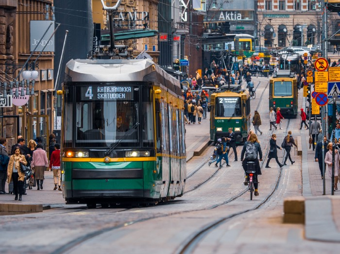

*Lessons from the happiest country on Earth*

As a Finn, I tend to raise an eyebrow whenever my American colleagues talk about “returning to work.”

After all, haven’t we been working the entire time?

What people mostly mean, of course, when they discuss RTW (*return to work*) , is what steps employers are taking to lure people back to their desks, from whimsical redecorating news to explicit orders to return or face career repercussions. The concept reveals the persistent beliefs business leaders hold about knowledge work — it’s still tied to a shared location and schedule.

In Finland, however, we have taken a different approach: trust.

Finland is a highly trust-based society. We were just [named the happiest country in the world for the fourth consecutive year](https://www.bbc.com/news/world-europe-56457295). The country’s well-being has been largely credited to our faith in both people and institutions.

During my 20+ years of working as a leader and a coach at Nokia, I asked countless leadership teams about how they react when someone tries to force them to do something. The answers invariably fell under four categories: fake, fight, ignore, or comply. People either pretend to follow the order, resist it, turn a blind eye, or passively follow it.

None of these responses are engaged or enthusiastic. So why do these same leaders then continue to oblige their people to do things they don’t want to do?

At Reaktor, a Nordic tech consultancy where I work, we have taken trust to the next level. Our people self-organize, and two of our offices even operate without a chief executive. As the pandemic fizzles out, every individual and team is permitted to figure out the best way for themselves and their clients to navigate the hybrid future of work. There are no demands to get back to the office — people come if they want to.


This high level of trust breeds highly active people who get things done.


Trusting is not always easy. Learning to trust means learning to endure uncertainty and discomfort. It requires a conscious decision from the top to trust in your employees’ intentions.

And if a person still breaks your trust, what matters is how you address the situation: face the uncomfortable emotions head-on and you might end up strengthening the bond between you and your colleague.

It’s also good to remember that trust is not about being “nice.” It’s about getting results, reducing complexity, and eradicating needless hierarchy.

I think that Covid has given the Corporate World a unique opportunity to explore self-organization at an unprecedented, historic scale. Individuals have tasted the freedom from micromanagement like never before. They don’t want to go back, nor should they.


If you’re an employer, this means letting go of some of the control you might have spent decades establishing. 


But in a world that is rapidly becoming more complex, I find the idea of supervising another person increasingly antiquated. We need to harvest the collective intelligence of all.

Besides, rethinking top-down workplace cultures won’t just reduce organizational waste, it will help organizations stay functional in even more unpredictable uncertainty of the future.

In the meantime, I suggest a Covid-free way to get companies to embrace such change even faster. Since the world is already filled with lists of the world’s most trusted brands, let’s turn the tables and start listing the world’s most trusting organizations as well.