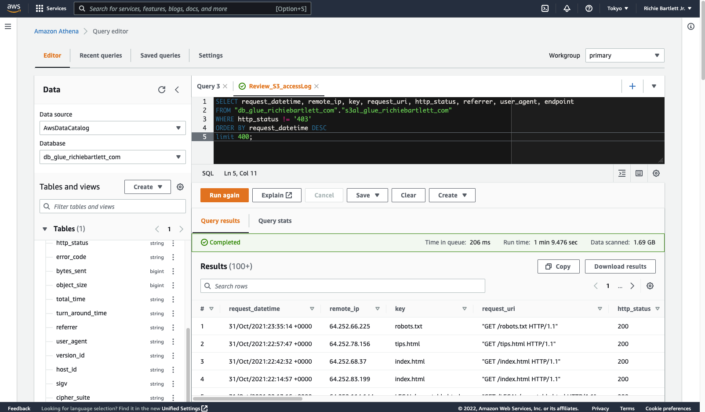
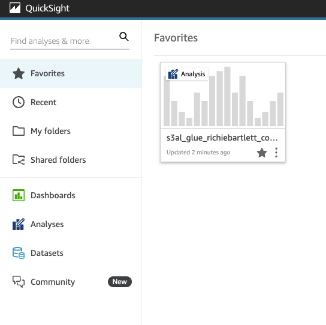
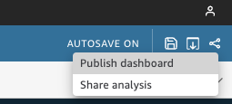

I'd like to see what visitors are viewing on my blog. It helps me to decide what I should write more about. 

Making decisions based on data is compelling. Especially, when you wrestle with the most straightforward decisions. Google Analytics is the de-facto standard for tracking your customers while clicking through your websites and applications. However, I decided to replace Google Analytics for the following reasons:

* I want to have more flexibility in how I collect and analyze data.
* I think data minimization is key for data privacy. 
* And I don’t agree with how Google collects and combines data.
* I want to transfer the ownership of the tracking data.

My goal is to employ native AWS services to display a dashboard with analytics for my website. I know Amazon QuickSight can do this. And, I've already configured CloudFront to log all access data. Reviewing the logs, I can see data for the requested page including HTTP status code, referrer, source-IP, datetime, user-agent, and OS. This is enough to build some advanced analytics for my websites. I only need to build the dashboard and the processes required by QuickSight.

Below is my documentation for that process. I hope that it will help others should they wish to achieve anything similar. 


## Website Platform Architecture
The website design is a "simple" serverless architecture as you can see in this diagram. It's basically S3 storage with CloudFront and an API gateway. I use GitHub for the VCS and the Code* services at AWS to push the code to my S3 buckets. I also have a simple database to track the "likes" and "shares" for each post. I have no intention to store any personal data - no username, no names, and definitely no financial details.


## CloudFront
First, we need to confirm that we have logging enabled and configured in the deployment of CloudFront website. From the AWS console, navigate to the CloudFront dashboard and select your distribution.


From here we can see that I have logging enabled. Now, we need to confirm where the logging is saved.


As I have multiple distributions (including my dev environments), I set the log prefix to `blog/`. This makes it easier to filter my analytics across different environments and websites. Now that CloudFront is configured to log all access and save it to an S3 bucket, I need to create visuals with that data using QuickSight.

## Starting QuickSight
My current idea is to have all the log data imported directly via QuickSight dataset S3 import. If that doesn't work, then the process grows a bit more complex as I need to involve Glue and Athena.

As I haven't used QuickSight for my personal account, I need to sign up since it's not automatically enabled. This also incurs a monthly service charge but isn't too expensive. Take note that Amazon defaults this to the "Enterprise edition" of their service. I don't need all of this at the beginning and "standard" is [cheaper](https://aws.amazon.com/quicksight/pricing/) at half the cost of "Enterprise." Select "standard" and continue to check the rest of the boxes.






I selected the `Tokyo` region as that is where I have this project homed. The reason is simple: cost and network latency. After clicking finish and waiting for it to complete, you should see something like this.


Upon entering the QuickSight dashboard, you are greeted with the basic introduction screens.







## Review the access data output
Going to the S3 bucket where I have my access logs, I navigated to one of the logs to inspect its contents. This is to confirm the structure of the log so I can build the ingestion process.

My log looks similar to this:
```log
79a59df900b949e55d96a1e698fbacedfd6e09d98eacf8f8d5218e7cd47ef2be awsexamplebucket1 [10/Aug/2022:00:58:01 +0000] 192.0.2.3 79a59df900b949e55d96a1e698fbacedfd6e09d98eacf8f8d5218e7cd47ef2be 3E57427F3EXAMPLE REST.GET.VERSIONING - "GET /awsexamplebucket1?versioning HTTP/1.1" 200 - 113 - 7 - "-" "S3Console/0.4" - s9lzHYrFp76ZVxRcpX9+5cjAnEH2ROuNkd2BHfIa6UkFVdtjf5mKR3/eTPFvsiP/XV/VLi31234= SigV2 ECDHE-RSA-AES128-GCM-SHA256 AuthHeader awsexamplebucket1.s3.us-west-1.amazonaws.com TLSV1.2
79a59df900b949e55d96a1e698fbacedfd6e09d98eacf8f8d5218e7cd47ef2be awsexamplebucket1 [10/Aug/2022:00:58:01 +0000] 192.0.2.3 79a59df900b949e55d96a1e698fbacedfd6e09d98eacf8f8d5218e7cd47ef2be 891CE47D2EXAMPLE REST.GET.LOGGING_STATUS - "GET /awsexamplebucket1?logging HTTP/1.1" 200 - 242 - 11 - "-" "S3Console/0.4" - 9vKBE6vMhrNiWHZmb2L0mXOcqPGzQOI5XLnCtZNPxev+Hf+7tpT6sxDwDty4LHBUOZJG96N1234= SigV2 ECDHE-RSA-AES128-GCM-SHA256 AuthHeader awsexamplebucket1.s3.us-west-1.amazonaws.com TLSV1.2
79a59df900b949e55d96a1e698fbacedfd6e09d98eacf8f8d5218e7cd47ef2be awsexamplebucket1 [10/Aug/2022:00:58:01 +0000] 192.0.2.3 79a59df900b949e55d96a1e698fbacedfd6e09d98eacf8f8d5218e7cd47ef2be A1206F460EXAMPLE REST.GET.BUCKETPOLICY - "GET /awsexamplebucket1?policy HTTP/1.1" 404 NoSuchBucketPolicy 297 - 38 - "-" "S3Console/0.4" - BNaBsXZQQDbssi6xMBdBU2sLt+Yf5kZDmeBUP35sFoKa3sLLeMC78iwEIWxs99CRUrbS4n11234= SigV2 ECDHE-RSA-AES128-GCM-SHA256 AuthHeader awsexamplebucket1.s3.us-west-1.amazonaws.com TLSV1.2
79a59df900b949e55d96a1e698fbacedfd6e09d98eacf8f8d5218e7cd47ef2be awsexamplebucket1 [10/Aug/2022:00:58:01 +0000] 192.0.2.3 79a59df900b949e55d96a1e698fbacedfd6e09d98eacf8f8d5218e7cd47ef2be 7B4A0FABBEXAMPLE REST.GET.VERSIONING - "GET /awsexamplebucket1?versioning HTTP/1.1" 200 - 113 - 33 - "-" "S3Console/0.4" - Ke1bUcazaN1jWuUlPJaxF64cQVpUEhoZKEG/hmy/gijN/I1DeWqDfFvnpybfEseEME/u7ME1234= SigV2 ECDHE-RSA-AES128-GCM-SHA256 AuthHeader awsexamplebucket1.s3.us-west-1.amazonaws.com TLSV1.2
79a59df900b949e55d96a1e698fbacedfd6e09d98eacf8f8d5218e7cd47ef2be awsexamplebucket1 [10/Aug/2022:00:58:01 +0000] 192.0.2.3 79a59df900b949e55d96a1e698fbacedfd6e09d98eacf8f8d5218e7cd47ef2be DD6CC733AEXAMPLE REST.PUT.OBJECT s3-dg.pdf "PUT /awsexamplebucket1/s3-dg.pdf HTTP/1.1" 200 - - 4406583 41754 28 "-" "S3Console/0.4" - 10S62Zv81kBW7BB6SX4XJ48o6kpcl6LPwEoizZQQxJd5qDSCTLX0TgS37kYUBKQW3+bPdrg1234= SigV4 ECDHE-RSA-AES128-SHA AuthHeader awsexamplebucket1.s3.us-west-1.amazonaws.com TLSV1.2
```

As I understand [AWS documentation](https://docs.aws.amazon.com/AmazonS3/latest/userguide/LogFormat.html), they use a proprietary format that is similar to common-log-file ([CLF](https://www.iri.com/blog/migration/data-migration/clf-elf-web-log-formats/)). *Server access log files consist of a sequence of newline-delimited log records. Each log record represents one request and consists of space-delimited fields.* Any field can be set to `-` to indicate that the data was unknown or unavailable, or that the field was not applicable to this request.


The log record includes the following fields:

* Bucket Owner
* Bucket
* Time [%d/%b/%Y:%H:%M:%S %z]
* Remote IP
* Requester
* Request ID
* Operation
* Key
* Request-URI
* HTTP status
* Error Code
* Bytes Sent
* Object Size
* Total Time
* Turn-Around Time
* Referer
* User-Agent
* Version Id
* Host Id
* Signature Version
* Cipher Suite
* Authentication Type
* Host Header
* TLS version
* Access Point ARN (Amazon Resource Name)


## Manifest
Now, let's create a manifest file for data files in S3[^1] and then create a dataset from it.[^2]

[^1]: https://docs.aws.amazon.com/quicksight/latest/user/create-a-data-set-s3.html

[^2]: https://docs.aws.amazon.com/quicksight/latest/user/supported-manifest-file-format.html


My manifest file would look something like this:
```json aws.quicksight.manifest.json
{
    "fileLocations": [
        {
            "URIPrefixes": [
                "https://s3-ap-northeast-1.amazonaws.com/richbartlett-log/"
            ]
        }
    ],
    "globalUploadSettings": {
        "format": "ELF"
    }
}
```

From the QuickSight main dashboard, tap on `Datasets` and `New dataset`.


QuickSight offers a lot of options for where to retrieve the data. In my case, the data is actually on an S3 bucket. So, I'll select `S3`.


Using the manifest file I created previously, upload it to QuickSight.


## Change strategy
The import failed... It seems I wasn't aware of the [limitations](https://docs.aws.amazon.com/quicksight/latest/user/data-source-limits.html) of file imports. Upon reviewing the metrics of my bucket, I realized that I have over 700K files. Obviously a lot more than 1000... 🙁


Furthermore, the total amount of data exceeds 1.4GB. This is well above the amount of storage allowed by SPICE & QuickSight for standard edition users. It appears I have to upgrade to the basic Enterprise edition after all... <*sigh*> 😮‍💨

So now I'm forced to take a different strategy. I'm definitely not going to spend time to merge 700,000+ files into a single source. And, I need a method that constantly updates with the latest log data. The solution is to use AWS Glue (an ETL service based on [Hadoop](https://hadoop.apache.org)) with Amazon Athena (text query service with SQL-like syntax). 


## Setup Athena


### Data Source
If this is your first time using Athena, you'll need to setup the data source. 


### Query Editor Settings
Need to define the settings for the Query Editor. No query will operate correctly until the query result location is defined. This requires the creation of a new empty bucket as I don't wish to mix this data with my logs. So, have to create a new S3 Bucket.


Once that is done, I'll be able to run queries against the tables from the DB that the Glue crawler will ingest. 


## Setup Glue

It's not obvious when you are going through the UI to create the DB, table, schema, *etc.* that you should only use _lowercase alphanumeric_ characters with the underscore `_` character. The UI won't inform you that Athena will error out. [^3] Be sure to avoid using the dot `.` character when naming your resources in Glue catalog.


[^3]: https://aws.amazon.com/premiumsupport/knowledge-center/athena-hive-bad-data-parsing-field-value/




### Glue bad UX
During the configuration of Glue, it seems to be a bit buggy in demanding certain irrelevant parameters to be set. The firsts few times I tried, it demanded a connector to my VPC despite the source data located in S3 only. I should not need a connector much less involve my VPC resources. When I used the create table method (instead of simply create crawler), it allowed me to skip the connector setup for the crawler. Strange bug...

Overall, the Glue interface is atrocious in its design. The UI provided by AWS is rather piss-poor in my strong opinion. It's not like the polished interfaces they have for EC2, S3, and Route 53. 

After several attempts to get this working, I found the following the workflow best to setup Glue to extract the S3 access log data.


### Glue Schema
During my initial crawl attempt, I found that Glue didn't recognize AWS's own log file format. Despite it being documented... I guess they haven't built that logic yet... So, I need to create that schema. 

Before creating the schema, I need to setup the `Schema Registry`.






Now, I add the schema to the registry. Normally, I'd make `HTTP_status`, `Bytes_Sent`, `Object_Size`, `Total_Time`, and `Turn_Around_Time` all `integer`, but the crawler software is too stupid to interpret "-" as zero. So, I'm forced to make all fields a `string`.

```json aws.glue.registry.schema.json
{
    "title": "AccessLog_CLF",
    "description": "https://docs.aws.amazon.com/AmazonS3/latest/userguide/LogFormat.html",
	"type": "object",
	"properties": {
		"Bucket_Owner": {
			"type": "string",
			"comment": "The canonical user ID of the owner of the source bucket. The canonical user ID is another form of the AWS account ID."
		},
		"Bucket": {
			"type": "string",
			"comment": "The name of the bucket that the request was processed against. If the system receives a malformed request and cannot determine the bucket, the request will not appear in any server access log."
		},
		"Time": {
			"type": "string",
			"comment": "The time at which the request was received; these dates and times are in Coordinated Universal Time (UTC). The format, using strftime() terminology, is as follows: [%d/%b/%Y:%H:%M:%S %z]"
		},
		"Remote_IP": {
			"type": "string",
			"comment": "The apparent internet address of the requester. Intermediate proxies and firewalls might obscure the actual address of the machine making the request."
		},
		"Requester": {
			"type": "string",
			"comment": "The canonical user ID of the requester, or a - for unauthenticated requests. If the requester was an IAM user, this field returns the requester's IAM user name along with the AWS root account that the IAM user belongs to. This identifier is the same one used for access control purposes."
		},
		"Request_ID": {
			"type": "string",
			"comment": "A string generated by Amazon S3 to uniquely identify each request."
		},
		"Operation": {
			"type": "string",
			"comment": "The operation listed here is declared as SOAP.operation, REST.HTTP_method.resource_type, WEBSITE.HTTP_method.resource_type, or BATCH.DELETE.OBJECT, or S3.action.resource_type for Lifecycle and logging."
		},
		"Key": {
			"type": "string",
			"comment": "The 'key' part of the request, URL encoded, or '-' if the operation does not take a key parameter."
		},
		"Request_URI": {
			"type": "string",
			"comment": "The Request-URI part of the HTTP request message."
		},
		"HTTP_status": {
			"type": "string",
			"comment": "The numeric HTTP status code of the response."
		},
		"Error_Code": {
			"type": "string",
			"comment": "The Amazon S3 Error code, or '-' if no error occurred."
		},
		"Bytes_Sent": {
			"type": "string",
			"comment": "The number of response bytes sent, excluding HTTP protocol overhead, or '-' if zero."
		},
		"Object_Size": {
			"type": "string",
			"comment": "The total size of the object in question."
		},
		"Total_Time": {
			"type": "string",
			"comment": "The number of milliseconds the request was in flight from the server's perspective. This value is measured from the time your request is received to the time that the last byte of the response is sent. Measurements made from the client's perspective might be longer due to network latency."
		},
		"Turn_Around_Time": {
			"type": "string",
			"comment": "The number of milliseconds that Amazon S3 spent processing your request. This value is measured from the time the last byte of your request was received until the time the first byte of the response was sent."
		},
		"Referer": {
			"type": "string",
			"comment": "The value of the HTTP Referer header, if present. HTTP user-agents (for example, browsers) typically set this header to the URL of the linking or embedding page when making a request."
		},
		"User_Agent": {
			"type": "string",
			"comment": "The value of the HTTP User-Agent header."
		},
		"Version_Id": {
			"type": "string",
			"comment": "The version ID in the request, or '-' if the operation does not take a versionId parameter."
		},
		"Host_Id": {
			"type": "string",
			"comment": "The x-amz-id-2 or Amazon S3 extended request ID."
		},
		"Signature_Version": {
			"type": "string",
			"comment": "The signature version, SigV2 or SigV4, that was used to authenticate the request or a '-' for unauthenticated requests."
		},
		"Cipher_Suite": {
			"type": "string",
			"comment": "The Secure Sockets Layer (SSL) cipher that was negotiated for HTTPS request or a '-' for HTTP."
		},
		"Authentication_Type": {
			"type": "string",
			"comment": "The type of request authentication used, AuthHeader for authentication headers, QueryString for query string (pre-signed URL) or a '-' for unauthenticated requests."
		},
		"Host_Header": {
			"type": "string",
			"comment": "The endpoint used to connect to Amazon S3."
		},
		"TLS_version": {
			"type": "string",
			"comment": "The Transport Layer Security (TLS) version negotiated by the client. The value is one of following: TLSv1, TLSv1.1, TLSv1.2; or - if TLS wasn't used."
		},
		"Access_Point_ARN": {
			"type": "string",
			"comment": "The Amazon Resource Name (ARN) of the access point of the request. If access point ARN is malformed or not used, the field will contain a '-'. For more information on access points, see Using access points. For more information on ARNs, see the topic on Amazon Resource Name (ARN) in the AWS Reference Guide."
		}
	}
}

```

Copy/paste this schema into the textarea for the new schema setup.






### Glue Classifier

A classifier determines the schema of your data. You can use the AWS Glue built-in classifiers or write your own.


Next, we need to define the data classifier. The built-in classifiers don't work for S3 log files... So, we have to roll our own.


### Database
With the registry and schema created, we can now create the DB for glue. From `Databases` tap on the `Add database` button and fill-in the details.


### Tables
I initially tried to create the tables manually using `Add Table with Schema`, but the interface is extremely limited and you can't edit all the properties as required for the parsing to work correctly. So, I found a way to create the table in Athena with the correct parameters built-in. 

From **Athena Query Editor** in a new browser tab, be sure to select your data source and database created earlier. Paste this SQL code into the editor and run the query. Be sure to update the `location` to your own S3 bucket.

```sql aws.athena.glue.db.table.sql
CREATE EXTERNAL TABLE `s3al_glue_richiebartlett_com`(
  `bucket_owner` string COMMENT '', 
  `bucket_name` string COMMENT '', 
  `request_datetime` string COMMENT '', 
  `remote_ip` string COMMENT '', 
  `requester` string COMMENT '', 
  `request_id` string COMMENT '', 
  `operation` string COMMENT '', 
  `key` string COMMENT '', 
  `request_uri` string COMMENT '', 
  `http_status` string COMMENT '', 
  `error_code` string COMMENT '', 
  `bytes_sent` bigint COMMENT '', 
  `object_size` bigint COMMENT '', 
  `total_time` string COMMENT '', 
  `turn_around_time` string COMMENT '', 
  `referrer` string COMMENT '', 
  `user_agent` string COMMENT '', 
  `version_id` string COMMENT '', 
  `host_id` string COMMENT '', 
  `sigv` string COMMENT '', 
  `cipher_suite` string COMMENT '', 
  `auth_type` string COMMENT '', 
  `endpoint` string COMMENT '', 
  `tls_version` string COMMENT '')
ROW FORMAT SERDE 
  'org.apache.hadoop.hive.serde2.RegexSerDe' 
WITH SERDEPROPERTIES ( 
  'input.regex'='([^ ]*) ([^ ]*) \\[(.*?)\\] ([^ ]*) ([^ ]*) ([^ ]*) ([^ ]*) ([^ ]*) (\"[^\"]*\"|-) (-|[0-9]*) ([^ ]*) ([^ ]*) ([^ ]*) ([^ ]*) ([^ ]*) ([^ ]*) (\"[^\"]*\"|-) ([^ ]*)(?: ([^ ]*) ([^ ]*) ([^ ]*) ([^ ]*) ([^ ]*) ([^ ]*))?.*$') 
STORED AS INPUTFORMAT 
  'org.apache.hadoop.mapred.TextInputFormat' 
OUTPUTFORMAT 
  'org.apache.hadoop.hive.ql.io.HiveIgnoreKeyTextOutputFormat'
LOCATION
  's3://richbartlett-log/'
TBLPROPERTIES (
  'classification'='csv', 
  'compressionType'='none', 
  'transient_lastDdlTime'='1660574735', 
  'typeOfData'='file')
```


After the query completes successfully, we need to edit the table properties in Glue. I couldn't find a way to do it directly in Athena...







### Crawler
Now that the classifier, schema, DB, and table are configured, we need to create a crawler and prepare it to run.


If you attempt to change any of the properties of the schema, registry, classifier, table, or database, the crawler will no longer function. You will be forced to recreate it. I learned this the hard way.







As I have over 1.5GB of data spread across more than 700,000 files, this will probably take a while to complete. 


## Test in Athena
Now that I finally have Glue setup, I need to test the queries in Athena. 

```sql review_s3_accesslog.sql
SELECT request_datetime, remote_ip, key, request_uri, http_status, referrer, user_agent, endpoint
FROM "db_glue_richiebartlett_com"."s3al_glue_richiebartlett_com"
WHERE http_status != '403'
ORDER BY request_datetime DESC
limit 400;
```

Athena treats single-quote `'` and double-quote `"` differently. Took me a bit to figure that out. This isn't like Microsoft SQL. As I understand it, the query language is actually based on [HiveQL DDL](https://cwiki.apache.org/confluence/display/Hive/LanguageManual+DDL). After reviewing the [syntax reference](https://prestodb.io/docs/0.217/functions), I could resolve my issues.




Sweet! 🤩 It works! Now, move on to the QuickSight setup.

## Create table views
Views are similar to tables where the data is collated in an easier to digest format. To make it easier for QuickSight to display the data we are after, we need to set these up.


<!-- tab VIEW: access_logs.sql -->
Access logs. You'll notice that I parse the datetime different ways. This is due to how the related views interpret that data. It makes it easier to build visualization from it when parsed this way. Additionally, I do some basic parsing on the `user_agent` field to detect OS, device, and browser. This will save time later when I need to extract metrics from those details. 
```sql access_logs.sql
CREATE OR REPLACE VIEW access_logs AS
SELECT CAST(
		parse_datetime(request_datetime, 'dd/MMM/yyyy:HH:mm:ss Z') AS timestamp
	) AS request_timestamp,
	substr(
		cast(
			parse_datetime(
				request_datetime,
				'dd/MMM/yyyy:HH:mm:ss Z'
			) as varchar
		),
		1,
		10
	) AS request_date,
	regexp_replace(
		request_datetime,
		'([0-9]{2})/([A-Za-z]{2,4})/([0-9]{4})\:([0-9]{2})\:([0-9]{2})\:([0-9]{2}) \+([0-9]{4})',
		'$3/$2/$1'
	) AS request_date2,
	regexp_replace(
		request_datetime,
		'([0-9]{2})/([A-Za-z]{2,4})/([0-9]{4})\:([0-9]{2})\:([0-9]{2})\:([0-9]{2}) \+([0-9]{4})',
		'$4:$5:$6'
	) AS request_time,
	remote_ip,
	key,
	referrer,
	http_status,
	error_code,
	request_uri,
	operation,
		CAST(
		CASE
			WHEN strpos(user_agent, 'Chrome') > 0 THEN 'Chrome'
			WHEN strpos(user_agent, 'Firefox') > 0 THEN 'Firefox'
			WHEN strpos(user_agent, 'Konqueror') > 0 THEN 'Konqueror'
			WHEN strpos(user_agent, 'Outlook') > 0 THEN 'Outlook'
			WHEN strpos(user_agent, 'MSIE') > 0 THEN 'Internet Explorer'
			WHEN strpos(user_agent, 'edge') > 0 THEN 'MS Edge'
			WHEN strpos(user_agent, 'iPhone') > 0 THEN 'iOS Safari'
			WHEN strpos(user_agent, 'iPad') > 0 THEN 'iPadOS Safari'
			WHEN strpos(user_agent, 'Safari') > 0 THEN 'Safari'
			WHEN strpos(user_agent, 'SeaMonkey') > 0 THEN 'SeaMonkey'
			WHEN strpos(user_agent, 'Dolfin') > 0 THEN 'Dolfin'
			WHEN strpos(user_agent, 'S3Console') > 0 THEN 'AWS Console'
			WHEN strpos(user_agent, 'CloudFront') > 0 THEN 'CloudFront'
			WHEN strpos(user_agent, 'aws-sdk') > 0 THEN 'AWS-sdk'
			WHEN strpos(user_agent, 'bot') > 0 THEN 'bot'
			WHEN strpos(user_agent, 'http://') > 0 THEN 'bot'
			WHEN strpos(user_agent, 'https://') > 0 THEN 'bot'
			WHEN strpos(user_agent, 'www.') > 0 THEN 'bot'
			WHEN strpos(user_agent, 'Wget') > 0 THEN 'hacker/bot'
			WHEN strpos(user_agent, 'curl') > 0 THEN 'hacker/bot'
			WHEN strpos(user_agent, 'urllib') > 0 THEN 'hacker/bot'
			ELSE 'other'
		END AS varchar
	) AS browser,
	CAST(
		CASE
			WHEN user_agent LIKE '%Windows Phone' THEN 'Windows Phone'
			WHEN user_agent LIKE '%KaiOS%' THEN 'KaiOS'
			WHEN user_agent LIKE '%Android%' THEN 'Android'
			WHEN user_agent LIKE '%CentOS%' THEN 'CentOS'
			WHEN user_agent LIKE '%Debian%' THEN 'Debian'
			WHEN user_agent LIKE '%Fedora%' THEN 'Fedora'
			WHEN user_agent LIKE '%FreeBSD%' THEN 'FreeBSD'
			WHEN user_agent LIKE '%Gentoo%' THEN 'Gentoo'
			WHEN user_agent LIKE '%Haiku%' THEN 'Haiku'
			WHEN user_agent LIKE '%Gentoo%' THEN 'Gentoo'
			WHEN user_agent LIKE '%Kubuntu%' THEN 'Kubuntu'
			WHEN user_agent LIKE '%Linux Mint%' THEN 'Linux Mint'
			WHEN user_agent LIKE '%OpenBSD%' THEN 'OpenBSD'
			WHEN user_agent LIKE '%Red Hat%' THEN 'Red Hat'
			WHEN user_agent LIKE '%SuSE%' THEN 'SuSE'
			WHEN user_agent LIKE '%Ubuntu%' THEN 'Ubuntu'
			WHEN user_agent LIKE '%Xubuntu%' THEN 'Xubuntu'
			WHEN user_agent LIKE '%Cygwin%' THEN 'Cygwin'
			WHEN user_agent LIKE '%Symbian OS%' THEN 'Symbian OS'
			WHEN user_agent LIKE '%hpwOS%' THEN 'hpwOS'
			WHEN user_agent LIKE '%webOS%' THEN 'webOS'
			WHEN user_agent LIKE '%Tablet OS%' THEN 'Tablet OS'
			WHEN user_agent LIKE '%Tizen%' THEN 'Tizen'
			WHEN user_agent LIKE '%Linux%' THEN 'Linux'
			WHEN user_agent LIKE '%linux%' THEN 'Linux'
			WHEN user_agent LIKE '%Mac%OS%' THEN 'MacOS'
			WHEN user_agent LIKE '%Macintosh%' THEN 'Macintosh'
			WHEN user_agent LIKE '%imac%' THEN 'iMac'
			WHEN user_agent LIKE '%Mac%' THEN 'MacOS'
			WHEN user_agent LIKE '%Chrome%' THEN 'Chrome'
			WHEN user_agent LIKE '%Chromium%' THEN 'Chromium'
			WHEN user_agent LIKE '%iPhone%' THEN 'iOS'
			WHEN user_agent LIKE '%iPad%' THEN 'iPadOS'
			WHEN user_agent LIKE '%iPod%' THEN 'iOS'
			WHEN user_agent LIKE '%Windows %' THEN 'MS Windows'
			WHEN user_agent LIKE '%Nokia%' THEN 'Nokia'
			WHEN user_agent LIKE '%BlackBerry%' THEN 'BlackBerry'
			WHEN user_agent LIKE '%Galaxy%' THEN 'Galaxy'
			WHEN user_agent LIKE '%NetBSD%' THEN 'NetBSD'
			WHEN user_agent LIKE '%SunOS%' THEN 'SunOS'
			WHEN user_agent LIKE '%OpenSolaris%' THEN 'Open Solaris'
			WHEN user_agent LIKE '%OS/2%' THEN 'IBM OS/2'
			WHEN user_agent LIKE '%BeOS%' THEN 'BeOS'
			WHEN user_agent LIKE '%PlayStation%' THEN 'PlayStation'
			WHEN user_agent LIKE '%TouchPad%' THEN 'TouchPad'
			WHEN user_agent LIKE '%Nexus%' THEN 'Nexus'
			WHEN user_agent LIKE '%Kindle%' THEN 'Kindle'
			WHEN user_agent LIKE '%Nook%' THEN 'Nook'
			WHEN user_agent LIKE '%Transformer%' THEN 'WII'
			WHEN user_agent LIKE '%Wii%' THEN 'WII'
			WHEN user_agent LIKE '%Xbox%' THEN 'MS Xbox'
			WHEN user_agent LIKE '%Xoom%' THEN 'Xoom'
			WHEN user_agent LIKE '% TV%' THEN 'TV'
			ELSE 'other'
		END AS varchar
	) AS OS,
	CAST(
		CASE
			WHEN strpos(user_agent, 'Apple') > 0 THEN 'Apple'
			WHEN strpos(user_agent, 'Alcatel') > 0 THEN 'Alcatel'
			WHEN strpos(user_agent, 'Amazon') > 0 THEN 'Amazon'
			WHEN strpos(user_agent, 'Asus') > 0 THEN 'Asus'
			WHEN strpos(user_agent, 'Barnes & Noble') > 0 THEN 'InternetBarnes & Noble'
			WHEN strpos(user_agent, 'BlackBerry') > 0 THEN 'BlackBerry'
			WHEN strpos(user_agent, 'Safari') > 0 THEN 'Safari'
			WHEN strpos(user_agent, 'Galaxy') > 0 THEN 'Galaxy'
			WHEN strpos(user_agent, 'Google') > 0 THEN 'Google'
			WHEN strpos(user_agent, 'HP') > 0 THEN 'HP'
			WHEN strpos(user_agent, 'HTC') > 0 THEN 'HTC'
			WHEN strpos(user_agent, 'Huawei') > 0 THEN 'Huawei'
			WHEN strpos(user_agent, 'Lenovo') > 0 THEN 'Lenovo'
			WHEN strpos(user_agent, 'LG') > 0 THEN 'LG'
			WHEN strpos(user_agent, 'Microsoft') > 0 THEN 'Microsoft'
			WHEN strpos(user_agent, 'Motorola') > 0 THEN 'Motorola'
			WHEN strpos(user_agent, 'Nintendo') > 0 THEN 'Nintendo'
			WHEN strpos(user_agent, 'Nokia') > 0 THEN 'Nokia'
			WHEN strpos(user_agent, 'Oppo') > 0 THEN 'Oppo'
			WHEN strpos(user_agent, 'Samsung') > 0 THEN 'Samsung'
			WHEN strpos(user_agent, 'Sony') > 0 THEN 'Sony'
			WHEN strpos(user_agent, 'Xiaomi') > 0 THEN 'Xiaomi'
			ELSE 'unknown'
		END AS varchar
	) AS manufacturer,
	user_agent
FROM "db_glue_richiebartlett_com"."s3al_glue_richiebartlett_com"
WHERE operation LIKE 'REST.GET.%';

```
<!-- endtab -->

<!-- tab QUERY: page_hits.sql -->
Page hit count. Essentially, the popular page.
``` sql page_hits.sql
SELECT key, COUNT(*) AS hits
FROM access_logs
WHERE http_status = '200'
	AND (
		key LIKE '%/'
		OR key like '%/%.html'
	)
GROUP BY key
ORDER BY hits DESC
LIMIT 100;
```
<!-- endtab -->

<!-- tab QUERY: page_hit_byDate.sql -->
This is the daily traffic counter.
``` sql page_hit_byDate.sql
SELECT request_date,
	COUNT(*) AS hits
FROM access_logs
WHERE http_status = '200'
	AND (
		"request_uri" LIKE 'GET / %'
		OR "key" like '%.html'
	)
GROUP BY request_date
ORDER BY request_date DESC
LIMIT 100;
```
<!-- endtab -->

<!-- tab QUERY: top_referrer.sql -->
What page is referring traffic? Where is everyone coming from?
``` sql top_referrer.sql
SELECT referrer,
	COUNT(*) AS hits
FROM access_logs
WHERE referrer != '-'
GROUP BY referrer
ORDER BY hits DESC
LIMIT 100;
```
<!-- endtab -->


<!-- tab QUERY: top_Browser.sql -->
Similar to the `bot_logs.sql` script, we can extract the basic details of the browser. For a more detailed analysis, the user-agent would need to be parsed by a JavaScript with the complete case of variations for all OS/browsers. But for my purposes, I don't require that much detail at this stage.

This was based on the `platform.js` script at https://github.com/bestiejs/platform.js/blob/master/platform.js 


PrestoDB doesn't appear to support *aliased columns* in the `GROUP BY` clause. The workaround is the copy/paste the conditional statement from the `SELECT` to `GROUP BY`...


```sql top_Browser.sql
SELECT COUNT(*) AS hit,
	CAST(
		CASE
			WHEN strpos(user_agent, 'Chrome') > 0 THEN 'Chrome'
			WHEN strpos(user_agent, 'Firefox') > 0 THEN 'Firefox'
			WHEN strpos(user_agent, 'Konqueror') > 0 THEN 'Konqueror'
			WHEN strpos(user_agent, 'Outlook') > 0 THEN 'Outlook'
			WHEN strpos(user_agent, 'MSIE') > 0 THEN 'Internet Explorer'
			WHEN strpos(user_agent, 'edge') > 0 THEN 'MS Edge'
			WHEN strpos(user_agent, 'iPhone') > 0 THEN 'iOS Safari'
			WHEN strpos(user_agent, 'iPad') > 0 THEN 'iPadOS Safari'
			WHEN strpos(user_agent, 'Safari') > 0 THEN 'Safari'
			WHEN strpos(user_agent, 'SeaMonkey') > 0 THEN 'SeaMonkey'
			WHEN strpos(user_agent, 'Dolfin') > 0 THEN 'Dolfin'
			WHEN strpos(user_agent, 'S3Console') > 0 THEN 'AWS Console'
			WHEN strpos(user_agent, 'CloudFront') > 0 THEN 'CloudFront'
			WHEN strpos(user_agent, 'aws-sdk') > 0 THEN 'aws-sdk'
			WHEN strpos(user_agent, 'bot') > 0 THEN 'bot'
			WHEN strpos(user_agent, 'http://') > 0 THEN 'bot'
			WHEN strpos(user_agent, 'https://') > 0 THEN 'bot'
			WHEN strpos(user_agent, 'www.') > 0 THEN 'bot'
			WHEN strpos(user_agent, 'Wget') > 0 THEN 'bot'
			WHEN strpos(user_agent, 'curl') > 0 THEN 'bot'
			WHEN strpos(user_agent, 'urllib') > 0 THEN 'bot'
			ELSE 'other'
		END AS varchar
	) AS browser
FROM access_logs
GROUP BY (
		CASE
			WHEN strpos(user_agent, 'Chrome') > 0 THEN 'Chrome'
			WHEN strpos(user_agent, 'Firefox') > 0 THEN 'Firefox'
			WHEN strpos(user_agent, 'Konqueror') > 0 THEN 'Konqueror'
			WHEN strpos(user_agent, 'Outlook') > 0 THEN 'Outlook'
			WHEN strpos(user_agent, 'MSIE') > 0 THEN 'Internet Explorer'
			WHEN strpos(user_agent, 'edge') > 0 THEN 'MS Edge'
			WHEN strpos(user_agent, 'iPhone') > 0 THEN 'iOS Safari'
			WHEN strpos(user_agent, 'iPad') > 0 THEN 'iPadOS Safari'
			WHEN strpos(user_agent, 'Safari') > 0 THEN 'Safari'
			WHEN strpos(user_agent, 'SeaMonkey') > 0 THEN 'SeaMonkey'
			WHEN strpos(user_agent, 'Dolfin') > 0 THEN 'Dolfin'
			WHEN strpos(user_agent, 'bot') > 0 THEN 'bot'
			WHEN strpos(user_agent, 'http://') > 0 THEN 'bot'
			WHEN strpos(user_agent, 'https://') > 0 THEN 'bot'
			WHEN strpos(user_agent, 'www.') > 0 THEN 'bot'
			WHEN strpos(user_agent, 'Wget') > 0 THEN 'bot'
			WHEN strpos(user_agent, 'curl') > 0 THEN 'bot'
			WHEN strpos(user_agent, 'urllib') > 0 THEN 'bot'
			ELSE 'other'
		END 
	) 
ORDER BY hit DESC;
```
<!-- endtab -->

<!-- tab VIEW: utm_logs.sql -->
UTM logs [[The Complete Guide to UTM Codes: How to Track Every Link and All the Traffic From Social Media](https://buffer.com/library/utm-guide/)]
``` sql utm_logs.sql
CREATE OR REPLACE VIEW utm_logs AS 
SELECT *, url_extract_parameter('?' || url_decode(key), 'utm_source') AS utm_source, 
url_extract_parameter('?' || url_decode(key), 'utm_medium') AS utm_medium, 
url_extract_parameter('?' || url_decode(key), 'utm_campaign') AS utm_campaign, 
url_extract_parameter('?' || url_decode(key), 'utm_term') AS utm_term, 
url_extract_parameter('?' || url_decode(key), 'utm_content') AS utm_content
FROM access_logs 
WHERE key LIKE '%utm_source%';
```
<!-- endtab -->

<!-- tab QUERY: bot_logs.sql -->
See what bots are crawling over my sites. This is based on my logs and known common bots.
```sql bot_logs.sql
SELECT user_agent,
	COUNT(*) AS hit
FROM access_logs
WHERE user_agent LIKE '%Google%'
	OR user_agent LIKE '%bingbot%'
	OR user_agent LIKE 'Twitter%'
	OR user_agent LIKE 'facebook%'
	OR user_agent LIKE 'facebot%'
	OR user_agent LIKE '%LinkedIn%'
	OR user_agent LIKE 'AddThis%'
	OR user_agent LIKE 'Disqus%'
	OR user_agent LIKE '%DuckDuckBot%'
	OR user_agent LIKE '%crawl%'
	OR user_agent LIKE '%spider%'
	OR user_agent LIKE '%Yandex%'
	OR user_agent LIKE '%Slurp%'
	OR user_agent LIKE '%Exabot%'
	OR user_agent LIKE '%Sogou%'
	OR user_agent LIKE '%SEMrushBot%'
	OR user_agent LIKE '%DotBot%'
	OR user_agent LIKE '%AhrefsBot%'
	OR user_agent LIKE '%applebot%'
	OR user_agent LIKE '%PetalBot%'
	OR user_agent LIKE '%OpenSite%'
	OR user_agent LIKE '%mj12bot%'
	OR user_agent LIKE '%Seznam%'
	OR user_agent LIKE '%ZGrab%'
	OR user_agent LIKE '%Daum%'
	OR user_agent LIKE '%ADmantX%'
	OR user_agent LIKE '%Pinterest%'
	OR user_agent LIKE '%Wget%'
	OR user_agent LIKE '%curl%'
	OR user_agent LIKE '%urllib%'
	OR user_agent LIKE '%http://%'
	OR user_agent LIKE '%www.%'
	OR user_agent LIKE '%bot%'
GROUP BY user_agent
ORDER BY hit DESC;
```
<!-- endtab -->

<!-- tab VIEW: server_error.sql -->
This list will likely give me security details about potential hack attempts.
``` sql server_error.sql
CREATE OR REPLACE VIEW server_error AS
SELECT request_timestamp,
	key,
	http_status,
	error_code,
	request_id,
	host_id
FROM "db_glue_richiebartlett_com"."s3al_glue_richiebartlett_com"
WHERE http_status like '5%';
```
<!-- endtab -->

<!-- tab red_team.sql -->
//TODO: (Will add more security minded queries here...)

``` sql server_403.sql
CREATE OR REPLACE VIEW server_403 AS
SELECT request_timestamp,
	key,
	http_status,
	error_code,
	request_id,
	host_id
FROM "db_glue_richiebartlett_com"."s3al_glue_richiebartlett_com"
WHERE http_status = '403';
```
<!-- endtab -->




## Setup QuickSight Analysis
### Configure Athena Dataset








On the Analysis page, the datasets and Athena tables/views that were created above are used to build the visuals.
You can use different sheets to fetch data from different datasets that were created earlier in order to visualize the data.

After the dataset is imported, let's preview the table.


From here, we can adjust the column names or add calculated fields to make it easier for deeper analysis. You can also add other datasets and combine data from various tables.  Once done, simply click on the `SAVE & PUBLISH` button in the upper-right corner.


### Build basic dashboard
I want to track the following metrics:
* Total daily visits
* Most popular pages (URI)
* Most popular "referrer"
* Top browser (user-agent)
* Percentage of traffic from Social Media sites (Facebook, Twitter, LinkedIn, YouTube, *etc.*)
 


Now we can build a new dashboard based on the datasets with the Athena-queried log data. 






### Daily traffic counts
Now that we have setup the dataset and added an analysis, we can _finally_ build the first chart in QuickSight.
From the `Fields list` add the `request_timestamp` to the "X-axis" and the `key` to "Color" in the `Field wells`. I also double-click on the title section to enter my own custom title. You should see something similar to this.


From here, I can already start to see some interesting patterns in the traffic to my website. The `Key` legend also suggests the most popular pages. However, this data is based on logging from the day I started logging access. I'll need to add a control and some dynamic filters to show more meaningful metrics. One nice feature of this line-chart graph is the time-bar at the bottom of the chart. It allows you to limit the data drawn and slide it along x-axis of the data's lifetime.

Playing with the other chart types, I found the stacked-line chart to be more valuable as it's much easier to see the _total daily_ traffic. The line-chart only shows the traffic for _individual pages_. And, I don't need the legend visible as I'll create another visual for the pages.


### Popular pages
Now with the traffic view ready to go, we can add another section that allows further drilling down into the pages with the most traffic. From the top-left corner, click on `+ADD` and select `Add visual`. This can be a simple pivot table - select it from the `Visual types` in the lower-left corner.


For this visual, I only need to show `key` with a descending count on the rows.


### Where's traffic coming from?
Similar to the popular pages visual, we use a simple pivot table with the `referrer` field. Be sure to select the right-hand (count) column and click on `sort descending`.


I can see that most of my traffic either doesn't offer a referrer or the user directly accessed the site by typing in the URL. Direct traffic is good. But I also need to see that the search engines are bringing traffic to my website.


### Top Broswer
Unlike the previous metrics, this and following sections will rely on the parsing of the User-Agent string that is provided by all browser software. From the top-left corner, click on `+ADD` and select `Add visual`. This time, I select the `pie-chart` visual. Since I already created a dedicated field for `browser` I don't need to commit significant resources for SPICE to parse out the `user_agent` field. Add `browser` to the `Group/Color` "field well." From the bottom `Group By: browser` down-arrow, I select the "Sort by" A-Z option. 


Looks like most of my traffic is from Chrome, CloudFront, and bots. 


### Top OS
Very similar to the top-browser visual, create the chart for the top OS. This time, I will simply duplicate the visual. From the top-right corner of the top-browser visual, click the ellipsis (...) button for the context menu. Select `Duplicate visual`.


As I'd like the analytics to be visible on a single screen, I'll need to rearrange the size of some visuals. As almost half of my traffic doesn't have a known OS (since they are probably bots), I will want to filter that out for a more meaningful graph. From the left-hand menu I click on `Filter` and then select `ADD FILTER`. From the drop-down list, select "os." 


In the edit filter options, leave the filter condition to "include." Now scroll down the list of values and un-check the "other" value. Then click `APPLY` for the visual to update. 


Seems like I get a lot of Mac and Android users. 


### Top Device
Now duplicate the top-OS visual and move it below that chart. While the pie-chart is selected, change the field to `manufacturer` for the data to repopulate the pie-chart.›


Seems like most of my visitors are "Apple" users. That will probably change as more people discover my blog.


### UTM
“UTM” stands for “Urchin tracking module.” This is something new that I plan to develop further as I will continue to push posts to various online social media platforms. For now, I have the logic prepared. But need to implement the URI parameters for each platform.

//TODO: [[  📔 Need to post QS visuals ]]


## Publish the QuickSight dashboard
This is a good time to check your theme and settings to update the style to match your preferences. Don't be afraid to play with different options.
Now that I've built the basic visuals, I need to publish it. From the share icon in the top-right corner, click on `Publish dashboard`.


A new screen will display your charts. As it is a lot of data, it may take a couple of minutes for all visuals to populate.


Next, I'll need to add some additional controls and filters for a better drill-down analysis... but I'll save that for another post. 😎

At this point, you should have an excellent idea of how to build an analytics dashboard on AWS using native services. And, you don't need to rely on some third party to sell you data on your website's analytics. Furthermore, you own your metrics!


## Update my architecture
Now that I have a working dashboard, I can start to keep an eye on my websites' analytics and security *visually*. I updated my Architecture diagram to include these newly added services within AWS.


## Reference
* 🎥 [AWS Glue Tutorial for Beginners [FULL COURSE in 45 mins]](https://youtu.be/dQnRP6X8QAU)
* 💻 [How do I analyze my Amazon S3 server access logs using Athena?](https://aws.amazon.com/premiumsupport/knowledge-center/analyze-logs-athena/)
* 🎥 [Querying Amazon CloudFront logs](https://docs.aws.amazon.com/athena/latest/ug/cloudfront-logs.html)
* 💻 [Querying AWS service logs](https://docs.aws.amazon.com/athena/latest/ug/querying-AWS-service-logs.html)
* 💻 [Amazon S3 server access log format](https://docs.aws.amazon.com/AmazonS3/latest/dev/LogFormat.html)
* 💻 [Ultimate Cheat Sheet On Amazon Athena](https://blog.openbridge.com/what-is-aws-athena-interactive-query-service-7eb0e08b8316?gi=ccbdc6a6b83c)
* 💻 [SQL reference for Amazon Athena](https://docs.aws.amazon.com/athena/latest/ug/functions-operators-reference-section.html)
* 💻 [How Amazon QuickSight works](https://docs.aws.amazon.com/quicksight/latest/user/how-quicksight-works.html)
* 💻 [AWS: Publishing dashboards](https://docs.aws.amazon.com/quicksight/latest/user/creating-a-dashboard.html)
* 💻 [AWS: Arranging visuals in dashboards](https://docs.aws.amazon.com/quicksight/latest/user/visualizing-data-dashboards.html)
* 🎥 [How Amazon QuickSight works](https://youtu.be/-9YWgYi8P_s)
* 🎥 [Build Advanced Analytics and Dashboards with Amazon QuickSight - Virtual Workshop](https://youtu.be/2KEWxdPiUh8)
* 🎥 [URL Actions in AWS QuickSight](https://youtu.be/kI-IlBpWpxk)
* 💻 [Hidden Markov Model](https://www.sciencedirect.com/topics/medicine-and-dentistry/hidden-markov-model#:~:text=In%20Computational%20Biology%2C%20a%20hidden,'hidden'%20from%20the%20observer.)
* 💻 [Internet traffic classification using a Hidden Markov Model](https://ieeexplore.ieee.org/document/5601068)
* 💻 [The Complete Guide to UTM Codes: How to Track Every Link and All the Traffic From Social Media](https://buffer.com/library/utm-guide/)
* 💻 [Best practices when using Athena with AWS Glue](https://docs.aws.amazon.com/athena/latest/ug/glue-best-practices.html)
* 💻 [Presto 0.275 Documentation](https://prestodb.io/docs/current/functions.html)
* 💻 [group http user agent sql](https://dotclear.placeoweb.com/post/group-http-user-agent-sql)
* 💻 [Group user agents by browser](https://stackoverflow.com/questions/10560082/group-user-agents-by-browser)