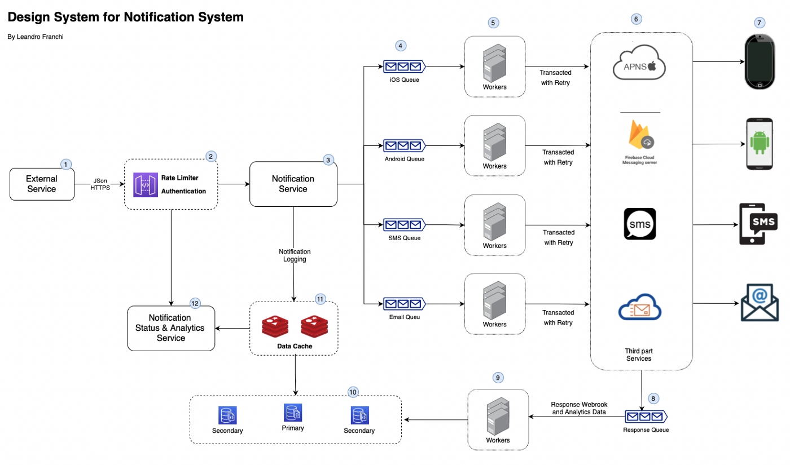

 A notification system has become a mandatory feature of any system that helps touch users, collect analytics data, *etc*. It's more than a mobile push and there are some different types of notification formats like push, SMS, email and software badge (not covered here).

 In this article, we will skim the surface on Notification System Design for Push, SMS and email formats in near real time, average of 10 million of notifications per day triggered by a secure API Endpoint respecting an unsubscribe list control.

## Notification Types
### iOS Push
 

 A provider sends notifications do Apple Push Notification Service, a remote service provided by Apple do push notifications do iOS devies.

### Android Push
 

 The android notification is similar of IOS notification flow, but, instead using de APNs we will use Firebase Cloud Messaging do tens android push notifications.

### SMS Message
 

 Same above, but, using a SMS Service provider like Twilio. Some providers like Twilio has features to send message using WhatsApp telephony and mail marketing.

### Email Message
 

 Same above, but, using a email service provider like Sendgrid (or AWS SES with SQS).

## Complete Notification System Design
 Important to say, it's a high-level design and we will have a lot of not covered details in this article when we focus on each point of this picture.

 

 1. External software sends JSON message through https with message data, like address, type, message, etc.
 2. Rate limiter validate internal rules to protect system overload and security issues.
 3. Notification Service receives the message, deliver to correct message queue and writes some log to data store over a Data Cache cluster.
 4. Some workers consumes the messages from queue and connect with third part software to send a message to defined device type ou message format.
 5. Third part software calls back using Web Hooks to give status and analytics information about message.
 6. More workers running gets these informations and stores on data store layer.
 7. Status and analytics data are available for Notification Status & Analytics Service giving these data to external Service back.

 Using these system design the software we gain the following benefits:
 * Reliability: mechanisms to minimize the failure rate and SPOF.
 * Security: running over https using AppKey/appSecret pair to ensure only authorized users can send messages.
 * Tracking and Monitoring: logs, status and analytics data are stored.
 * Rate Limiting: protect system overload, unexpected burst and security issues.
 * This design works very well and should be replicated in other regions to increase the SLA, inserting new components like Load balancers, Big IPs, etc.

 More about balance and reliability [here](https://leandrofranchi.medium.com/system-design-for-bam-application-28b009bc9b92).

