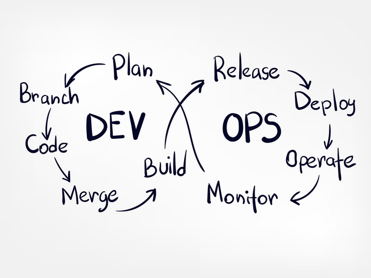

## Background
If you read my [previous blog about feature flags](https://www.ranthebuilder.cloud/post/aws-lambda-cookbook-part-6-feature-flags-configuration-best-practices), you know what a powerful tool they are. 

However, adding feature flags makes your code harder to read and maintain as the testing matrixes expand. 

This blog presents a straightforward feature flags' development/lifecycle process to mitigate these complex challenges. This process walks you through all feature flags stages: 
1. plan & design
2. testing
3. production
4. monitoring
5. retirement

While the code examples are written in Python, the concepts I describe are the same for any feature flag SDK written in any programming language that you might choose.

## Ownership
I believe that the *development* team owns the feature flags process from start to end. 

The team and its lead are required to implement the feature flag and manage it throughout its’ lifecycle. 

The development team is the source of truth for the design as it has the best understanding of the feature flag’s side effects, implementation, points of failure, and how to overcome them.

## CI/CD Infinity Loop

Plan, Code, and Build
Once a new planned feature has been deemed significant enough or risky, you must consider enabling it through a feature flag.

The most straightforward implementation is a single execution point with a single ‘if-else’ statement. Consider the following pseudo-code example:



### How is ‘get_my_feature_flag’ implemented? 
I’ve presented an implementation for fetching and evaluating feature flags in my AWS Lambda Cookbook [blog series](https://www.ranthebuilder.cloud/post/aws-lambda-cookbook-part-6-feature-flags-configuration-best-practices). It’s based on AWS AppConfig and [AWS Lambda Powertools](https://awslabs.github.io/aws-lambda-powertools-python/latest/utilities/feature_flags/).

That blog also describes how to separate the feature flag from the AWS Lambda function pipeline, thus making it truly dynamic. A dynamic feature flags allows you to quickly change your AWS Lambda function behavior without redeploying the function. Read more about static vs. dynamic configuration [here](https://www.ranthebuilder.cloud/post/aws-lambda-cookbook-part-6-feature-flags-configuration-best-practices).

Be advised that any 3rd party solution works as well. Choose a solution that fits your needs best.

## Test
Most people focus their tests on the obvious use case: enable the feature and test the new logic surrounding it: verify that the business logic is handled correctly and the side effects are as expected. They will also ensure that the code coverage remains as high as possible if they are thorough.

However, it is also critical to verify that the feature’s logic is **NOT** run when the value of the feature flag is **`False`**. This might seem obvious, but running a feature’s logic when its' flag is set to `false`, can have horrific results. It can be caused by bugs in the code or edge cases.

### Integration/Unit Test with Mocks
The tests in this example are run locally and not on AWS as they use Pytest mocks. 

In the following example, ‘my_handler’ is tested when ‘my_feature’ is enabled. 

The handler is called with a generated event and a mocked 'get_my_feature_flag' function. Although the test runs locally with Pytest mocks, the handler can still call real services and not just mocks. Define mocks and return values that simulate the test edge cases.



Lines 8 to 9 enable the feature.

Line 11 triggers the Lambda handler with a mocked event. 

In lines 12 and 13, the test verifies that the handler’s output and side effects of the feature (when enabled) are as excepted.

 
And now, the test is rerun but the feature is mocked to be disabled:



The feature is disabled in lines 8–9. 

The test verifies in line 14 that the entry point of the feature flag handler is not called by mistake.

The feature is indeed disabled as it only has a **SINGLE** execution point.

### E2E tests
E2E tests should **not** be used to test a single feature flag's logic as a rule of thumb. 

The mocked tests above have already tested the feature flag's logic. 

E2E tests can only simulate the "happy" flows of the **entire** service as it's challenging to create failures on AWS Serverless services where you don't have full control of the infrastructure. For that reason, edge cases and mocked failures are tested prior to the E2E stage in the unit and integration tests stages as extra tests to the tests examples above.

I believe that when a feature flag is '*disabled*,' all E2E tests are expected to pass and serve as a '*sanity test*' baseline. They also check that the feature flags SDK works as expected and that it evaluates the feature flag's value correctly.

However, once the feature flag is enabled in the '*dev*' environment, some E2E tests might fail. This failure suggests that the mocked tests missed an edge case/use case. 

Fix the mocked tests accordingly and continue to the next step — release and deploy.

## Release and Deploy
Assuming you don’t deploy straight to production, it’d be wise to first deploy the feature flag as ‘*disabled*’ to all non ‘*dev*’ environments.

When you are ready and can test & debug, release the feature flag in at least one environment that simulates a real production environment- ‘*staging*.’ 

This might cause E2E tests to fail if your mocked tests missed some edge cases. In that case, add the missing tests and continue the release.

## Release to production
There are numerous deployment strategies. Choose the one that fits your need. 

Common deployment strategies include ‘all at once,’ ‘canary’ deployment, and ‘dark launching.’

Read more about deployment strategies for [AWS AppConfig](https://docs.aws.amazon.com/appconfig/latest/userguide/appconfig-creating-deployment-strategy.html).

Read more about Dark Launching on [Martin Fowler’s blog](https://martinfowler.com/bliki/DarkLaunching.html).

## Monitor and Operate
Once the feature goes live, there’s no turning back. If there’s a problem, you are required to act fast:

1. Disable the feature flag ASAP.
2. Update tests, and add missing use cases.
3. Deploy and re-release.
4. Conduct retro meeting — try to identify additional overlooked use cases.

### But how do I know if there’s a problem?
Monitoring depends heavily on your chosen feature flags. I use AWS AppConfig. 

AWS AppConfig has automatic health checks which can monitor any CloudWatch alert. 

It is also possible to define an automatic configuration rollback if an [AWS CloudWatch alert is triggered](https://docs.aws.amazon.com/appconfig/latest/userguide/getting-started-with-appconfig-cloudwatch-alarms-permissions.html).

Other solutions such as [AWS CloudWatch Evidently](https://aws.amazon.com/blogs/aws/cloudwatch-evidently/) provide graphs and insights into the deployment enabled flag.

Remember that defining AWS CloudWatch alerts that monitor your service’s health and status is considered best practice regardless of the feature flags usage.

## Plan to Retire
Feature flags are powerful and *addictive*. However, the more you add, your code complexity and testing overhead increase.

Nevertheless, you are not bound forever to those feature flags.

It’s okay and **recommended** to give them the ‘ax’ once they reach maturity and stability. 

The fundamental principle here is **visibility**. Make sure you can view ALL your feature flags in ALL your AWS accounts in one **single** view. You need to understand the complete state of feature flags across all AWS accounts at a glance. If your tool of choice does not provide such a way, create it yourself. It can be a simple dashboard or a simple UI.

The development team should schedule a **one-hour meeting** per month to review the current state of feature flags and decide what features can be retired.

Here are my rules of thumb for selecting a proper retirement candidate:

1. The feature has been deployed to 100% of customers for ‘X’ weeks. Use common sense to define ‘X.’
2. The feature has been stable for ‘X’ weeks — no known issues/bugs.
3. Customer feedback is positive, and there are no open issues.
4. The feature is not expected to undergo any refactors/additions.
5. Your product team does not use it or believes it is required anymore.

