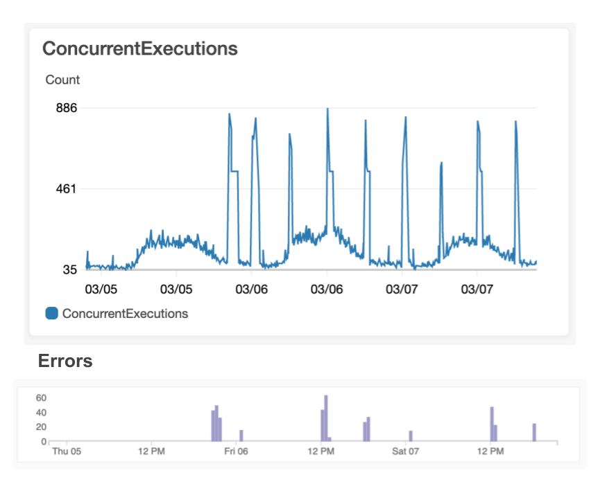
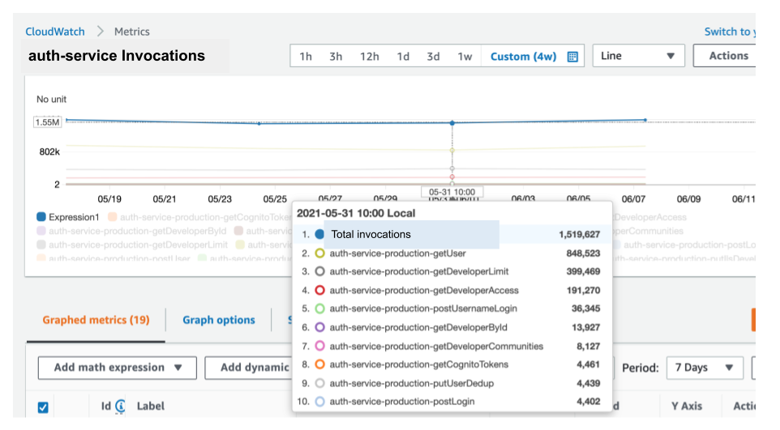
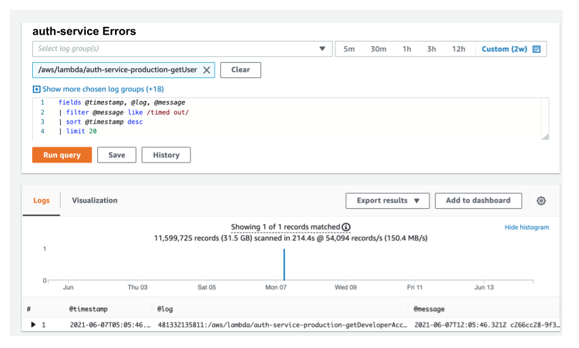

*The pitfalls of Lambda that made us switch away*


The views expressed in this post are my own and not necessarily those of my employer.


This is a story about how we migrated from Lambda to ECS because of a 2% error rate and limited concurrency controls. And, about how AWS has more recently fixed their error-rate issues and how enhancements to concurrency controls could win us back to Lambda.

When I first started at [Knock](https://www.knockcrm.com) in 2018, we were running our entire stack on AWS EC2 instances that we were manually managing.

As a result, it was painful to scale and maintain our infrastructure, and we were wasting money as we were unable to distribute our resource consumption. We were considering a managed container service like AWS Elastic Container Service (ECS) and AWS’s most recent serverless option, Lambda.

AWS claimed that Lambda was a reliable, feature-rich environment that abstracts away any notion of having to manage a server, and we were excited about the prospect of just being able to focus on the code.

Unfortunately, after a year of using Lambda in production, we observed Lambda was a relatively unreliable technology and when it was used to deliver customer-facing features, a 2% error rate in the AWS layer resulted in a very poor user experience. So, we decided to migrate some of our customer-facing Lambdas to ECS.

Before we dive into the details, I’d like to clarify that this post is not a hate letter to AWS about Lambda.

As you will read later, in 2020, AWS made improvements to Lambda networking, which has almost completely eroded the error rates we were seeing.

This leaves just the concern of concurrency, which is something that can be mitigated in certain use cases, but not all.

Because there is one shared concurrency pool for all your Lambdas, a burst of activity in any of your Lambdas can easily lead to significant throttling of mission-critical functionality, which results in an unacceptable user experience.

Overall, I’m hopeful that AWS will eventually enhance the concurrency model for Lambda and remain committed to the promise of a world where engineers spend less time managing servers.

## What Were We Running On Lambda?
Let’s start by describing the types of services we had running on Lambda, as after all, we can sometimes tolerate latency and failures in certain use cases.

The first class of services comprises a backend of RESTful APIs fronted by API Gateway and backed by a Lambda function for each route.

We had both Node.js (Typescript) and Python code running in this layer. Although the programming language choices here have little impact on what we discuss in this post, they do impact cost and overall Lambda concurrency and latency.

The main callout here is that most of these APIs were being called by frontends synchronously and thus, significant latency and failure is unacceptable as it manifests as downtime to the user.

The second class of services mostly consists of background tasks that read messages from SQS queues and then perform IO operations on RDS instances and S3 buckets.

In our case, nothing in this pipeline is too time-sensitive, so if these background tasks fail occasionally, a retry mechanism is enough to keep our system healthy and everyone happy.

## Up to 2% Error Rates in Lambda From 2019–2020
It wasn’t until we launched RESTful APIs in production that we began to notice that transient errors in the AWS layer were common for AWS Lambda. In particular, we started noticing errors in CloudWatch where a Lambda would timeout before it even ran any of our application-layer code. We knew the application code was not running as the very first thing our application code does is log the incoming request and these log statements from our application layer were missing. In other words, there was nothing that we could tune to prevent this from happening as the issue was occurring in the AWS layers. For example:


START RequestId: 56a12bf8–43eb-4b6c-8a20-c73fa2152c6b Version: $LATEST

**[Missing entries from application logs]**

END RequestId: 56a12bf8–43eb-4b6c-8a20-c73fa2152c6b

REPORT RequestId: 56a12bf8–43eb-4b6c-8a20-c73fa2152c6b Duration: 30019.42 ms Billed Duration: 30000 ms Memory Size: 1024 MB Max Memory Used: 77 MB

2019–08–22T20:10:31.270Z 56a12bf8–43eb-4b6c-8a20-c73fa2152c6b **Task timed out after 30.02 seconds**



On August 28th, 2019, We reached out to AWS via a support ticket and they confirmed that a 1–2% failure rate was somewhat normal:


START RequestId: 56a12bf8–43eb-4b6c-8a20-c73fa2152c6b Version: $LATEST
Just to summarize the conversation, we talked about a 1%-2% failure rate not being outside of the realm of possibility in spikes, and the recommended implementation is backoff and retry on the client side.


AWS recommended a retry mechanism, but in practice, the only way to detect these problems was by setting a more aggressive timeout and then retrying.

Some of our legacy code in the critical code path can take several seconds to run during heavy times of load and Lambda cold starts used to be fairly significant.

So, let’s say that we implemented a five-second timeout and then retried at this point. This would result in the user having to wait at least five seconds, which is unacceptable when it happens 2% of the time!

Moreover, our backend is distributed, and therefore operations are not always atomic, meaning that there would be an increased possibility of duplicate requests when aborting the Lambda invocation and retrying the request.

This was a major deal-breaker for us, so we decided to start migrating away from Lambda at the end of 2019.

## Shared Concurrency Leads To Throttled Execution and Frustrated Users
One could argue that the concurrency control capabilities of Lambda are severely lacking as there is a single per-region cap on Lambda currency per AWS account.

This means that any bursting Lambda activity can cause customer-facing Lambdas to be throttled. Here, I’m defining customer-facing Lambdas as those fielding synchronous requests from our users via a UI.

In other words, Lambda-powered background tasks can starve these customer-facing Lambdas and can essentially result in your app becoming unresponsive. This manifests as an outage to your users and is completely unacceptable when it occurs frequently.

As illustrated in the next set of graphs, you can see that spikes in customer-facing errors roughly correlate to the spikes in our account’s Lambda concurrency:

This cannot be easily prevented as there is a limit of 1,000 concurrent Lambdas on our account, and the only way to bound Lambda executions is by reserving part of this pool of 1,000. In other words, each time you reserve concurrency for a Lambda, you forever take away potential concurrency for your other Lambdas, resulting in an awkward juggling act where you have some Lambdas that are statically bounded and others that are not.

If you are familiar with AWS Elastic Container Service (ECS) or Elastic Kubernetes Service (EKS), you’ll know that it is fairly trivial to control the number of containers (worker pool) by scaling up or down the number of tasks running for a service. In other words, you have full control over how you allocate your resources and aren’t locked into a primitive per-function concurrency model — like you are with Lambda. In a later section in this post, we’ll investigate how I think AWS could improve its concurrency controls to facilitate better resource sharing.

Given Lambda’s basic concurrency controls, is there anything we can do to prevent throttling our user-facing Lambdas? Yes, you can:

1. temporarily constrain the concurrency of more Lambdas with reserved concurrency
2. file a request with AWS support to bump up your concurrency limit from 1,000
3. increase the batch size on your SQS reads to a maximum of 10. This means that it takes fewer Lambdas to service the same SQS traffic. Let’s just hope you structured your code to work this way before your Lambdas were throttled
4. set the reserved or provisioned concurrency for user-facing Lambdas. This is fine if you only have a few Lambdas, but if you have one for each RESTful API route, you could have hundreds of Lambdas and you’ll quickly get into a situation where you actually lock up all of your concurrency. For example, imagine you have just 10 Lambdas/routes and set the reserved concurrency at 20 for each of these Lambdas, resulting in a total reserved concurrency of 20 x 10 = 200 (recall you have a max of 1,000 for your entire AWS account). That number can quickly add up and what’s more is that each of these Lambdas is now bound to a max concurrency of 20, meaning that your user-facing Lambdas aren’t going to scale as your traffic increases, which is a big reason why you even use Lambda in the first place.
5. stand up a SQS queue in front of API endpoints for things that are resource-intensive and/or can be processed asynchronously, e.g., email sending and report generation. This allows the customer-facing Lambdas to complete their execution faster as the resource-intensive work is deferred. Although this is typically a good pattern as it reduces latency to your user, it’s not always enough to keep your Lambda concurrency low enough to prevent throttling and it may just increase the concurrency among your background tasks if you are using Lambda to run your background tasks.
6. Move your user-facing Lambdas to a different region so that you have access to a different concurrency pool of 1,000. This can greatly increase the complexity of your deployments and it may even mean that other services like Cognito, DynamoDB, SQS, etc., would need to be moved to another region.

A lot of these mitigations are good things to consider when using Lambda, but they don’t solve the root problem of very limited concurrency controls leading to throttling. If you use these mitigations, you’re basically just incurring tech debt that you’ll be on the hook for later.

Poor error rates and unavoidable throttling? These were both deal-breakers, so we had no choice but to migrate away from Lambda.

## Refactoring Our Code So That It Can Run On Both Lambda And ECS
Now that we had decided to migrate away from Lambda, we wondered if there was a way to make a minimal set of changes to our code so that it could also run in a Docker environment.

We chose AWS’s Elastic Container Service (ECS) to run our containers as it is relatively easy to manage and something that our DevOps team had the bandwidth to support. Fortunately, we noticed that the Lambda handlers we already implemented utilize a nice abstraction, which could be used to translate from a Docker-supported framework to a Lambda one and vice-versa. All we needed to do was create a wrapper that would:

1. translate the ExpressJS request payload to the *event* payload needed by the Lambda handler
2. translate the Lambda response to an ExpressJS response
3. use a wrapper that would allow us to reuse all our existing Lambda handler code and run it on top of the ExpressJS framework! We chose to go with ExpressJS to build the RESTful API as we were using Node.js and ExpressJS is a battle-tested framework. The following implementation is in JS but the pattern will work with any web framework and any programming language. (Our actual implementation is in TypeScript.)

Let’s take a look at some code to see how we did this. Consider a simplified version of a Lambda handler that implements a POST `/lead/:leadId` route, which accepts a JSON body of `{ name, email }`:



We created a `lambdaToExpress` function that translates from ExpressJS to Lambda and back again, using the following code:



Then, we registered our ExpressJS routes using our new wrapper. Here is its code:



With just a few lines of code, we enhanced our single codebase to support both Lambda and ExpressJS. One thing to note is that both the `lambdaToExpress` and handler functions are performing a `JSON.stringify()` and `JSON.parse()`, which adds a tiny bit of extra overhead. That being said, these operations are very quick and unnoticeable in the grand scheme of things.

The code was all set, but what about anything provided by AWS’s API Gateway?

As part of our API is external-facing, we needed to support rate-limiting. To achieve this, we incorporated [node-rate-limiter-flexible](https://github.com/animir/node-rate-limiter-flexible/wiki/Overall-example#authorized-and-not-authorized-users) (backed by ElasticCache) to implement rate-limiting. And, we simply added this rate-limiting check to our lambdaToExpress wrapper to implement this in a single place.

We were using the [Serverless Framework](https://www.serverless.com) to deploy our Lambdas, and you could probably use this framework to deploy code to ECS, but we find [Terraform](https://www.terraform.io) to be a slightly more versatile tool for configuring non-serverless infrastructure and were already using Terraform to deploy other microservices.

So, we created [Terraform Modules](https://www.terraform.io/docs/language/modules/develop/index.html) alongside our `serverless.yml` configuration and deployed them with [Jenkinsfiles](https://www.jenkins.io/doc/book/pipeline/jenkinsfile/).

And now, we were running on ECS!

We have been happily running a portion of our RESTful API backend on AWS Lambda for over a year and have found that we have reduced our compute costs by 90%! In a future post, I’ll dive into a cost comparison between Lambda and ECS.

## Lambda Reduced Its Error Rate From 2% To 0.0000625%
If you recall from earlier, in August 2019, we found that AWS Lambda could suffer from an error rate of up to 2%!

In September 2019, AWS released a blob post touting [improvements to networking for Lambda](https://aws.amazon.com/blogs/compute/announcing-improved-vpc-networking-for-aws-lambda-functions/) that would reduce latency incurred with cold starts. We were very excited about this news as it meant that AWS had acknowledged the problem and was actively working on a fix.

We had migrated some of our backends from Lambda to ECS but had a lot of remaining functionality on Lambda.

In 2021, we performed another analysis and found that the latest version of Lambda was resulting in an error rate of only 0.0000625%. This is a significant improvement from 2%!

Here is the analysis we did for our auth-service, a RESTful API responsible for authentication and authorization functionality in our system. In a seven-day period, the auth-service had about 1.6 million invocations and only one resulted in a timeout.

With error rates as low as this, our error rate concern with user-facing Lambdas has been eliminated! But what about the lingering concern with concurrency controls?

## How Could AWS Improve Its Concurrency Controls?
If you recall, we ended up performing many of the concurrency mitigations mentioned above and moved a number of our Lambdas to ECS.

Afterward, we were left with a relatively comfortable set of about 200 Lambdas, and as a result, bursting concurrency is now less of a concern.

That being said, we now avoid using Lambda for any new user-facing services. And, we generally avoid using it for substantial background jobs as we are worried that excessive use will result in throttling our few remaining user-facing Lambdas.

Despite this current strategy, I’m hoping the day will come when AWS implements a more feature-rich implementation of Lambda concurrency controls that better mimics that of an ECS environment. Here are some enhancements that would make a huge difference.

### Max Concurrency
Let’s define the Max Concurrency of a Lambda as a setting for the max concurrent invocations of a specific Lambda. This value is **not** the same as Reserved Concurrency in that the value of Max Concurrency wouldn’t subtract from the overall concurrency available for the AWS account.

Here’s an example: assume Lambda A has a Max Concurrency of 100 and your account has a global max concurrency of 1,000 (the AWS default).

Lambda A would not be throttled until there are over 100 instances of Lambda A running concurrently. Other Lambdas, e.g., Lambda B/C, can still consume up to 1,000 instances, if Lambda A has 0 running instances.

This in essence means that no matter what, Lambda A cannot consume more than 100 instances of the total 1,000, but doesn’t require us to set aside 100 instances from our total 1,000 for Lambda A.

This setting is somewhat akin to having an ECS service that can burst to an upper bound of max tasks but doesn’t require us to reserve a portion of our cluster, even if that service is not running all the instances.

### Group Max Concurrency
We consider a service to be a group of related Lambdas. For example, consider 10 Lambdas that comprise 10 RESTful endpoints of a service. Or, 10 Lambdas that define the workers of an ETL pipeline. Often, we’d like to define an upper bound on concurrency for a group of Lambdas, e.g., we don’t want our ETL pipeline to consume more than 100 out of our total of 1,000 current Lambda invocations.

A Group Max Concurrency could effectively be accomplished by first allowing you to tag Lambdas to be part of a group. Second, you could then set the Group Max Concurrency for that group. Or AWS could even reuse the concept of a “stack” and have a Stack Max Concurrency.

This Group Max Concurrency is similar to how you may have an ECS service where each container is performing multiple (a group of) operations, e.g., a web server fielding requests for multiple RESTful API endpoints.

### Ability to increase account-wide Max Concurrency without contacting AWS support
Some will point out that you can always increase your total Lambda concurrency just by contacting AWS support.

In fact, we actually did this to bump our *Full account concurrency* from 1,000 to 2,000. AWS support was pretty amenable to this, but it took a couple of days for them to make the change and we needed to provide justification.

All the while, our user-facing Lambdas were throttled, and our users were upset. I’ve even heard of companies being able to get AWS to increase their max concurrency to hundreds of thousands of Lambdas.

That’s great, but why is special approval even needed? Isn’t the fact that a company is willing to pay for the increased usage enough?

To compare with ECS, this max-concurrency-per-account setting is similar to how you can easily customize the number of nodes in an ECS cluster, which effectively defines a max number of ECS tasks that can be run concurrently.

And of course, ECS has autoscaling capabilities that allow you to scale your cluster based on your own needs. None of this scaling requires any special approval from AWS.

If AWS were able to implement these controls, it would bring AWS Lambda’s concurrency controls to parity with those of ECS and EKS, and I’d once again advocate for using Lambda in many more areas of our system.

## When Does Lambda Shine?
Even with its limited concurrency controls, Lambda shines in the following areas:

1. For background tasks, *e.g.*, ones that read off SQS. Sure, you can stand up something like [celery](https://docs.celeryproject.org/en/stable/) or [bull](https://github.com/OptimalBits/bull) to get something similar, but wiring up a Lambda to an SQS queue or one of the many other AWS triggers, is such a beautifully simple thing. Note: Lambda has a max timeout of 15 minutes, so it is only suitable for running relatively quick tasks.
2. When you have other Lambdas that don’t burst to consume all of the available concurrency, such as when you have a relatively small amount of Lambda activity.
3. When you wish to optimize autoscaling so that you only pay for what you use. Lambda automatically scales up and down at the single invocation layer so that you can save a ton of money during low traffic periods
4. As a place to run your code without the need to manage infrastructure

## Conclusion
The promise of serverless — where developers don’t need to manage infrastructure — is very compelling, and I don’t want to let this dream die.

AWS has fixed its error-rate problem with Lambdas, but Lambda is still lacking better concurrency controls.

Until these concurrency controls are enhanced, you’ll probably want to use ECS or EKS for your user-facing services, if your Lambda usage is significant and will lead to throttling.

I suspect that AWS will continue to evolve the Lambda technology to the point where it becomes a strong alternative to ECS and when it does, I’ll once again tout the virtues of using Lambda everywhere.

