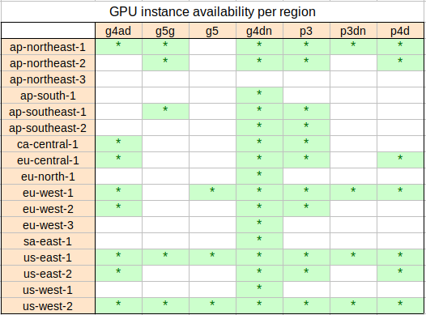
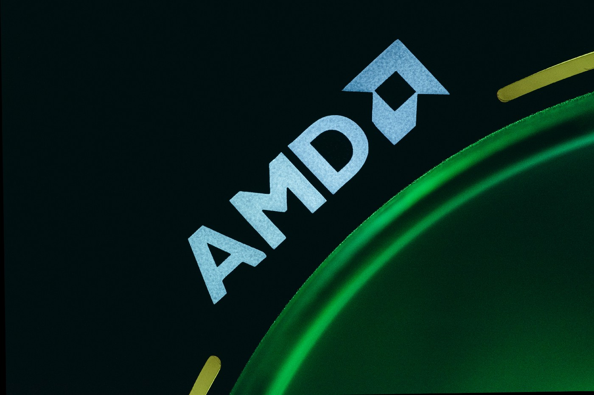
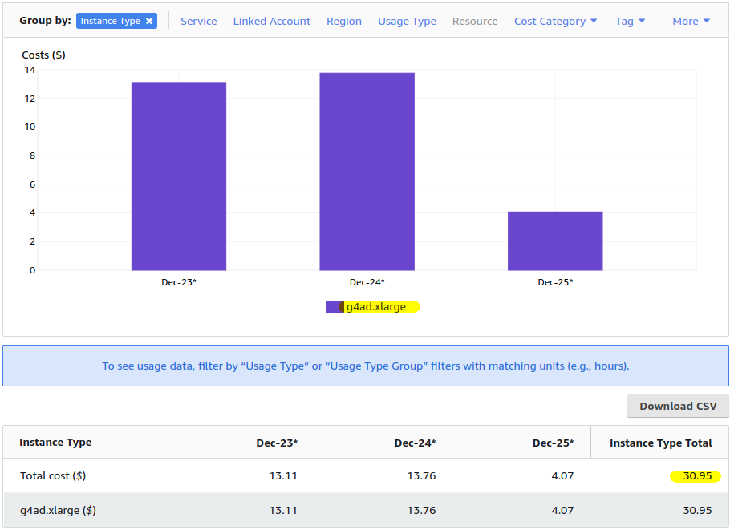
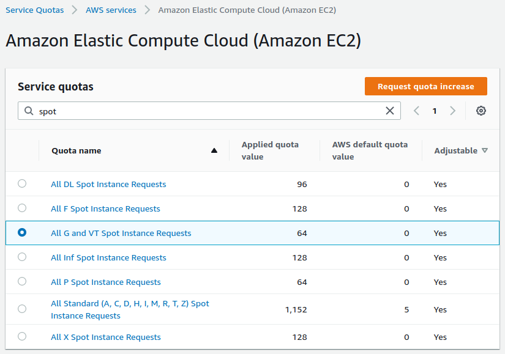
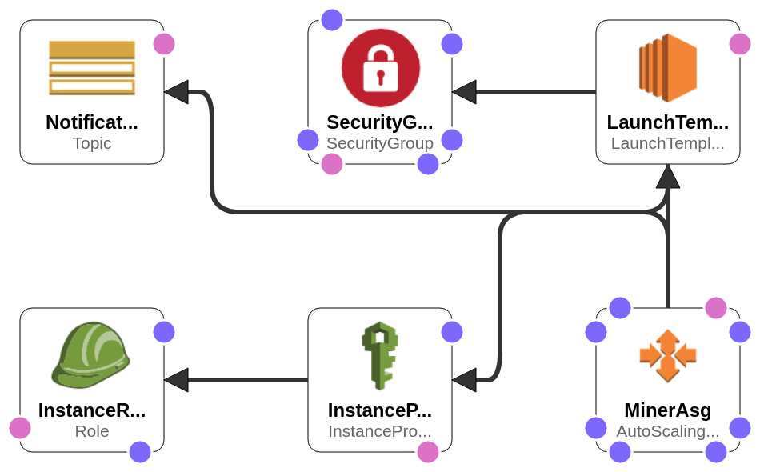

 *Mining Ethereum on AWS until now wasn’t profitable. This new AWS instance is the game changer that not only breaks even but can finally make you money!*

 

 Ever since I wrote my first article about [Ethereum and Bitcoin mining on AWS](https://michael-ludvig.medium.com/mining-bitcoin-and-other-crypto-on-aws-eb172940059f) more than a year ago I was bombarded over and over again with the same sort of questions :

 * Is it profitable now that the ETH price has increased?
 * … that this new AWS instance type was released?
 * … that this new coin is the hype of the day?

 So far the answer was always a NO. The profitability has gradually improved from some $20 mined in ETH for every $100 spent on AWS services [a year ago](https://michael-ludvig.medium.com/mining-bitcoin-and-other-crypto-on-aws-eb172940059f), to $60 or $65 in ETH for the same $100 AWS spent [a month ago](https://michael-ludvig.medium.com/mining-ethereum-on-aws-is-it-worth-it-f13645c12eec). You would still be losing money though.

 Until now. Let me introduce you two new GPU-enabled EC2 instances, one of which finally changes the game. It took me some time to benchmark them because they are not the typical some-kind-of NVIDIA GPU in some-kind-of Intel CPU platform that we have seen so far in the form of p3.2xlarge, g4dn.xlarge, or as the newer g5.xlarge instances. Nope, these two that we are going to benchmark today are completely different and need a different setup. That’s why it took me a bit longer to get report on them.

 *You can also try [Quicknode](https://www.quicknode.com) if you are looking for Ethereum APIs.*

## TL;DR — for the impatient
 Here is the most recent hashrate chart, updated with the g4ad.xlarge and g5g.xlarge instances discussed in this post.

 

 Right now the _most cost efficient_ EC2 instance for ETH mining is **g4ad.xlarge** at a spot price in one of the US regions. You can actually *make money* with it — the cost of running g4ad.xlarge *can be* slightly lower than the value of the mined ETH. That means profit!

## Launch Stack
 Read below for details or **start mining** by launching the Ethminer CloudFormation template in [us-east-1](https://console.aws.amazon.com/cloudformation/home?region=us-east-1#/stacks/new?stackName=ethminer&templateURL=https://s3.us-west-2.amazonaws.com/cnl4uehyq6/ethminer/template-eth-default-vpc.yml), [us-east-2](https://console.aws.amazon.com/cloudformation/home?region=us-east-2#/stacks/new?stackName=ethminer&templateURL=https://s3.us-west-2.amazonaws.com/cnl4uehyq6/ethminer/template-eth-default-vpc.yml), or [us-west-2](https://console.aws.amazon.com/cloudformation/home?region=us-west-2#/stacks/new?stackName=ethminer&templateURL=https://s3.us-west-2.amazonaws.com/cnl4uehyq6/ethminer/template-eth-default-vpc.yml). For any other region go to my [AWS Ethereum Miner GitHub repo](https://github.com/lorezyra/aws-ethereum-miner) and download the CloudFormation templates from there.

 To choose your AWS region consult this table:

 

## G5g instances — mining on ARM64 / Graviton2
 G5g instances offer NVIDIA T4g GPU on AWS Graviton2 platform. Graviton2 is Amazon’s own CPU based on the ARM64 architecture — you may have already used T4g, M6g, or R6g EC2 instances and RDS databases sporting these processors. They are typically about 20% *faster* than the comparable Intel instances, while also about 20% *cheaper*. You should check them out for your general purpose AWS computing if you haven’t already.

 The downside of Graviton2 is that it’s not binary compatible with the usual Intel or AMD EC2s — the OS and the apps must be compiled for the ARM instruction set. However the end-users such as you or me do not necessarily need to care much. The official Amazon Linux 2, Ubuntu, RedHat Linux as well as many other Linux distros have AMIs already available for ARM64 (aka AARCH64) and almost all the open source applications like Apache, Java, Python, PHP, or, yes — ethminer — look and feel just the same when running on ARM. You won’t notice the difference, except that you’ll be paying less. Also note that you can’t run Windows on Graviton2. Yet. But who cares about Windows.

 Conveniently NVIDIA provides their [CUDA runtime](https://developer.nvidia.com/cuda-downloads) for ARM64 Ubuntu, AWS provides an Ubuntu AMI for ARM64 instances and I have also found an ARM64 version of the venerable [ethminer](https://github.com/obykk/ethminer/releases/tag/v0.19.0-cuda). The last step is updating the [CloudFormation template](https://github.com/mludvig/aws-ethereum-miner) — some changes were needed to support two different CPU architectures but nothing too difficult. Looks like we’re good to go!

 The measured hashrate of the **g5g.xlarge** instaces is comparable to that of the **g4dn.xlarge** instance [benchmarked last year](https://michael-ludvig.medium.com/mining-bitcoin-and-other-crypto-on-aws-eb172940059f) because of the similar NVIDIA Tesla T4 / T4g GPU. They both do **roughly 25 MH/s** (Mega Hashes per Second).

 Although the performance is the same the G5g price is much lower — g5g.xlarge costs $0.1260/hr on spot compared to $0.1578/hr for g4dn.xlarge. That makes the new instances about 20% _more cost efficient_ compared to g4dn.xlarge. Unfortunately that’s still not enough to break even. As of now you may expect a little over $70 mined in ETH for every $100 spent in AWS costs when using g5g.xlarge.

 On the positive side these instances are right now readily available at the spot price unlike many other GPU instances. Apparently the users are slow to switch to a completely different CPU architecture. Take advantage of that before they wake up :)

 Also note that only g5g.xlarge make sense. Most of the bigger ones (g5g.2xlarge, and up) still have only 1 GPU while the price keeps going up due to more RAM and CPU cores which we don’t need. The first instance with 2 GPUs is g5g.16xlarge but at $0.8232/hr it’s far too expensive for our needs.

 

## g4ad.xlarge — yay, finally getting rich!!
 Again, this is a completely different platform from the ones that we have discussed before. While the CPU is an unexciting [AMD Epyc](https://aws.amazon.com/ec2/amd/) that have been seen in the T3a, M5a or M6a before, the GPU here is [AMD Radeon Pro V520](https://aws.amazon.com/about-aws/whats-new/2021/07/introducing-new-amazon-ec2-g4ad-instance-sizes/). Long story short it clocks around 48 MH/s at the spot price as low as $0.1136. That’s faster and cheaper than the above g5g.xlarge! In fact it’s so fast and cheap that [it _is_ profitable](https://aws.amazon.com/about-aws/whats-new/2021/07/introducing-new-amazon-ec2-g4ad-instance-sizes/).

 To make sure that I’m not dreaming I ran 5 of these instances for just over 2 days and mined into a new Ethereum wallet to have a clean picture of the results.

 * AWS cost: $30.95
 * ETH mined: 0.00820 worth $33.36 at that time

 That means **$108 in ETH for $100 spent** on AWS costs!

## That. Is. Brilliant! ETH mining on AWS finally makes some sense.
 Bear in mind that the spot prices fluctuate, that you may not be able to get g4ad instances due to a high demand, and that the ETH price and the Ethereum network difficulty are volatile like everything in crypto. The profit margin is thin but right now it works.

 

 On Dec 24 the instances ran for the whole day. Therefore we can calculate the effective spot price: $13.76 per day / 5 instances / 24 hours = **$0.1147/hr** per instance. Slightly above the rock bottom $0.1136 but still profitable.

## How do I start mining?
 I have covered that in details in my previous articles. I suggest you check them out…


 

 
 

 To recap you will need:

 * **Ethereum web wallet** — I recommend [MetaMask](https://metamask.io) as it allows you to easily change the payout settings at the Ethermine mining pool. If you don’t know what a mining pool is head over to my first article linked above that explains it.
 * Your **Ethereum wallet address** — that’s where the mined ETH will be sent from the pool. Once they’re in your wallet they are truly yours.
 * **AWS account** with high enough **service limits** to start “G spot instances”, that is g4ad, g5g, g5 or g4dn and eventually also “P spot instances” for running p3 or p3dn instances.

 Request the service limit increase through _Service Quotas_ -> _AWS Services_ -> _Amazon Elastic Compute Cloud (Amazon EC2)_ in each region where you’re planning to run the miners.

 

 If your account is new, *request a small increase first*. For example, 4 or 8 vCPUs in *one* region then use it for a while and then request some more. You’re not likely to get an approval for a high increase without a history of using them!



Note that both g4ad.xlarge and g5g.xlarge have 4 vCPUs, therefore a limit of 8 vCPUs will let you start 2 mining instances.



## Deploy the ETH miner CloudFormation stack
 With these pre-requisites out of the way go ahead and start mining. Choose a region that offers the required instance types and deploy the ready to go CloudFormation template from my [AWS Ethereum Miner GitHub project](https://github.com/lorezyra/aws-ethereum-miner). The template is “intelligent” enough to figure out what instance types are available in each region, what are their spot prices and which one is the most cost effective to run.

 



Typically the old US regions — Ohio, N. Virginia and Oregon — are the cheapest.



 Login to your AWS account and launch the miner in one of the regions where g4ad.xlarge is offered:

 * [us-east-1](https://console.aws.amazon.com/cloudformation/home?region=us-east-1#/stacks/new?stackName=ethminer&templateURL=https://s3.us-west-2.amazonaws.com/cnl4uehyq6/ethminer/template-eth-default-vpc.yml) (N. Virginia)
 * [us-east-2](https://console.aws.amazon.com/cloudformation/home?region=us-east-2#/stacks/new?stackName=ethminer&templateURL=https://s3.us-west-2.amazonaws.com/cnl4uehyq6/ethminer/template-eth-default-vpc.yml) (Ohio)
 * [us-west-2](https://console.aws.amazon.com/cloudformation/home?region=us-west-2#/stacks/new?stackName=ethminer&templateURL=https://s3.us-west-2.amazonaws.com/cnl4uehyq6/ethminer/template-eth-default-vpc.yml) (Oregon)
 * [eu-west-1](https://console.aws.amazon.com/cloudformation/home?region=eu-west-1#/stacks/new?stackName=ethminer&templateURL=https://s3.us-west-2.amazonaws.com/cnl4uehyq6/ethminer/template-eth-default-vpc.yml) (Ireland)
 * [eu-west-2](https://console.aws.amazon.com/cloudformation/home?region=eu-west-2#/stacks/new?stackName=ethminer&templateURL=https://s3.us-west-2.amazonaws.com/cnl4uehyq6/ethminer/template-eth-default-vpc.yml) (London)
 * [eu-central-1](https://console.aws.amazon.com/cloudformation/home?region=eu-central-1#/stacks/new?stackName=ethminer&templateURL=https://s3.us-west-2.amazonaws.com/cnl4uehyq6/ethminer/template-eth-default-vpc.yml) (Frankfurt)
 * [ca-central-1](https://console.aws.amazon.com/cloudformation/home?region=ca-central-1#/stacks/new?stackName=ethminer&templateURL=https://s3.us-west-2.amazonaws.com/cnl4uehyq6/ethminer/template-eth-default-vpc.yml) (Canada)
 * [ap-northeast-1](https://console.aws.amazon.com/cloudformation/home?region=ap-northeast-1#/stacks/new?stackName=ethminer&templateURL=https://s3.us-west-2.amazonaws.com/cnl4uehyq6/ethminer/template-eth-default-vpc.yml) (Tokyo)

 

 You can set the required *hashrate*, choose the desired *instance types* and of course set your *Ethereum wallet address*.

 Once the stack is created navigate to its *Outputs* to find the link to your Ethermine dashboard. Be patient — the miner stats may take around 15 to 20 minutes to appear and another hour or more to ramp up. You should mine for *at least 6 to 12 hours* to receive some meaningful results.

 ## Instance and access
 To get the most out of the GPU-enabled instances we’ll use “[Deep Learning AMI (Ubuntu 18.04) Version 52.0](https://aws.amazon.com/machine-learning/amis/)” that comes with all the necessary NVIDIA drivers preconfigured. That will save us a lot of setup work.

 Also in line with the best practices, we won’t configure SSH access. Instead, use [SSM Session Manager](https://aws.nz/best-practice/ssm-session-manager/) for interactive access to the instances using a web-based shell session. Or use the super-convenient command-line tool [`ssm-session`](https://aws.nz/projects/ssm-session/) for accessing the instance from a Linux or Mac shell.

 Once we’ve got access to the instance we can, for example, check out the miner log with `tail -f /tmp/ethminer.log` and verify the hash rate.

 **Happy mining!**
