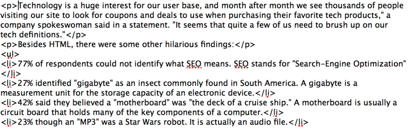



Nice... Please don't infect me with _your_ HTML!!! ;)


 

 If you’re talking tech with Americans, you may want to avoid using any jargon.

 A recent study found that many Americans are lost when it comes to tech-related terms, with 11% in a survey saying that they thought HTML — a language that is used to create websites — was a sexually transmitted disease.

 The study was conducted by [Vouchercloud.net](https://www.vouchercloud.net/), a coupons website, as a way to determine how knowledgeable users are when it comes to tech terms.

 “Technology is a huge interest for our user base, and month after month we see thousands of people visiting our site to look for coupons and deals to use when purchasing their favorite tech products,” a company spokeswoman said in a statement. “It seems that quite a few of us need to brush up on our tech definitions.”

 Besides HTML, there were some other amusing findings:

 * 77% of respondents could not identify what SEO means. SEO stands for “Search-Engine Optimization”
 * 27% identified “gigabyte” as an insect commonly found in South America. A gigabyte is a measurement unit for the storage capacity of an electronic device.
 * 42% said they believed a “motherboard” was “the deck of a cruise ship.” A motherboard is usually a circuit board that holds many of the key components of a computer.
 * 23% thought an “MP3" was a “Star Wars” robot. It is actually an audio file.
 * 18% identified “Blu-ray” as a marine animal. It is a disc format typically used to store high-definition videos.
 * 15% said they believed “software” is comfortable clothing. Software is a general term for computer programs.
 * 12% said “USB” is the acronym for a European country. In fact, USB is a type of connector.

 Despite the incorrect answers, 61% of the respondents said it is important to have a good knowledge of technology in this day and age.

 The study involved 2,392 men and women 18 years of age or older. The participants were not told that the study was specifically looking into their knowledge of tech terms. They were presented with both tech and non-tech terms and were asked to choose from three possible definitions.

 “Hence why a mix of both normal and technology-related words were used,” the company said in a statement.

 [**Updated 9:40 a.m. PST, March 5**: The origin and veracity of the survey have come under question by a [journalism ethics website](https://www.imediaethics.org/News/4422/Latimes__time__buzzfeed_cite_poll_10_america_thinks_html_is_a_std.php). The firm that conducted the survey, 10 Yetis Public Relations, said it stands by its work and has provided the [full survey results](https://drive.google.com/file/d/0B9HJeR-F9NIeczNDb2hVb2p6UTQ/edit?usp=sharing).

 The survey is “100% genuine, and it’s a valid survey,” said Leanne Thomas, a senior account executive for 10 Yetis Public Relations.

 Thomas said the survey was conducted over email over the course of seven days. She said participants of the survey were given no incentive to respond.]