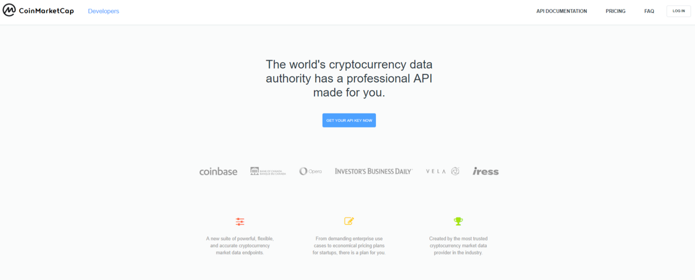
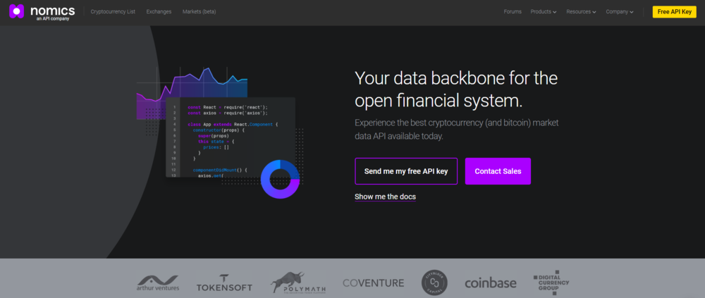
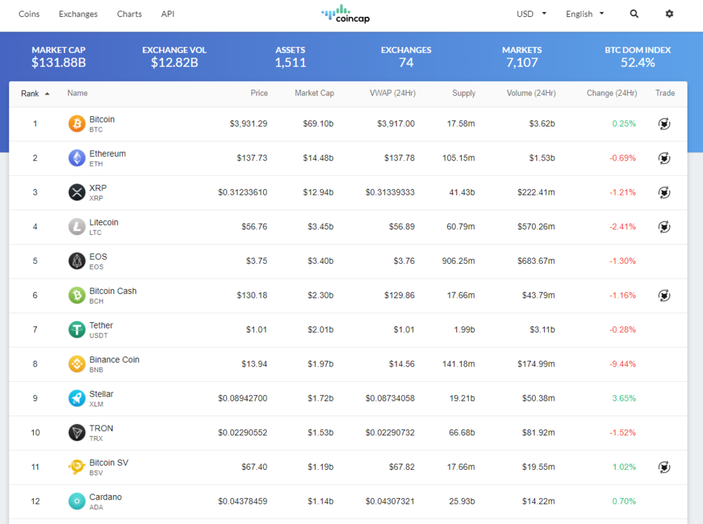
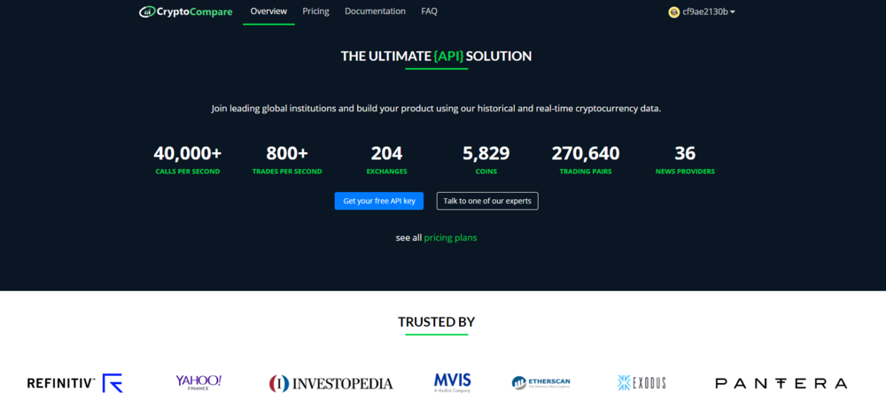
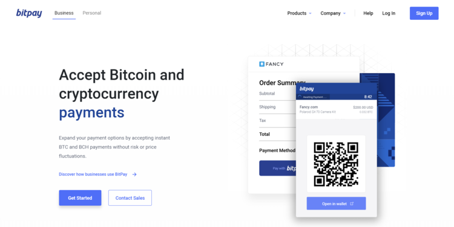
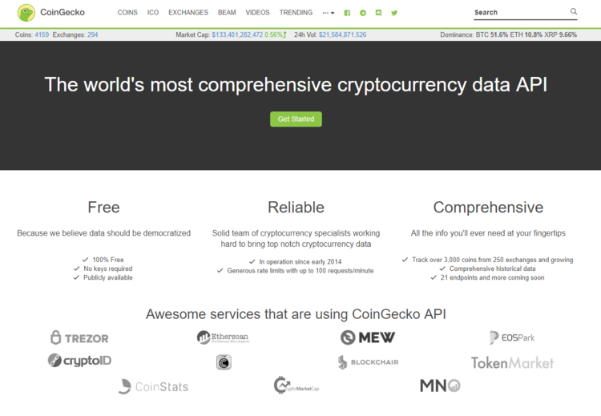
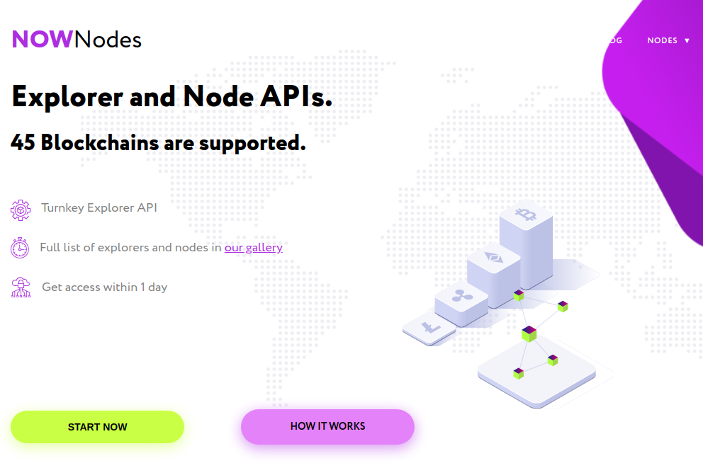

 

 Bitcoin recently marked its 10th anniversary on January 3, 2019, a full decade since the genesis block was mined by Satoshi Nakamoto back in 2009. The beginning years of Bitcoin history flew under the radar for most people, aside from the most passionate individuals in the crypto community.

 While infrastructure development was slow to start, the bull run of 2017 brought a new wave of products onto the crypto scene. Today, development in crypto is at an all-time high, with new developers flocking from other industries in search of a “crypto gold rush”.

 [Feeling the itch to develop your own crypto application?](https://blog.goodaudience.com/8-things-you-can-build-with-the-shrimpy-universal-exchange-apis-b4cd8ae3bc56) Whether you’re a cryptocurrency developer, trader, or just passionate about all things crypto, there are APIs available that are designed to make your crypto journey smoother. Whether you want to develop a personal trading bot, a payments application, or business settlement solution, there are APIs that can help you get started.

 Let’s explore some of the best crypto APIs in market.

## CryptoAPIs

 

 The upgraded version 2.0 of Crypto APIs includes a powerful product suite consisting of Wallet as a Service, Blockchain Data, Blockchain Events, Blockchain Tools, Blockchain Automations and Market Data.

 The infrastructure layer utilizes Kubernetes and the OpenAPI 3.0 specification, making it easy to scale and customize. Using a single point of integration, customers can get access to over 170 endpoints connected with top blockchain protocols. Developers can choose between 9 SDK libraries in their preferred language and add the integration to their system.

 The pricing options are usage-based, so you can always upgrade your plan if you need to serve higher demand or scale fast. Using Crypto APIs Wallet as a Service product can also save you up to 90% on transaction network fees.



 Use the coupon ~~GET30~~ to get a 30% off for new subscriptions.



## Bitquery

 

 

 [Bitquery](https://bitquery.io) provides blockchain data APIs for more than 20 blockchains. These APIs are built using GraphQL technology, therefore, you can access data across blockchains using a single [GraphQL endpoint](https://graphql.bitquery.io). In addition, you can write GraphQL queries to get specific data based on your need.

 Besides, Bitquery’s [Coinpath APIs](https://bitquery.io/products/coinpath) are build to track blockchain money flow and can be used for building [crypto compliance](https://bitquery.io/products/coinpath) or surveillance solutions.

 Also Read: 
 

 
## Coin API

 

 

 [CoinAPI](https://www.coinapi.io) is a service provider that is solely focused on providing price and market data. With over 20TB of raw market data in its database, CoinAPI has a reputable name for high-quality crypto data in the market.
 
 CoinAPI provides real-time data streaming services and a database of historical market data. CoinAPI has servers located all around the world, designed to transfer data reliably and quickly.

## CoinMarketCap API

 
 
 

 [CoinMarketCap](https://coinmarketcap.com) is a website that tracks exchange and liquidity markets for a variety of cryptocurrencies and digital assets. As one of the most well-known resources in the crypto space, CoinMarketCap is a top data aggregator when it comes to tracking crypto markets. CoinMarketCap also has a professional API for traders and developers that includes complete historic cryptocurrency market data since 2013.
 
 CoinMarketCap API has a limited free plan that quickly increases in price based on the number of monthly call credits.

## Nomics API

 

 

 [Nomics](https://nomics.com) is a Bitcoin and cryptocurrency data API with the functional purpose of becoming “**the data backbone for developers and professional crypto investors.**” Nomics’ API was built upon its core product of **archiving**, **aggregating**, and **analyzing** complete crypto asset data.

 Nomics’ API is a great resource for traders, quants, and hedge fund managers as it provides detailed raw trade data, but can be quite expensive for small teams and independent developers in search of an affordable data provider.

## Coincap.io API

 

 

 [CoinCap](https://coincap.io) is a tool that collects real-time pricing and market activity for over 1,000 cryptocurrencies, with the goal of providing transparent and accurate data on digital asset markets. Created by the ShapeShift team, CoinCap API is free for all users.

 CoinCap API functions well as a free API for aggregating real-time prices and markets but can fall short as a solution that requires accurate historical data, such as backtesting portfolio strategies.

## Wyre

 

 

 [Wyre](https://www.sendwyre.com) provides crypto apps and services with a regulated and compliant fiat-to-crypto on-ramp. Wyre API is a simple integrated payment solution for crypto startups looking to implement crypto as a payment method, rather than traditional payment methods.

## CryptoCompare API

 

 

 [CryptoCompare](https://www.cryptocompare.com) is used by a wide range of businesses, investment institutions, and crypto companies. CryptoCompare includes a variety of data from market, trade, blockchain, and social sources.

 CryptoCompare’s API provides highly reliable and scalable endpoints, reaching 180 million requests per hour at peak times and collecting 800+ trades per second. Their global data centers support over 30k clients.

## BitPay

 

 

 [BitPay](https://bitpay.com) is a Bitcoin and cryptocurrency payment processor that enables merchants and consumers to instantly accept cryptocurrency as payment without risk or price fluctuations. Currently, credit cards can charge up to 3% in processing fees on every transaction. Compared to credit cards, BitPay only charges a flat 1% settlement fee for crypto-to-fiat bank conversion. Furthermore, traditional payment methods require customers to provide sensitive personal information that could lead to fraud and identity theft.

 The BitPay API can be used to create and manage invoices, issue refunds, manage bills, retrieve real-time rates information, view merchant ledger entries, and much more.

## CoinGecko

 

 

 [CoinGecko](https://www.coingecko.com/en)’s mission is to empower crypto users and help them gain a better understanding of fundamental factors that drive the market. In addition to crypto prices, trading volume, and market capitalization, CoinGecko also measures community growth, open-source code development, events and on-chain metrics for a complete analysis beyond just technical indicators. Operating since 2014, CoinGecko is one of the largest crypto data providers, tracking nearly 3,300 tokens from more than 260 cryptocurrency exchanges.

 CoinGecko is a free-to-use API that provides access to data such as live pricing, trading volume, tickers, exchanges, and historical data. The API also provides non-market data such as images, development & social community statistics, events, global markets, and exchange status updates.

## NOWNodes

 

 

 NOWNodes provides access to Explorer and Node APIs. 40+ most popular blockchain networks connected. With NOWNodes you can:

 * add new blockchain networks, coins, and tokens;
 * get a handy backup solution to maintain the network smooth work & quality of service;
 * concentrate on product development while reducing infrastructure costs.

 The service has a Free plan for up to 20,000 requests per day for any supported network.

 You can start working with blockchain nodes using NOWNodes,free plan is available.

## Also, Read













