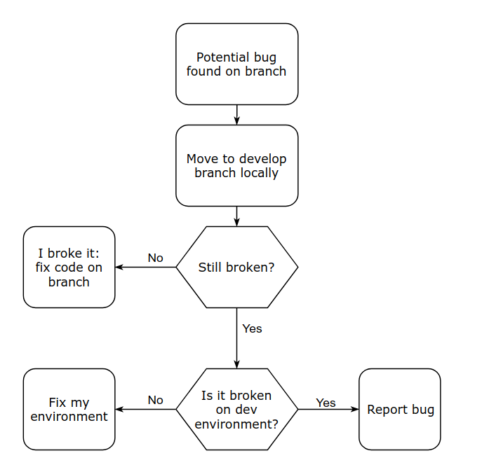
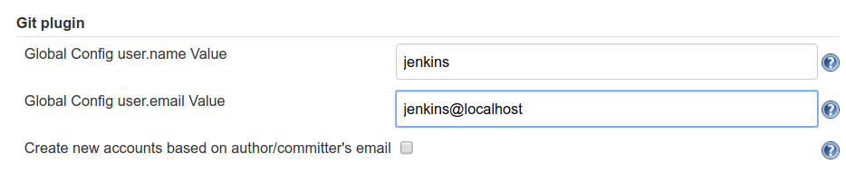
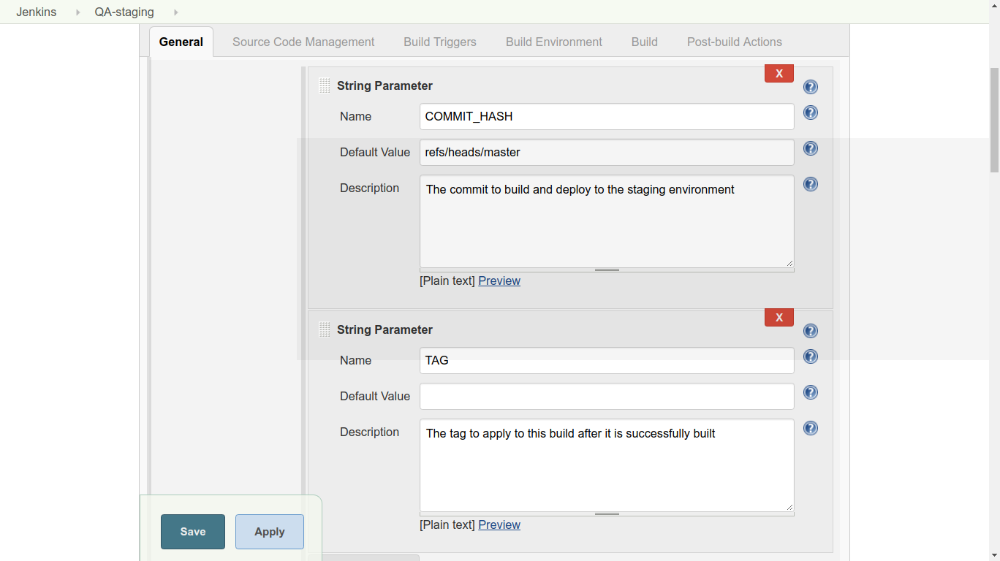
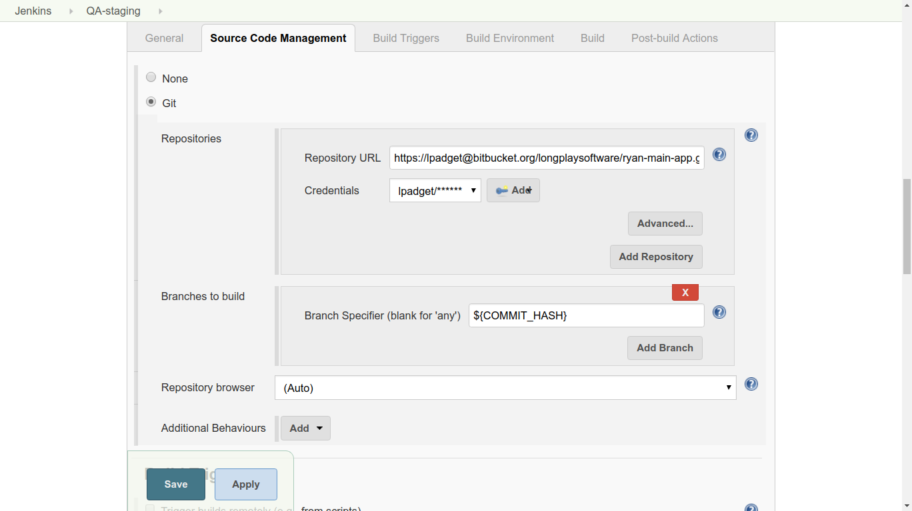
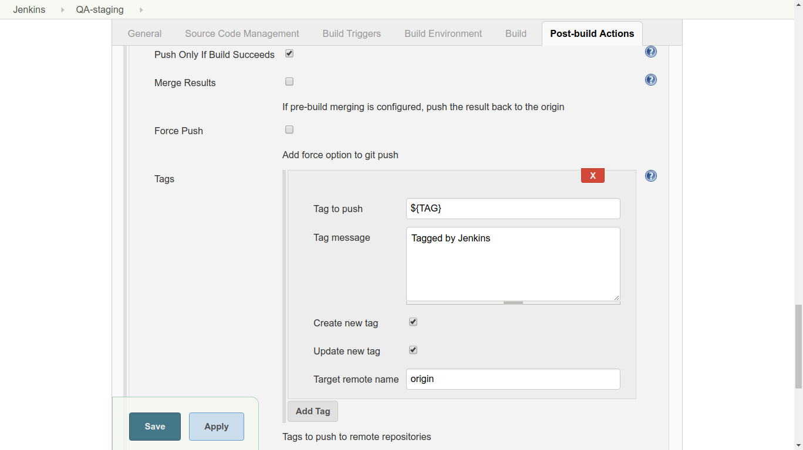
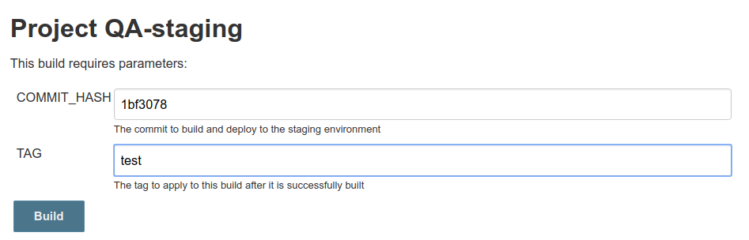
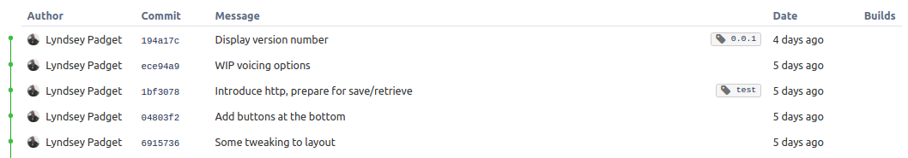

## Building a Continuous Delivery Pipeline with Git & Jenkins
 [Jenkins](https://jenkins.io/) is an automation server which can be used to build, test and deploy your code in a controlled and predictable way. It is arguably the most popular continuous integration tool in use today. The process of automatically building code in stages – and at each stage, testing and promoting it on to the next stage – is called a pipeline.

 Jenkins is open source and has an extensive library of well-supported plugins. Not only is Jenkins cross-platform (Win/Mac/Linux), but it can also be installed via [Docker](https://docs.docker.com/engine/docker-overview/), or actually on any machine with a Java Runtime Environment! (Raspberry Pi with a side of Jenkins, anyone?)

 Note that there are other continuous integration tools available, including the ones described in [this article](https://stackify.com/jenkins-teamcity-bamboo/), as well as my personal favorite, [Travis](https://travis-ci.org/). However, because Jenkins is so common, I want to explore a pattern that often becomes needlessly overcomplicated – setting up a staging pipeline (dev => QA => prod) using a Git repository.

 Also note that Jenkins has its own “pipeline” concept (formerly known as “workflows”) that are for long-running, complicated build tasks spanning multiple build slaves. This article strives to keep things as simple as possible using backwards-compatible freestyle jobs. The idea is to use the power and simplicity of Git rather than introduce complexity from – and coupling to – Jenkins.

## Review your Git Workflow
 The power of using Git for source control management is most realized when working on a team. Still, I recommend using Git for projects where you are the sole contributor, as it makes future potential collaboration easier – not to mention preserving a thorough and well-organized history of the project with every cloned instance of the repository.

 For the purpose of the example we’ll explore here, consider a typical team of 3-8 regular code contributors working in a single Git repository. If you have more than 8 developers on one project, you may want to consider breaking the application into smaller, responsibility-driven repositories.

 A common Git workflow in use today is [Vincent Driessen’s “GitFlow”](http://nvie.com/posts/a-successful-git-branching-model/), consisting of a master branch, a develop branch, and some fluctuating number of feature, release, and hotfix branches. When I’m working alone on a personal project, I often commit straight to the master branch. But on a large professional endeavor, GitFlow is used to help the code “flow” into the appropriate places at the appropriate times. You can see how Git branches are related to continuous integration and release management in general.

## What is the Goal of a Staging Pipeline?
 Nearly every team I’ve worked on uses some variation of a staging pipeline, but surprisingly, no one ever really asks this question. It just feels like something we do because, well, it’s the way it’s *supposed* to be done.

 So what is the goal, anyway? In most cases, a staging pipeline is intended to deploy automatically-built, easily-identifiable, and trustworthy versions of the code that gives non-developers insight into what has been created by the team. Note that I’m not talking about official versions here, just a runnable instance of the code that comes from a particular Git commit.

 These non-developers may include technical team members, such as business analysts (BAs), project managers (PMs), or quality analysts (QAs). Or they may include non-technical roles, such as potential customers, executives, or other stakeholders. Each role will have a different set of reasons for wanting this visibility, but it’s safe to assume that these people are not developers and do not build the code on their own machines. After all, developers can run different versions of the code locally whenever and however they like.

 Let’s keep this in mind, noting that while Jenkins can be set up for developers to run parameterized builds using manual triggers, doing so does not achieve the stated goal. Just because you can do something doesn’t mean that you *should*!

## Mapping Git Branches to Staging Environments
 Now that we understand the purpose of a staging pipeline in general, let’s identify the purpose of each environment. While the needs of each team will vary, I encourage you to embrace the KISS Principle and only create as many environments in your pipeline as needed. Here’s a typical (and usually sufficient) example:

## Dev
 The purpose of the dev environment is to provide insight into what is currently on the develop branch, or whatever branch is intended to be in the next “release” of the code.

## QA (aka staging)
 The purpose of the QA environment is to provide a more stable and complete version of the code for the purpose of QA testing and perhaps other kinds of approval.

## Prod
 The purpose of the prod environment is to host production-ready code that is currently on the master branch (or whatever branch you use for this purpose). This represents what can be made available to users, even if the *actual* production environment is hosted elsewhere. The code in this branch is only what has already been approved in the QA environment with no additional changes.

 While developers can checkout and run code from any branch at any time, these environments represent *trustworthy* instances of that codebase/repository. That’s an important distinction, because it eliminates environmental factors such as installed dependencies (i.e. NPM node_modules, or Maven JARs), or environment variables. We’ve all heard the “it works on my machine” anecdote. For example, when developers encounter potential bugs while working on their own code, they use the dev environment as a sanity check before sounding the alarm:

While the dev and prod environments are clearly linked to a Git branch, you might be wondering about the QA environment, which is less clear. While I personally prefer continuous deployments that release features as soon as they’re ready, this isn’t always feasible due to business reasons.

The QA environment serves as a way to test and approve features (from develop) in batch, thus protecting the master branch in the same way that code reviews (pull requests) are meant to protect the develop branch. It may also be necessary to use the QA environment to test hotfixes – although we certainly hope this is the exception, not the rule. Either way, someone (likely the quality analyst) prevents half-baked code from making its way into the master branch, which is a very important role!

Since the QA environment is not tied to a branch, how do you specify what code should be deployed, and where it should come from?

In my experience, many teams overlook the [tagging](https://git-scm.com/book/en/v2/Git-Basics-Tagging) portion of GitFlow, which can be a useful tool in solving this problem. The QA environment represents a release candidate, whether you officially call it that or not. In other words, you can specify the code by tagging it (i.e. 1.3.2-rc.1), or by referencing a commit hash, or the HEAD of any branch (which is just a shortcut to a commit hash). No matter what, the code being deployed to the QA environment corresponds to a unique commit.

It’s important that the person who is testing and approving the code in the QA environment is able to perform these builds on their own, whenever they deem it necessary. If this is a quality analyst and they deploy to the QA environment using commit hashes, then they need a manual, parameterized Jenkins job and read-only access to the repository. If, on the other hand, they don’t/shouldn’t have access to the code, a developer should create the tag and provide it (or the commit hash, or the name of the branch). Personally, I prefer the former because I like to minimize the number of manual tasks required of developers. Besides, what if all of the developers are in a meeting or out to lunch? That never happens… right?

After it’s approved, that *exact* version of the code should be tagged with a release number (i.e. 1.3.2) and merged into master*. Commits can have many tags, and we hope that everything went well so that the version of the code that we considered to be a release candidate actually *was* released. Meaning, it makes perfect sense for a commit to be labelled as 1.3.2-rc.1 and 1.3.2. Tagging should be automatic if possible.

* Note that my recommendation differs from Driessen’s on this point, as he suggests tagging it after merging. This may depend on whether your team merges or rebases. I recommend the latter for simplicity.

Try Stackify’s free code profiler, [Prefix](https://stackify.com/prefix/), to write better code on your workstation. Prefix works with .NET, Java, PHP, Node.js, Ruby, and Python.

## How to Make Staging Environments More Trustworthy
 You can make your environments even more trustworthy in the following ways:

- Follow a code review process where at least one other team member must approve a pull request
- Configure build and unit test enforcement on all pull requests, so it is impossible to merge code that would “fail” (whatever that means for your team/application)
- Establish branch protection in your Git repository so users cannot accidentally (or intentionally) push code directly to environment-related branches in the team repository, thus circumventing the review process
- Set up a deployment hook, so that a Jenkins build job is automatically triggered when code is committed (or merged in) to the corresponding branch. This may make sense for the develop branch!
- Be cautious about who has access to configure Jenkins jobs; I recommend two developers only. One person is too few due to the [Bus Factor](https://en.wikipedia.org/wiki/Bus_factor), and more than two unnecessarily increases the likelihood of a job being changed without the appropriate communication or consensus.
- Display the version of the code in the application somewhere, such as the footer or in the “about” menu. (Or, put it in an [Easter Egg](https://en.wikipedia.org/wiki/Easter_egg_(media)) if you don’t want it visible to users.) The way you obtain the version, specifically, will depend greatly on the language of your app and the platform you use to run it.

## Creating a QA build job from a commit hash
 I have now sufficiently nagged you about all the ways you should protect your code. (You’ll thank me later, I promise!) Let’s get down to the business of configuring a Jenkins job for a single Git repository.

 This job will fit into the middle of the dev => QA => prod pipeline, helping us deploy code to the QA (aka staging) environment. It will allow a quality analyst to build and tag the code given a commit hash and tag name.

 This build should:

 1. check out the specific commit (or ref)
 2. build the code as usual
 3. tag the commit in Git
 4. push the tag to the origin repo
 5. (optional, but likely) deploy it to a server

 Notice that order matters here. If the build fails, we certainly don’t want to tag and deploy it. Steps 2 and 5 are fairly standard for any Jenkins job, so we won’t cover those here.

## One-time setup
 Since Jenkins needs to push tags to the origin repo, it will need a basic Git configuration. Let’s do that now. Go to Jenkins > Manage Jenkins > Configure System > Git plugin. Enter a username and email. It doesn’t really matter what this is, just be consistent!

 

## Create a new job
 1. Create a new freestyle project with a name of your choosing (for example, “QA-staging”)
 2. Under General, check “This project is parameterized”. Add two parameters, as shown below. The “Default Value” of COMMIT_HASH is set to “refs/heads/master” for convenience since we just want to make sure the job has a valid commit to work with. In the future, you may wish to set this to “refs/heads/develop”, or clear this field entirely.
 
 3. Under Source Code Management, choose ‘Git’. Add the URL of the repository and the credentials. (Jenkins will attempt to authenticate against this URL as a test, so it should give you an error promptly if the authentication fails.) Use the commit hash given when the job was started by typing ${COMMIT_HASH} in the Branch Specifier field.
 
 4. Under Post-build Actions, add an action with the type “Git Publisher”. Choose “Add Tag” and set the options as shown below. We check both boxes, because we want Jenkins to do whatever it needs to do in the tagging process (create or update tags as needed). ${TAG} is the second parameter given when the job was started.
 
 When you run the job, you’ll be prompted to enter a commit hash and tag name. Here, you can see that I’ve kicked off two builds: The first build checked out and tagged the latest commit on master (you’d probably want /refs/heads/develop if you’re using GitFlow, but you get the idea).
 
 The first build, the HEAD of the master branch, succeeded. It was then tagged with “0.0.1” and pushed to the origin repo. The second build, the older commit, was tagged as well!
 

## Conclusion
 Git and Jenkins are both very powerful, but with great power comes great responsibility. It’s common to justify an unnecessary amount of complication in a build pipeline simply because you *can*. While Jenkins has a lot of neat tricks up his sleeve, I prefer to leverage the features of Git, as it makes release management and bug tracking significantly easier over time.

 We can do this by being careful about the versions of code that we build and tagging them appropriately. This keeps release-related information close to the code, as opposed to relying on Jenkins build numbers or other monikers. Protecting Git branches reduces the risk of human error, and automating as many tasks as possible reduces how often we have to pester (or wait on) those humans.

 Finally, processes are necessary when working on a team, but they can also be a drag if they are cumbersome and inflexible. My approach has always been: if you want people to do the right thing, make it the easy thing. Listen to your team to detect pain points over time, and continue to refine the process with Git and Jenkins to make life easier.

## Video (12 minutes) Github Actions CI/CD
 In this video, I go over everything you need to know to get started with Github actions.  Video includes an explanation of what Github Actions is and a lab you can follow along with.
 
  start: 0,
  allowfullscreen: 1,
  autoplay: 0,
  hl: en,
  cc_lang_pref: en,
  cc_load_policy: 1,
  color: white,
  controls: 1,
  disablekb: 0,
  enablejsapi: 1,
  fs: 0,
  iv_load_policy: 3,
  loop: 0,
  modestbranding: 1,
  playsinline: 0,
  privacy_mode: yes,
  rel: 0,
  showinfo: 0,
  origin: blog.richiebartlett.com,
  widget_referrer: blog.richiebartlett.com


## Video (86 minutes) GitHub Actions Tutorial
 In this GitHub Actions Tutorial you will be able to go from zero to hero in 90 minutes. This is a complete course about GitHub Actions.
 
  start: 0,
  allowfullscreen: 1,
  autoplay: 0,
  hl: en,
  cc_lang_pref: en,
  cc_load_policy: 1,
  color: white,
  controls: 1,
  disablekb: 0,
  enablejsapi: 1,
  fs: 0,
  iv_load_policy: 3,
  loop: 0,
  modestbranding: 1,
  playsinline: 0,
  privacy_mode: yes,
  rel: 0,
  showinfo: 0,
  origin: blog.richiebartlett.com,
  widget_referrer: blog.richiebartlett.com
