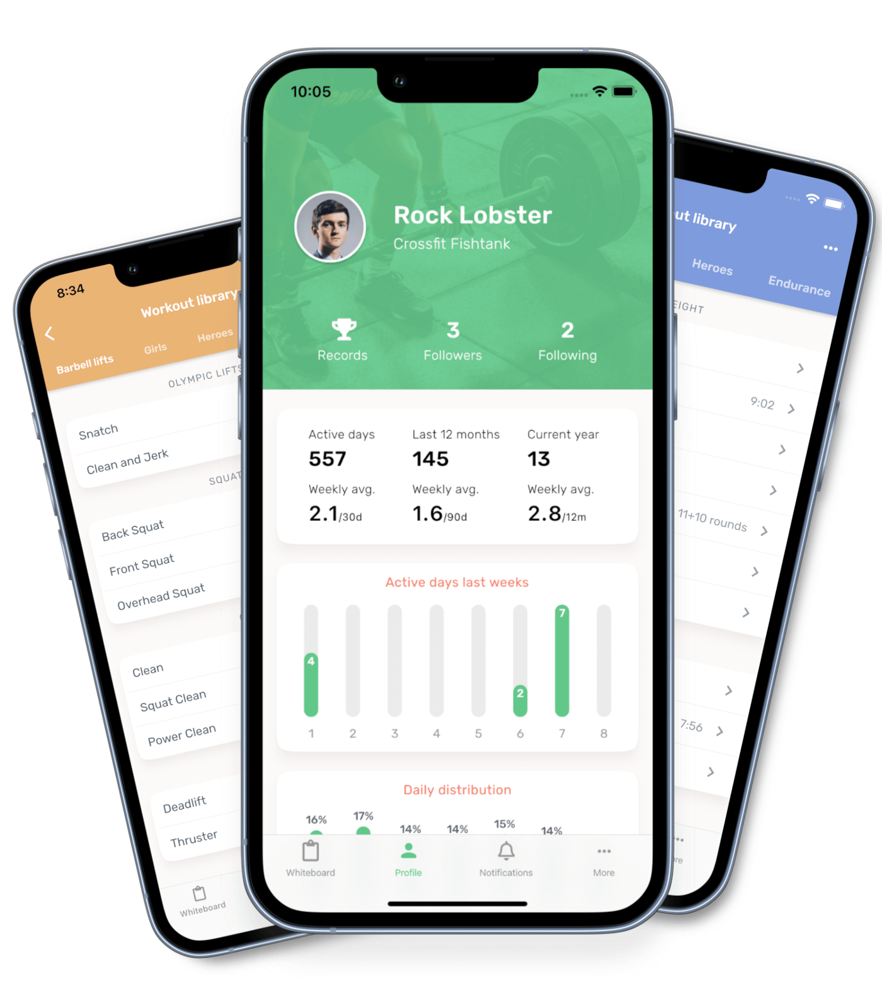

 Time flies! Here are some thoughts, tips, and mistakes after running a tech company as a solo developer for almost a year.

 

## What am I building? ❓
 I had the idea that I wanted to build a Crossfit training app for gyms and athletes. I named it [Dreamwod](https://www.dreamwod.app/) and just launched it on [App Store](https://apps.apple.com/se/app/dreamwod/id1541012149) and [Google Play](https://play.google.com/store/apps/details?id=com.dreamwod.app). The things that I have been building are two apps, one for iOS and one for Android, a backend API, and a company web page.

 This article will talk about the tech stack, ways of working, what I have learned and what mistakes I made.

## Deciding on the Tech Stack 🤔
 The requirements I had on the tech stack were the following.

### Backend and operations
 1. Quick development and iteration time.
 2. Easy to run locally.
 3. Easy to scale the backend / be able to handle high load.
 4. Easy to deploy.
 5. Keep it as simple as possible.

### App development
 1. Easy to learn (I didn’t have any experience of iOS app development).

## The Stack
### Backend - Golang 💻
 The language of choice for the backend was golang. I wanted something that was was easy to learn, quick to compile, had a good performance, and had a low memory and CPU footprint in production.

### Apps — Flutter ☎️
 I didn’t have a lot of experience with either iOS or Android and I wanted apps for both platforms so the decision was pretty easy, try with Flutter and see if it works.

### Database — PostgreSQL 🏬
 I had several options available when picking a database. The assumptions I based the decision on were, 
 * Data will be shared between users, i.e. the data in the app is not only viewed and edited by the user uploading it.
 * I would have some joins and interconnected tables.
 * I assumed that I wanted support for full-text search and didn’t want to spend the time and energy on ElasticSearch or something similar.
 * The decision was to go with Postgres. It got full-text search support out of the box with the [pg_trgm](https://www.postgresql.org/docs/12/pgtrgm.html) extension. It also has good support for PostGIS with the postgis extension so it’s easy to calculate coordinates and distance from the user to for example a gym.

### Cloud — GCP ☁️
 I looked at two options for hosting, Google Cloud Platform (GCP) and AWS. I picked GCP because I could then run the backend API on Cloud Run and only pay for the processing time, which basically has been zero during development and beta.

 Some other useful tools that I’ve been using,

 **Cloud Build** for building containers. Since I’m the only developer and not building that many containers then I’m easily within their free their of 120 minutes/day.

 **Cloud Storage** is used for content uploaded by the users.

 **Pub/sub** is used for async processing, see the [article](https://medium.com/dreamwod-tech/asynchronous-processing-with-cloud-run-and-pub-sub-16f80e76fe46) for how I use an approach where I can develop locally as well as deploy it easily to GCP.

 The monthly bill right now is around $30, of that is the two largest services load balancer for the CDN $18 and the Postgres $10. This bill will of course increase when I get more users and need to use larger database instances but the cost should still be fairly low for quite some users.

### Emails — Mailgun 📫
 There is a lot of options out there, just picked Mailgun since I have used them in the past.

### Payments — Stripe 💰
 I’m adding support for subscriptions in the app and using Stripe was a good decision since they have a subscription portal for users where they can cancel and change subscriptions.

### Company Web Page — Webflow 🕸
 I picked webflow as the framework/tool for the company web page. I was looking for something simple that I could set up and then forget. Web page available at [www.dreamwod.app](https://www.dreamwod.app/).

## Way of working
### No tests 🛑
 Not common to see this statement and maybe it’s something that will turn out to be a mistake later on but here are the top reasons why I haven’t added more than 5-10 tests in the backend project.

 * As the solo developer (Backend, Frontend, QA) then I will test the backend code when I implement the frontend.
 * Adding tests take a lot of time. When building this app it has been a lot of experimenting and trying out ideas and adding tests for something I wouldn’t use would slow down the development speed.
 * The things that I have tests for are mostly regular expression-related parsing, so it was quicker to write tests compared to testing the API directly.

### Monolith instead of microservices 🐻
 Always a bit controversial to go with one service instead of a microservice strategy but the reason why I only have one backend API/service is that:

 * I don’t want to spend time defining contracts/API and solving hosting-related problems that come with a multi-service approach.
 * It’s hard to know where to split a single service into different ones when starting a new project. My bet is that it’s easier to do this later if/when needed.
 * I don’t have a lot of load on the system so I don’t have any issues with performance bottlenecks or special flows in the backend that needs to be optimized.

 With this said, it’s of course still good to divide the code into different areas/domains and not have “spaghetti code” in the codebase.

## What have I learned? 🎒
 * “*The last 20% takes 80% of the time*”, is a famous quote but it’s been true for me. The last things have taken a **lot** longer time than anticipated.
 * Working on my own means that I don’t have any strict deadlines but it can be hard to focus. I have learned that for me it works best if I have as many routines as possible when it comes to coding, training, etc as you have in a normal 9–5 job. A typical day would be one coding session before lunch, a longer lunch break with a gym session, and then a coding session in the afternoon.

## What would I do differently in the Tech Stack?
 I am overall very happy with the tech stack and it isn’t a lot of things that I would have changed. But some things that I would have done differently are:
 
 * I would have investigated if GraphQL API would have been a better option instead of a REST API.
 * I’m a bit concerned that it can be tricky to scale (let’s see if it ever will be needed) the solution globally. The database and services are hosted in Belgium's data center right now and there would be a high latency if someone would use it from for example US or Brazil.

## What would I do differently from a product point-of-view?
 Sometimes it would have been better to take a “quick and easy” solution instead of a “correct one”.
 * An example was that Cloud Run was kind of new when I started and they didn’t support some things like retrieving secrets from the GCP Secrets Manager. I spend some time on implementing something around that and it would have been better if I just did some quick and easy hack and then waited on proper support from Google Cloud.

## Conclusions
 It’s always easy to look back at the things and to think about those things that didn’t go the way you planned, but it’s equally important to think about the things that actually worked out really well, that’s one of the reasons why I wrote this short article — to reflect on the things that worked good 😎.

 If you are thinking about starting a company as a solo developer, stop thinking and do it! It’s a lot of fun! 🚀
