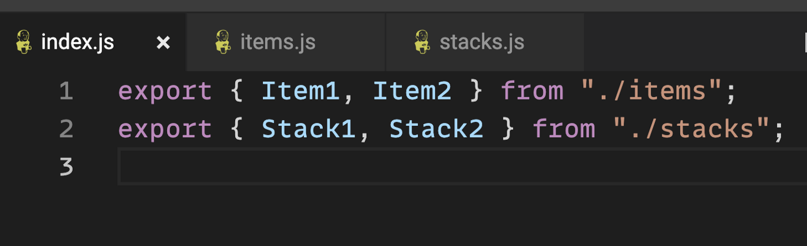
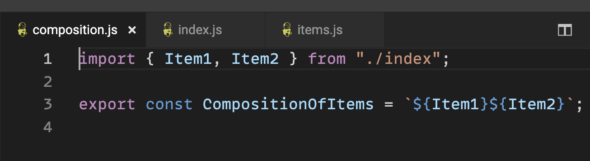
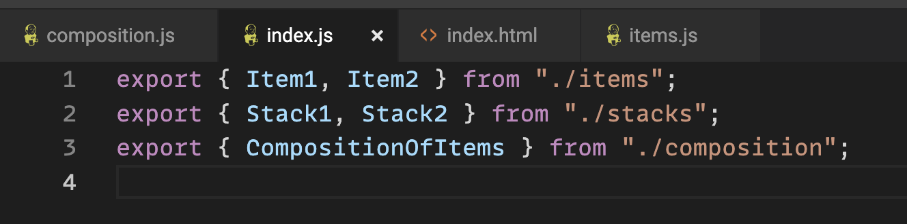
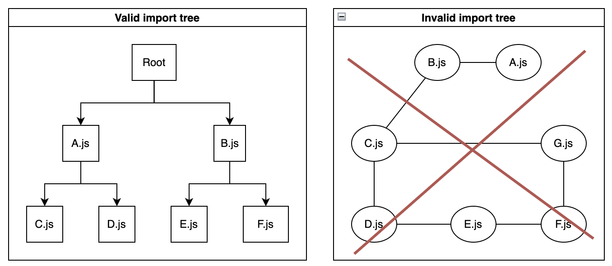
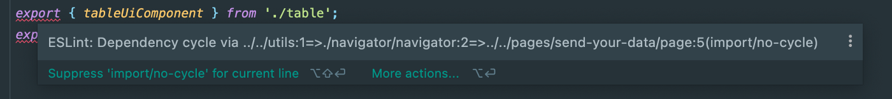
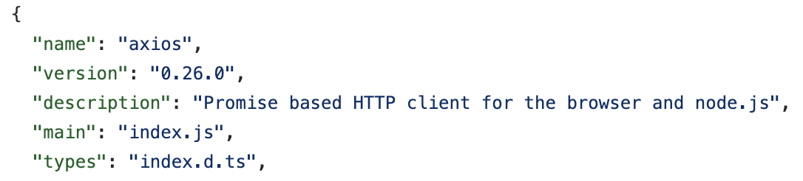

 In most Javascript projects, whether frontend React project, or backend node.js project, you have the ability to group all your imports to a single index.js. This can “conveniently” expose all the relevant exports in one file. Then, it is possible to extract imports from this file. It looks cute and clean, but it can get out of hand quickly.

## TLDR; why you should avoid grouping all your imports into one index.js file?

 1. Circular dependency
 2. Unintended imports when using dynamic imports
 3. Because the creator of node js said so :)
 * When using index.js is fine? if you create an npm package.

## How does the index.js file typically look like
 A typical index.js file can look like that, you group all exports to one file,

 


## Circular dependency
 So, time goes on and the index file is getting bigger. and one developer uses the auto-import feature, importing from the index.js a sibling file. (IDEs prefer importing the shortest path of import)

 

 Now, the developer will export it in our index.js, of course, as everyone did before him/her.

 

 What’s the problem here? Created a circular dependency.

 How? “composition.js” is importing “index.js” to get Items. “index.js” is importing “composition.js” to export the “CompostionsOfItems”.

 > Houston we have a problem

 composition.js → index.js → composition.js

 Now, a file (eg. “items.js”) that imports some variable from the index.js file throws this exception: `cannot read property "Item1" of undefined` some compilers might work around the circular import (eg. Webpack with babel), but in some cases (jest + ts-jest, jest + babel) the compilation cannot overcome the circular and the outcome is an ambiguous error message. this is pretty hard to debug, but when you know to avoid index.js it will be much less frequent.

 Question: so how should we do it properly?

 Answer: avoid index.js and import only what you need from where you need it. in our case, importing *Item1* and *Item2* from the Items.js file wouldn’t create an issue.

 Avoiding index.js will not guarantee that you won’t have circular dependencies issues. You have to structure your importing statements as a **tree**.

 

 Another way to avoid circular is to use the Eslint rule `no-cycle` of [eslint-plugin-import](https://www.npmjs.com/package/eslint-plugin-import)

 


## Unintended imports when using dynamic imports
 When writing a frontend app it is common and considered a best practice to seperate the code using dynamic importing (also known as Code Splitting). eg. in React you can use `React.lazy()` to split the code into several chunks. It doesn't matter which framework, but let’s say you are writing a react app and all your Routes are beautifully arranged in one single `routes.js` file

```javascript
 // routes.js
export Route1 from 'route1'
export Route2 from 'route2'
export Route3 from 'route3'
export Route4 from 'route4'
```

 if you want to enjoy the benefits of lazy load to make your app load faster. you probably have that code somewhere on your app

```javascript
const LazyRoute1 = React.lazy(() => import('./routes').then(module => ({ default: module.Route1 }));
```

 What’s the culprit? instead of loading only Route1 “on-demand” you will actually fetch all routes at once, resulting in more bandwidth than expected, and defeats the whole purpose of lazy loading and code splitting.


## Because the creator of node.js said so 😉
 In a JSConf EU javascript conference, the creator of node.js, Ryan Dahl, presented 10 things he regret about node.js, one of his points was the the “index.js” file. it’s a good talk and I suggest you watch it fully.

 
### Video (26:41 minutes)
 10 Things I Regret About Node.js - Ryan Dahl - JSConf EU

 See also https://github.com/ry/deno

 JSConf EU is coming back in 2019 https://2019.jsconf.eu/



    start: 0,
    allowfullscreen: 1,
    autoplay: 0,
    hl: en,
    cc_lang_pref: en,
    cc_load_policy: 1,
    color: white,
    controls: 1,
    disablekb: 0,
    enablejsapi: 1,
    fs: 0,
    iv_load_policy: 3,
    loop: 0,
    modestbranding: 1,
    playsinline: 0,
    privacy_mode: yes,
    rel: 0,
    showinfo: 0,
    origin: blog.richiebartlett.com,
    widget_referrer: blog.richiebartlett.com



## When should you use index.js?
 If you create an open-source package, and you want to expose the public module, it is commonly accepted to use a file that exposes everything the library exposes.

 