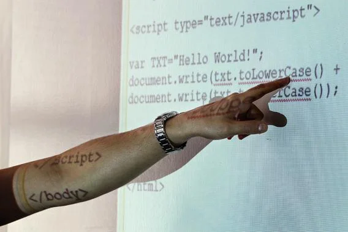

 A software engineer’s take on the new education call to arms.

 > 
 >
 > Antoine Hage explains the JavaScript code to employees of software company FreeCause at a JavaScript training boot camp on June 6, 2012.

 In the past few years, programming has gone mainstream, as celebrities from [Chris Bosh](http://www.youtube.com/watch?v=nKIu9yen5nc) to [President Obama](http://news.cnet.com/8301-17938_105-57569503-1/obama-endorses-required-high-school-coding-classes/) jump on the “everyone should learn to code” bandwagon. The idea is that teaching kids to code will make them employable and help American students keep up with their competition abroad.

 But this idea has [generated substantial whining](http://pandodaily.com/2013/05/07/should-everybody-learn-to-code-a-pandodaily-meta-media-mashup-of-opinion/) among programmers—including me. Like a good computer scientist, I took the edict quite literally and had a pretty visceral reaction to it. I value the spread of programming knowledge to the extent that I value generally making all kinds of knowledge accessible. It gives a window into the crossover that computer science has with some [interesting](http://plato.stanford.edu/entries/chinese-room/) [intellectual](http://plato.stanford.edu/entries/self-reference/) [problems](http://plato.stanford.edu/entries/multiple-realizability/), and this exposure will undoubtedly help the field as it tries to attract the most capable people to join its ranks. Something has to trick people into banging their heads against the wall, whether it’s plush offices, intellectual rigor, prestige, or sheer beauty in the work.

 I imagine that people get excited about physics by reading some [Bad Astronomy](http://www.slate.com/blogs/bad_astronomy.html) or Richard Feynman’s [QED](http://www.amazon.com/dp/0691125759/?tag=slatmaga-20), but no one jumps from reading about physics to doing physics—there is a substantial amount of school missing there. With programming, however, there’s very little separation between appreciating and making something. From the first days of learning a language like Python, you can write self-contained programs that build real things. As you move forward in your education, you’ll find an almost Wild West world that’s open both in the [cultural](http://www.gnu.org/philosophy/free-sw.html) and physical senses. And unlike other sciences, your credentials are primarily the programs you have written, not the stature of the professor whose lab you cleaned.

 But this lack of authority comes at a price: It also means that anyone can call himself a teacher and spew nonsense to unsuspecting students. Several professionals have written about the alarming number of programming job applicants who [overestimate their credentials](http://www.codinghorror.com/blog/2010/02/the-nonprogramming-programmer.html). It seems that many computer science instructors—whether in person or in a self-guided online class—are failing to teach people to recognize what they don’t know. And if you don’t know what you don’t know, credentials are pretty easy to come by.

 I’m not going to pretend that you need to be a genius to do useful things with a computer. It is possible to build a website solely from a facile use of Rails syntax. But in both the long and short term, you need to know more than that, and popular Web and mobile courses might not make this clear. Restricting yourself to learning about the technology du jour makes it easy to memorize habits rather than thinking them through. Eventually those technologies and programming languages will go out of style, and you’ll need a flexible understanding to tweak your habits for the next thing. And without knowing more of the bigger picture, you’re forced to hack away at a problem, which can take you pretty far until you run into one that is better solved by more careful design.

 Frankly, just the idea that you can learn to code in a year gives me the creeps: I would be terrified if someone with only a couple of classes were writing programs for me, not because he (of course, and unfortunately, [most programmers are men](https://mitpress.mit.edu/books/recoding-gender-0)) has learned anything wrong—but because of what he doesn’t know.

 For those aspiring to be a professional programmer, these services look like a great resource as a starting point; I completed [Codecademy’s Python exercises](https://www.codecademy.com/learn/learn-python) and thought they were pretty well done. And there’s certainly no reason for this information to be under the price lock of a university, especially when there is such demand for it in the market. Several of my colleagues are successful self-taught programmers, and these resources make it easy for the size of that group to increase.

 But if you aren’t dreaming of becoming a programmer—and therefore planning to embark on a lengthy course of study, whether self-directed or formal—I can’t endorse learning to code. Yes, it is a creative endeavor. At its base, it’s problem-solving, and the rewards for exposing holes in your thinking and discovering elegant solutions are awesome. I really think that some programs are beautiful. But I don’t think that most who “learn to code” will end up learning anything that sticks.

 One common argument for promoting programming to novices is that technology’s unprecedented pervasiveness in our lives demands that we understand the nitty-gritty details. But the fact is that no matter how pervasive a technology is, we don’t need to understand how it works—our society divides its labor so that everyone can use things without going to the trouble of making them. To justify everyone learning about programming, you would need to show that most jobs will actually require this. But instead all I see are vague predictions that the growth in “IT jobs” means that we must either “program or be programmed” and that [a few rich companies](http://www.code.org/) want more programmers—which is not terribly persuasive.

 You could argue that people have an obligation to be responsible consumers, so they should have an idea of what their proprietary software is doing. People would definitely interact with software differently if they knew something about whether their personal data is “secure.” But there are several other things that everyone should—and does not—know, such as civic knowledge or even more basic understandings of other educational topics like logic, science, etc. For most, software is just another black box that they will happily coexist with, and that’s OK.

 But I wonder why people are comfortable with thinking of computers as a scary black box in the first place. Computers do only what people tell them to do, and yet it is absurdly common to hear, “Windows crashed again! Call over the IT guy—it’s so complicated!” So many users do not feel empowered to understand how to use computers well, and I think that the urgency to spread programming is a symptom of this feeling. Perhaps if everyone had some practice telling computers what to do, tech intimidation wouldn’t be so prevalent. But many of the efforts to promote programming could have the opposite effect, turning computer science into the latest technical fad.

 This is my nightmare vision—“everyone” approaches programming as a set of arbitrary technical details just because he or she should. With only bits and pieces, users can’t appreciate the ways that languages are designed to solve problems, and they are left with an even larger black box. With this approach to programming, their knowledge will eventually float into the ether in the company of other meaningless knowledge, like how to talk nicely to that broken Nintendo 64 cartridge.

 This can be avoided if you have concrete problems to solve. Take a biologist who frequently uses software to analyze data. A graphical interface might not be able to extract all the information she wants, so she needs the flexibility of the command line to write her own scripts. This is a compelling reason to extend programming knowledge outside of the IT realm. Her knowledge comes from a focused learning of the topics or a language that is specialized for her application. She doesn’t just “learn Python.”

 I’m not sure it’s even possible to teach everyone how to code, but I do know that to mandate programming as a general education requirement would displace something else that we’re already failing to teach, and that’s not good, either. We don’t need everyone to code—we need everyone to think. And unfortunately, it is very easy to code without thinking.

