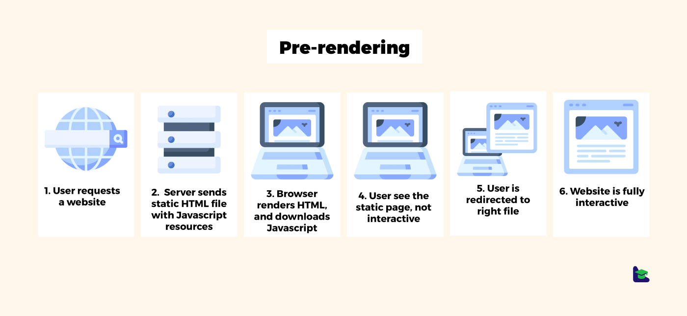

 

 Modern web development sometimes looks complex. The terms SSR, SSG and SPA usually emerge in the vast majority of content out there. When I first heard about these names, I sure was confused. What are those? Which one to use? When to choose one over the other? Can multiple patterns be used in the same app? I’m going to break down these questions for you. Hopefully, at the end of this article, you will have a better understanding of them, and a finer capability to make better architectural decisions for your next project.


## SSR (Server-Side Rendering)
 In SSR, when a web page is requested, it is rendered on the server, served to the client, and finally rendered by the client.

 

 Why is this useful? Imagine a templating system, like the Django templating system, where you have dynamic data like below.

```django
Hello {{user.name}}!
```

 Using SSR, the HTML's dynamic content is evaluated at runtime, based on the server state, and returned to the client. So the HTML sent to the user is actually:

```text
Hello John!
```

 The browser (client-side) just has to render the page into the DOM and voilá, there's the page.


## SSG (Static-Site Generating)
 

 SSG has similarities with SSR. The page is also generated in the server, however, the page is rendered at **build time**. So, instead of rendering the page on the server upon the receival of a request, the page is already rendered in the server, waiting to be served to the client. I’ll discuss the advantages and disadvantages of this approach, and compare it with SSR further below.


## SPA (Single-Page Application)
 

 This approach is relatively new compared with the previous two. This is a result of the rapid growth of the internet, software, and hardware industries over the last two decades. With SPA, the server provides the user with an **empty HTML** page and **Javascript**. The latter, is where the magic happens. When the browser receives the HTML + Javascript, it loads the Javascript. Once loaded, the JS takes place and, through a set of operations in the DOM, renders the necessary components to the page. The routing is then handled by the browser itself, not hitting the server. This is usually done through a frontend framework (or library) like React, Vue or Angular.


## Server-side rendering (SSR and SSG) vs Client-side rendering (SPA)
 Note: *in this section, when I mention SSR I mean both SSR and SSG, and by CSR I mean SPA.*

 * **SSR allows better SEO** (Search Engine Optimization) because the content doesn't have to be loaded by Javascript like in CSR, so the search engine's web crawlers can directly parse the information.
 * **SSR is better for slow connections** because the HTML is immediately provided, whereas in CSR the user sees a blank page until the Javascript is loaded and renders the page's content.
 * **SSR allows seeing content with Javascript disabled.** I know it sounds bizarre, however, users can have it disabled, intentionally or not. See this [link](https://kryogenix.org/code/browser/everyonehasjs.html) where some of these situations are exposed.
 * **SSR first load is usually faster** because it doesn't need to fetch the whole website in a Javascript bundle as CSR does (some performance optimizations can be made in CSR to reduce this payload, like dynamic imports).
 * **CSR is faster after the first load** since there are no server requests to change pages, which makes it insanely fast.
 * **CSR provides a better UX** (user experience) because it gives a native-app feel to the page.


## SSR vs SSG
 The difference between these two is that in SSR the server needs to render the page before sending it to the user (render at **runtime**), and with SSG this is not necessary, because it's done at **build time**. You may feel like "*why on earth should I use SSR then?*". It's simple: most websites usually have dynamic, stateful data (e.g.: user email/logo on the navbar when a user is logged in). This means we can't pre-render at build time templates with this data, so the only way to have this data with SSG would be to import it via Javascript (which would defeat SSG's core purpose).


## When to use what?
 All three approaches have their upsides and downsides. There's no better option overall. You can potentially use all three in the same project. In this section, I'm going to give you some examples of practical use-cases.


### The documentation website
 Imagine you're building React's documentation. What would you want in it? Surely **accessibility** to a broad audience, including users with slow internet and event javascript disabled. **SEO** would also be a concern (you would want to have the users hitting the docs when they search for something React related). With this, we can narrow it down to either SSR or SSG. Which one to choose? *I would go for SSG*. The documentation doesn't have dynamic content, hence it would be both redundant and slower to render them on the server. With SSG, we would deliver the content to the client fast.

 Side note: *React does actually use SSG for their docs (they use [Gastby](https://www.mparticle.com/blog/what-is-gatsby))*.


### The blog
 A blog has data being inserted on a regular basis. Both **SEO** and **accessibility** are requirements for a successful blog. So, we would be deciding between SSR and SSG. This time, *I would go for SSR*. This is because we have dynamic data being inserted often, and we want to provide the user with the most up-to-date data. Note: SSR can be more expensive than SSG as it requires a *server* to render the site dynamically. However, SSG requires a method to manually upload the new content before it's rendered. SSG is the *cheapest* option when used with GitHub and CI/CD pipelines (*e.g.* Jenkins or AWS CodePipelines) and CDNs.


### The CRM (Customer Relationship Manager)
 A CRM has different requirements. **SEO isn't a concern**, since most of the pages are behind a login, hence the search engines can't reach there. Users often access the CRM in a stable environment (usually in the office, with good internet speed and a capable computer). Therefore, using *SPA would be recommended*. It would provide a native app feel, which the users would appreciate. Note that we can use other rendering methods in the same project. For example, we could have SSG on the login and FAQ pages.


## Final thoughts
 The exposed techniques are the everyday basis of the modern web. A firm understanding of them helps developers make better architectural decisions, providing a better experience, and creating better value for the end-user, which is ultimately what we aim at.
