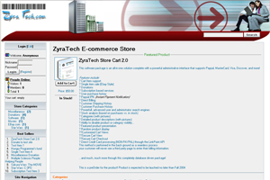

Today, I have restored the old ZyraTech.com e-commerce website that I originally developed over 5 years ago. My intent is to continue its development and to use it as a basis for my new vision of my hobby (and possible future business). I'm thinking that I may develop my code on LoreZyra.com and sell it all on ZyraTech.com. 

I originally wrote this website to operate as an add-on module for PHPnuke(.org). However, going forward, I feel that strategy must change. Most likely, I will repackage the e-commerce application as a stand-alone and with many more JavaScript-based enhancements.

Stay tuned to see my exciting developments. ;)

