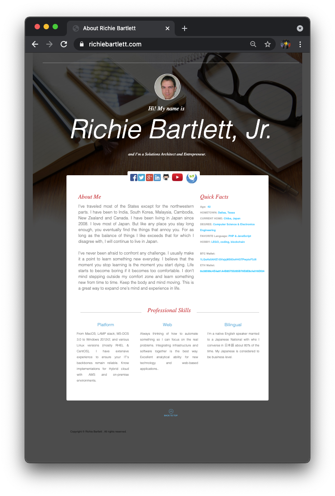

 ## The old website
  Originally, I used my domain name ```RichieBartlett.com``` for email and a landing page. Somewhere people could find a few bits of information about me. I didn't really design it... as the template was free from GoDaddy.com. At the time I was using GoDaddy to host my website and manage all my DNS. Since then, I have moved a lot of my domains to AWS. I plan to migrate all my domains to AWS at some point. But need to wait for AWS to support the same TLDs that GoDaddy already has... 


## Afterthought
 The website was more of an afterthought. Something to add to my skill sets and point visitors to my other online profiles. I never designed it for mobile experience and while it looked _okay_ for the PC, it didn't scale very well. So, here I have an old, dusty webpage that needs to reflect who I am and where I'm going.
 


## New project
 I've created a new GitHub repo complete with [issues and project tracking](https://github.com/lorezyra/Richie2.com/projects/1) to see through the process to rebranding my main website. It can't be just a crappy excuse of a CV either. Besides I have LinkedIn for that... It must keep visitors engaged. Everyone wants to learn "who is Richie Bartlett?" And, why should they care when the old site did so little to keep them... 
 
 So, I've commissioned some help to build an awesome design. Over the next few weeks, visit again and watch the new website grow. I'm sure there will be plenty of little things that need attention and enhancement.


## Why not another single page site?
 As I would like to better understand what visitors are doing on my site, I've decided to break it into multiple pages as this makes it very easy to review from the access logs on the back-end. Pages that get more traffic will get more attention and will be made easier to reach. 


 ## Add a blog
  Also, I will merge the designs for the main site and the blog subdomain. The main site will come first. Then the blog will be redesigned to match and blend with the main website. The layout will be slightly different between the two, but overall theme will be the same. 
  