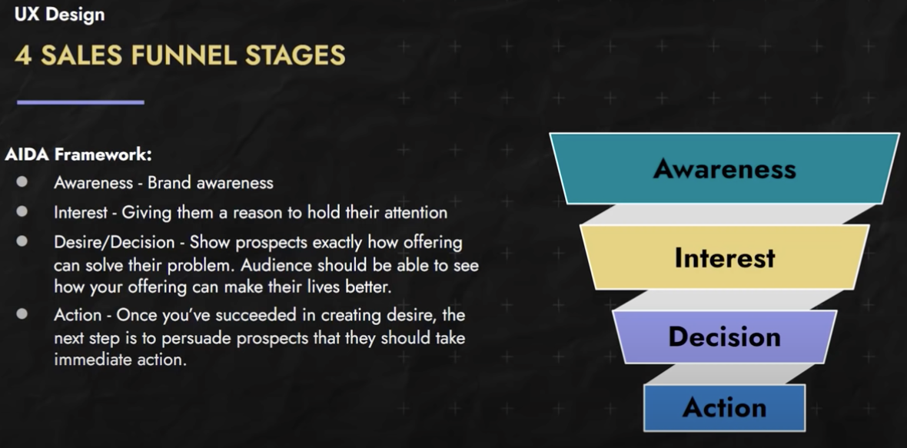
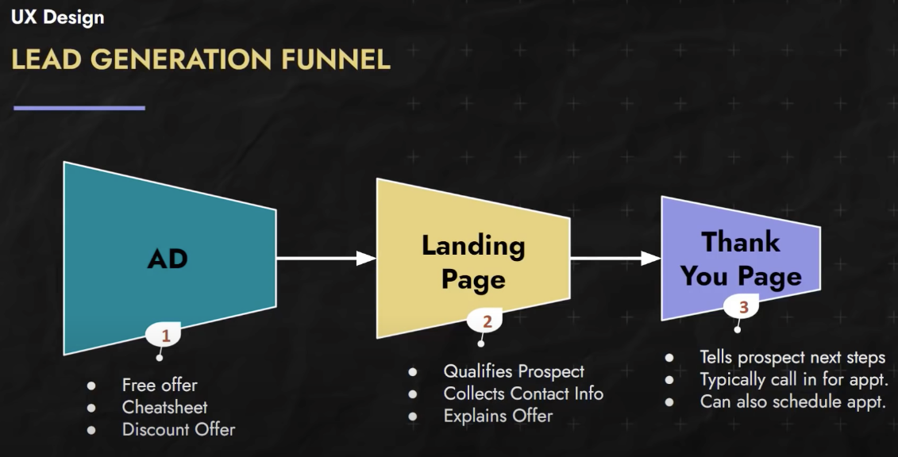

## Relearning the basics in Web design
 While I haven't really been doing much web design over the last few years, I have learned that advancements in JS/CSS have made things previously not easy now trivial.  <!-- more --> Below are some vidoes I found to be immensely useful in catching up with the latest advancements. Yes... I binge-watched all these videos so I could apply the lessons to this website. 

 Warning: this is a __very long__ post. The TOC on the right (PC view) will be helpful to skip to sections of interest.


## Tools
  One online tool to quickly build the components of your website or email template: https://designmodo.com/
  Use https://animate.style/ to preview various CSS animations.

### Learn Adobe XD in 2021 by Example
  Getting started in XD. Learn all about components, states, repeating grids, content aware layouts, plugins, auto-animate, scroll groups and much more.

#### Video (2 hours)

  allowfullscreen: 1,
  autoplay: 0,
  hl: en,
  cc_lang_pref: en,
  cc_load_policy: 1,
  color: white,
  controls: 1,
  disablekb: 0,
  enablejsapi: 1,
  fs: 0,
  iv_load_policy: 3,
  loop: 0,
  modestbranding: 1,
  playsinline: 0,
  privacy_mode: yes,
  rel: 0,
  showinfo: 0,
  origin: blog.richiebartlett.com,
  widget_referrer: blog.richiebartlett.com



### Visual Studio Code Plugin for Adobe XD
 Now that I'm familiar with Adobe XD, need to see how I could expedite my workflow by integrating it with VS code. Don' know what [Figma](https://www.figma.com/) is, but apparently this is something used between designers and front-end coders. I see a lot of potential with a tool like this, but doubt I would place more effort than required to get my websites up and running.

#### Video  (40 minutes)

  allowfullscreen: 1,
  autoplay: 0,
  hl: en,
  cc_lang_pref: en,
  cc_load_policy: 1,
  color: white,
  controls: 1,
  disablekb: 0,
  enablejsapi: 1,
  fs: 0,
  iv_load_policy: 3,
  loop: 0,
  modestbranding: 1,
  playsinline: 0,
  privacy_mode: yes,
  rel: 0,
  showinfo: 0,
  origin: blog.richiebartlett.com,
  widget_referrer: blog.richiebartlett.com



### Visual Studio Code shortcuts
 These VS code shortcuts will help step up your workflow!

#### Video  (11 minutes)

  allowfullscreen: 1,
  autoplay: 0,
  hl: en,
  cc_lang_pref: en,
  cc_load_policy: 1,
  color: white,
  controls: 1,
  disablekb: 0,
  enablejsapi: 1,
  fs: 0,
  iv_load_policy: 3,
  loop: 0,
  modestbranding: 1,
  playsinline: 0,
  privacy_mode: yes,
  rel: 0,
  showinfo: 0,
  origin: blog.richiebartlett.com,
  widget_referrer: blog.richiebartlett.com



### Adobe XD to HTML CSS
 Before last month, I never knew what Adobe XD was for. I'm familiar with Illustrator and have experience with Photoshop, but never really used XD. With the rebuild website project, I discovered its value and have started understanding how it makes the mock-up process so much faster. Previously, I just used my iPad and sketched out a bunch of stuff. With XD and the web-export plugin, I can rapidly build a site. This video covers that process.

#### Video  (1 hour)

  allowfullscreen: 1,
  autoplay: 0,
  hl: en,
  cc_lang_pref: en,
  cc_load_policy: 1,
  color: white,
  controls: 1,
  disablekb: 0,
  enablejsapi: 1,
  fs: 0,
  iv_load_policy: 3,
  loop: 0,
  modestbranding: 1,
  playsinline: 0,
  privacy_mode: yes,
  rel: 0,
  showinfo: 0,
  origin: blog.richiebartlett.com,
  widget_referrer: blog.richiebartlett.com



### Convert Adobe XD to Responsive HTML
 I'm very interested in how to make a responsive website. Something that looks good on the big 4K screens but transistions to the small handheld devices like an iPhone without writing a whole new website. (That's what they used to do over a decade ago.)

#### Video (2 hours)

  allowfullscreen: 1,
  autoplay: 0,
  hl: en,
  cc_lang_pref: en,
  cc_load_policy: 1,
  color: white,
  controls: 1,
  disablekb: 0,
  enablejsapi: 1,
  fs: 0,
  iv_load_policy: 3,
  loop: 0,
  modestbranding: 1,
  playsinline: 0,
  privacy_mode: yes,
  rel: 0,
  showinfo: 0,
  origin: blog.richiebartlett.com,
  widget_referrer: blog.richiebartlett.com



### Adobe XD Animation with CSS
 Use Animate.css with your HTML website exports in Adobe XD to replace the default Prototype and extend your creativity with native CSS animation transitions.  Animate.css is a library of ready-to-use, cross-browser animations for use in your web projects.

#### Video (8 minutes)

  allowfullscreen: 1,
  autoplay: 0,
  hl: en,
  cc_lang_pref: en,
  cc_load_policy: 1,
  color: white,
  controls: 1,
  disablekb: 0,
  enablejsapi: 1,
  fs: 0,
  iv_load_policy: 3,
  loop: 0,
  modestbranding: 1,
  playsinline: 0,
  privacy_mode: yes,
  rel: 0,
  showinfo: 0,
  origin: blog.richiebartlett.com,
  widget_referrer: blog.richiebartlett.com



### Use FireFox to debug your CSS
 If you aren't already using Firefox for your dev browser, I strongly recommend it. Chrome's devtools are great, but Firefox's grid and flex inspector, among a few other of it's features, make it my go to. Even if you don't fully make the switch, if you're trying to learn grid and find it frustraing, you *need* to use it for the grid inspector and make your life so much easier.

#### Video (2 hours)

  allowfullscreen: 1,
  autoplay: 0,
  hl: en,
  cc_lang_pref: en,
  cc_load_policy: 1,
  color: white,
  controls: 1,
  disablekb: 0,
  enablejsapi: 1,
  fs: 0,
  iv_load_policy: 3,
  loop: 0,
  modestbranding: 1,
  playsinline: 0,
  privacy_mode: yes,
  rel: 0,
  showinfo: 0,
  origin: blog.richiebartlett.com,
  widget_referrer: blog.richiebartlett.com



## UX Design Course for Beginners
 I've seen people use UI and UX interchangeably when they are _not_ the same thing. UX is more entrenched in behavioral pyschology than graphics design. Whereas a UI designer is more like a coder that is concerned with the interface elements. The UX designer would instruct the UI designer how best to engage the customers/users. In larger organizations, the roles around a website design are divided up among at least six different roles. However, in a startup (like what I do), I'm often that one person that does it all. However, I'm likely to outsource the visual/graphics design.

### UX & UI





### Video course (4 hours)
 
  allowfullscreen: 1,
  autoplay: 0,
  hl: en,
  cc_lang_pref: en,
  cc_load_policy: 1,
  color: white,
  controls: 1,
  disablekb: 0,
  enablejsapi: 1,
  fs: 0,
  iv_load_policy: 3,
  loop: 0,
  modestbranding: 1,
  playsinline: 0,
  privacy_mode: yes,
  rel: 0,
  showinfo: 0,
  origin: blog.richiebartlett.com,
  widget_referrer: blog.richiebartlett.com



### Customers & Sales





### Sales Funnel Stages






### Lead Generation Funnel







### Principles of Influence




### Age based Influence





### Gender based Influence





### Interest based Marketing
Here are some tools to use to determine the demographics available on Facebook / Instagram and elsewhere.
- [FaceBook Insights](https://www.facebook.com/business/news/audience-insights)
- [Instagram Insights](https://www.facebook.com/help/instagram/788388387972460)
- [Google Trends](https://trends.google.com/trends/)
- [Google Analytics](https://analytics.google.com/analytics/web/#/)






## Typography
 As I have read a lot of books and online sites, I've observed a number of "unwritten rules" around the way information is presented. I've seen what I found easy to read versus simple content that is difficult to parse due to poor design choices. That said, I'm no expert at Lettering nor Typography. So, I've watched this "crash course" on the topic. I'm not concerned about Lettering so much as I'm not looking to display hand-written work. 

### Video (2 hours)

  allowfullscreen: 1,
  autoplay: 0,
  hl: en,
  cc_lang_pref: en,
  cc_load_policy: 1,
  color: white,
  controls: 1,
  disablekb: 0,
  enablejsapi: 1,
  fs: 0,
  iv_load_policy: 3,
  loop: 0,
  modestbranding: 1,
  playsinline: 0,
  privacy_mode: yes,
  rel: 0,
  showinfo: 0,
  origin: blog.richiebartlett.com,
  widget_referrer: blog.richiebartlett.com


### Psychology
 
 
 
 [Psychology of Font Choices](https://www.crazyegg.com/blog/psychology-of-fonts-infographic/)

### Design resources to review:
- [Archetypeapp.com](https://Archetypeapp.com)
- [DesignSystems.com](https://DesignSystems.com)
- [Material.io](https://Material.io)

### Online Icon repositories
- [FeatherIcons.com](https://FeatherIcons.com)
- [FlatIcon.com](https://FlatIcon.com)
- [IconFinder.com](https://IconFinder.com)
- [TheNounProject.com](https://TheNounProject.com)
 


### Improve your designs with these simple tricks to picking fonts
 Picking fonts can be a frustrating affair. Rather than diving deep into the world of typography, in this video I want to show you two super simple steps to how you can pick fonts for your site, and have them look great every single time!

#### Video (16 minutes)

  start: 163,
  allowfullscreen: 1,
  autoplay: 0,
  hl: en,
  cc_lang_pref: en,
  cc_load_policy: 1,
  color: white,
  controls: 1,
  disablekb: 0,
  enablejsapi: 1,
  fs: 0,
  iv_load_policy: 3,
  loop: 0,
  modestbranding: 1,
  playsinline: 0,
  privacy_mode: yes,
  rel: 0,
  showinfo: 0,
  origin: blog.richiebartlett.com,
  widget_referrer: blog.richiebartlett.com



### CSS & Topography
 There are a ton of CSS units out there, and the most underappreciated is, in my opinion at least, the ch unit.

#### Video (8 minutes)

  allowfullscreen: 1,
  autoplay: 0,
  hl: en,
  cc_lang_pref: en,
  cc_load_policy: 1,
  color: white,
  controls: 1,
  disablekb: 0,
  enablejsapi: 1,
  fs: 0,
  iv_load_policy: 3,
  loop: 0,
  modestbranding: 1,
  playsinline: 0,
  privacy_mode: yes,
  rel: 0,
  showinfo: 0,
  origin: blog.richiebartlett.com,
  widget_referrer: blog.richiebartlett.com



### Don't set font-sizes using em
 A lot of people struggle with the difference between the ```em``` and ```rem``` units. While there can be situations where it works out, in general I suggest using ```rem``` for font-size, and I take a look at why in this video.

 - For font-sizes, always use "rem" to avoid compounding problem.
 - Use "em" for properties other than fontSize like margin, padding, width etc...
 - rem are useful when we are trying to use media queries

#### Video (17 minutes)
 
  allowfullscreen: 1,
  autoplay: 0,
  hl: en,
  cc_lang_pref: en,
  cc_load_policy: 1,
  color: white,
  controls: 1,
  disablekb: 0,
  enablejsapi: 1,
  fs: 0,
  iv_load_policy: 3,
  loop: 0,
  modestbranding: 1,
  playsinline: 0,
  privacy_mode: yes,
  rel: 0,
  showinfo: 0,
  origin: blog.richiebartlett.com,
  widget_referrer: blog.richiebartlett.com



### Six simple typography tips
 Devs often struggle with the design of their sites. One thing that holds their designs back the most is the way they handle type, so in this video, we're looking at 6 simple steps for you to follow to make for better typography, which means a much nicer looking site :)

 1. Split the content up into groups
 2. Increase contrast through font-size
 3. Increase contrast through font-weight
 4. Increase contrast through color
 5. Increase the line-height of the body
 6. Decrease the line-height of large text

#### Video (38 minutes)

  allowfullscreen: 1,
  autoplay: 0,
  hl: en,
  cc_lang_pref: en,
  cc_load_policy: 1,
  color: white,
  controls: 1,
  disablekb: 0,
  enablejsapi: 1,
  fs: 0,
  iv_load_policy: 3,
  loop: 0,
  modestbranding: 1,
  playsinline: 0,
  privacy_mode: yes,
  rel: 0,
  showinfo: 0,
  origin: blog.richiebartlett.com,
  widget_referrer: blog.richiebartlett.com



## UI


### UI design techniques that have remained strong


#### Video (9 minutes)

  allowfullscreen: 1,
  autoplay: 0,
  hl: en,
  cc_lang_pref: en,
  cc_load_policy: 1,
  color: white,
  controls: 1,
  disablekb: 0,
  enablejsapi: 1,
  fs: 0,
  iv_load_policy: 3,
  loop: 0,
  modestbranding: 1,
  playsinline: 0,
  privacy_mode: yes,
  rel: 0,
  showinfo: 0,
  origin: blog.richiebartlett.com,
  widget_referrer: blog.richiebartlett.com



## Color






 Take a look at color-theory along with these websites:
- https://css-tricks.com/nerds-guide-color-web/








### Give your site a fantastic color scheme 
 I realize for a quick solution, this video is kind of long, but I give you the easy solution first, and then we look at how you can step it up and get something looking a little nicer and more complex. This isn't a look at color theory, but a quick solution to having a nice looking site quickly!

#### Video (26 minutes)

  allowfullscreen: 1,
  autoplay: 0,
  hl: en,
  cc_lang_pref: en,
  cc_load_policy: 1,
  color: white,
  controls: 1,
  disablekb: 0,
  enablejsapi: 1,
  fs: 0,
  iv_load_policy: 3,
  loop: 0,
  modestbranding: 1,
  playsinline: 0,
  privacy_mode: yes,
  rel: 0,
  showinfo: 0,
  origin: blog.richiebartlett.com,
  widget_referrer: blog.richiebartlett.com



### Marketing Color Psychology 
 What does marketing color psychology mean to you? Each color has positive and negative connotations, and you want to be careful of the messages you're sending. Watch this video all about the psychology of color before getting started on your own marketing graphics: https://www.visme.co
 This is why marketing color psychology is so essential to understand. Knowing how colors work together and what the different colors mean is key to creating beautiful designs.

 _NOTE_: Different cultures and languages have some very different color associations. Not everyone thinks of a certain color as associated with the same meanings. So try to learn about these color associations from different groups, by reading up on color.

#### Video (15 minutes)

  allowfullscreen: 1,
  autoplay: 0,
  hl: en,
  cc_lang_pref: en,
  cc_load_policy: 1,
  color: white,
  controls: 1,
  disablekb: 0,
  enablejsapi: 1,
  fs: 0,
  iv_load_policy: 3,
  loop: 0,
  modestbranding: 1,
  playsinline: 0,
  privacy_mode: yes,
  rel: 0,
  showinfo: 0,
  origin: blog.richiebartlett.com,
  widget_referrer: blog.richiebartlett.com



## CSS
 Cascading Sheet Styles

 Along with the video tutorials below, here's a list of excellent CSS / Web-Dev resources:
 - Modern CSS by Stephanie Eckles https://moderncss.dev/
 - Webbed Briefs https://briefs.video/ 
 - Sara Soueidan https://www.sarasoueidan.com/
 - The CSS Podcast https://thecsspodcast.libsyn.com/
 - Una's channel https://www.youtube.com/channel/UCJnidRIv3o1hf_YBWjKFljg
 - Live SCSS/SASS to CSS compiler https://www.sassmeister.com/


### Writing responsive CSS the wrong way?
 I know sometimes it's because we have a design file that's only a layout as a desktop layout, or because it's just how we're used to working since we're on a desktop, but I'm writing mobile-first CSS not only results in less code, I also think it's a lot easier.

#### Video (14 minutes)

  allowfullscreen: 1,
  autoplay: 0,
  hl: en,
  cc_lang_pref: en,
  cc_load_policy: 1,
  color: white,
  controls: 1,
  disablekb: 0,
  enablejsapi: 1,
  fs: 0,
  iv_load_policy: 3,
  loop: 0,
  modestbranding: 1,
  playsinline: 0,
  privacy_mode: yes,
  rel: 0,
  showinfo: 0,
  origin: blog.richiebartlett.com,
  widget_referrer: blog.richiebartlett.com



### 5 simple tips to making responsive layouts the easy way
 Before writing any code, build a better mindset or approach to designing your website.

#### Video (16 minutes)

  allowfullscreen: 1,
  autoplay: 0,
  hl: en,
  cc_lang_pref: en,
  cc_load_policy: 1,
  color: white,
  controls: 1,
  disablekb: 0,
  enablejsapi: 1,
  fs: 0,
  iv_load_policy: 3,
  loop: 0,
  modestbranding: 1,
  playsinline: 0,
  privacy_mode: yes,
  rel: 0,
  showinfo: 0,
  origin: blog.richiebartlett.com,
  widget_referrer: blog.richiebartlett.com



### Media queries & meta viewport
 Our phones assume that websites are NOT responsive, so if you don't tell them that you did all the hard work and set up some media queries, it'll just ignore all that and simply scale your website down to fit. Using the meta viewport tag, we can tell our devices that we did use media queries and prevent that from happening.

``` html
  <meta name="viewport" content="width=device-width, initial-scale=1.0" />
```

#### Video (4 minutes)

  allowfullscreen: 1,
  autoplay: 0,
  hl: en,
  cc_lang_pref: en,
  cc_load_policy: 1,
  color: white,
  controls: 1,
  disablekb: 0,
  enablejsapi: 1,
  fs: 0,
  iv_load_policy: 3,
  loop: 0,
  modestbranding: 1,
  playsinline: 0,
  privacy_mode: yes,
  rel: 0,
  showinfo: 0,
  origin: blog.richiebartlett.com,
  widget_referrer: blog.richiebartlett.com



### pick the right combinator
The descendant and child combinators easily the most common that you see out in the wild, so in this one, we take a quick look at the difference between the two.

 The Specificity Calculator
 - https://specificity.keegan.st/

#### Video (10 minutes)

  allowfullscreen: 1,
  autoplay: 0,
  hl: en,
  cc_lang_pref: en,
  cc_load_policy: 1,
  color: white,
  controls: 1,
  disablekb: 0,
  enablejsapi: 1,
  fs: 0,
  iv_load_policy: 3,
  loop: 0,
  modestbranding: 1,
  playsinline: 0,
  privacy_mode: yes,
  rel: 0,
  showinfo: 0,
  origin: blog.richiebartlett.com,
  widget_referrer: blog.richiebartlett.com



### Advanced CSS selectors
Most people know the basic selectors, but aren't aware that there are some really useful advanced selectors as well.

#### Video (20 minutes)

  allowfullscreen: 1,
  autoplay: 0,
  hl: en,
  cc_lang_pref: en,
  cc_load_policy: 1,
  color: white,
  controls: 1,
  disablekb: 0,
  enablejsapi: 1,
  fs: 0,
  iv_load_policy: 3,
  loop: 0,
  modestbranding: 1,
  playsinline: 0,
  privacy_mode: yes,
  rel: 0,
  showinfo: 0,
  origin: blog.richiebartlett.com,
  widget_referrer: blog.richiebartlett.com



### Support keyboard focus / navigation
 You are doing :focus wrong (and I was too)
 :focus is often, in the best case scenarios, ignored, and in the worst case scenarios, turned off.

 It's a very important part of writing good CSS though! Not everyone is in your exact situation, and many people will navigate the page with the keyboard instead of their mouse. Let's make their life as easy as possible too :)


#### Video (13 minutes)

  allowfullscreen: 1,
  autoplay: 0,
  hl: en,
  cc_lang_pref: en,
  cc_load_policy: 1,
  color: white,
  controls: 1,
  disablekb: 0,
  enablejsapi: 1,
  fs: 0,
  iv_load_policy: 3,
  loop: 0,
  modestbranding: 1,
  playsinline: 0,
  privacy_mode: yes,
  rel: 0,
  showinfo: 0,
  origin: blog.richiebartlett.com,
  widget_referrer: blog.richiebartlett.com



### Block, Inline, and Inline-Block
 Understaning how block, inline, and inline-block each behave is very important when learning CSS, as well as knowing why you might want to switch the display property of an element every now and then.

#### Video (14 minutes)

  allowfullscreen: 1,
  autoplay: 0,
  hl: en,
  cc_lang_pref: en,
  cc_load_policy: 1,
  color: white,
  controls: 1,
  disablekb: 0,
  enablejsapi: 1,
  fs: 0,
  iv_load_policy: 3,
  loop: 0,
  modestbranding: 1,
  playsinline: 0,
  privacy_mode: yes,
  rel: 0,
  showinfo: 0,
  origin: blog.richiebartlett.com,
  widget_referrer: blog.richiebartlett.com



### Flexbox design patterns 
 Flexbox is amazing, and I honestly feel like sometimes we're just stratching the surface with what we can do with it! In this video I explore three design patterns that you can use in your sites using flexbox.

 Want to learn more about flexbox? https://flexboxsimplified.com

#### Video (16 minutes)
 
  allowfullscreen: 1,
  autoplay: 0,
  hl: en,
  cc_lang_pref: en,
  cc_load_policy: 1,
  color: white,
  controls: 1,
  disablekb: 0,
  enablejsapi: 1,
  fs: 0,
  iv_load_policy: 3,
  loop: 0,
  modestbranding: 1,
  playsinline: 0,
  privacy_mode: yes,
  rel: 0,
  showinfo: 0,
  origin: blog.richiebartlett.com,
  widget_referrer: blog.richiebartlett.com



### Floats, Flexbox, Grid? 
 CSS is confusing enough, and now in 2018 there are so many different options out there, from floats to flexbox to CSS Grid. 

#### Video (27 minutes)
 
  allowfullscreen: 1,
  autoplay: 0,
  hl: en,
  cc_lang_pref: en,
  cc_load_policy: 1,
  color: white,
  controls: 1,
  disablekb: 0,
  enablejsapi: 1,
  fs: 0,
  iv_load_policy: 3,
  loop: 0,
  modestbranding: 1,
  playsinline: 0,
  privacy_mode: yes,
  rel: 0,
  showinfo: 0,
  origin: blog.richiebartlett.com,
  widget_referrer: blog.richiebartlett.com



### Flexbox is complicated
 Flex is a little strange in how it works, and I only recently dove deep enough into it to really understand what was going on, so I figured I'd share my discoveries with you! 

#### Video (23 minutes)
 
  allowfullscreen: 1,
  autoplay: 0,
  hl: en,
  cc_lang_pref: en,
  cc_load_policy: 1,
  color: white,
  controls: 1,
  disablekb: 0,
  enablejsapi: 1,
  fs: 0,
  iv_load_policy: 3,
  loop: 0,
  modestbranding: 1,
  playsinline: 0,
  privacy_mode: yes,
  rel: 0,
  showinfo: 0,
  origin: blog.richiebartlett.com,
  widget_referrer: blog.richiebartlett.com



### What is display: flow-root
 The CSS display property used to be so simple, but there are more and more options for it now, from the more well known things like display: flex and grid, to the lesser-known display: flow-root. It would have been *really* nice to have had this about 7 years ago, but better late than never, as we see in this video 😊

#### Video (7 minutes)
 
  allowfullscreen: 1,
  autoplay: 0,
  hl: en,
  cc_lang_pref: en,
  cc_load_policy: 1,
  color: white,
  controls: 1,
  disablekb: 0,
  enablejsapi: 1,
  fs: 0,
  iv_load_policy: 3,
  loop: 0,
  modestbranding: 1,
  playsinline: 0,
  privacy_mode: yes,
  rel: 0,
  showinfo: 0,
  origin: blog.richiebartlett.com,
  widget_referrer: blog.richiebartlett.com



### Build a Mosaic Portfolio Layout - Grid
 The CSS Grid is here, and this is my first real look at how to use it. To start with, I wanted to look at how we can make a cool looking layout in the simplest way possible, so all we're dealing with here is setting up the grid template, and then using spans to get things the size we need. Once the initial layout is done, I look at how you can add in an image and hover effect, and then I follow that up by looking at how easy it is to add more items to your layout.

#### Video (27 minutes)
 
  allowfullscreen: 1,
  autoplay: 0,
  hl: en,
  cc_lang_pref: en,
  cc_load_policy: 1,
  color: white,
  controls: 1,
  disablekb: 0,
  enablejsapi: 1,
  fs: 0,
  iv_load_policy: 3,
  loop: 0,
  modestbranding: 1,
  playsinline: 0,
  privacy_mode: yes,
  rel: 0,
  showinfo: 0,
  origin: blog.richiebartlett.com,
  widget_referrer: blog.richiebartlett.com



### Container queries - 2020
 Long thought impossible, Heydon Pickering has found a way to replicate the idea of container queries using a cool CSS trick / hack using a clever combination of flex-wrap, flex-basis, and flex-grow. It's a really powerful trick. We'll still need media queries for stuff, but this could prove to be really, really handy!

 Heydon's original article on The Holy Albatross: https://heydonworks.com/article/the-flexbox-holy-albatross/
 His follow-up: https://heydonworks.com/article/the-flexbox-holy-albatross-reincarnated/ 

 More info on Emmet: https://docs.emmet.io/

#### Video (17 minutes)
 
  allowfullscreen: 1,
  autoplay: 0,
  hl: en,
  cc_lang_pref: en,
  cc_load_policy: 1,
  color: white,
  controls: 1,
  disablekb: 0,
  enablejsapi: 1,
  fs: 0,
  iv_load_policy: 3,
  loop: 0,
  modestbranding: 1,
  playsinline: 0,
  privacy_mode: yes,
  rel: 0,
  showinfo: 0,
  origin: blog.richiebartlett.com,
  widget_referrer: blog.richiebartlett.com



### Container queries - 2021
 I think container queries easily have the potential to be as big of a game-changer as flexbox was back in the day. They are going to change the way we approach creating layouts. 

 The proposal by Miriam Suzanne build on top of David Baron’s, and is what is currently being implemented into Chrome Canary (behind a flag), so a huge thank you to her for being at the forefront of making this actually happen! 

 //////////// UPDATE ///////////
 If you want to try them out, the `contain` property now has a new requirement, with the `style` value.
 ```contain: layout style inline-size;```
 //////////////

#### Video (17 minutes)
 
  allowfullscreen: 1,
  autoplay: 0,
  hl: en,
  cc_lang_pref: en,
  cc_load_policy: 1,
  color: white,
  controls: 1,
  disablekb: 0,
  enablejsapi: 1,
  fs: 0,
  iv_load_policy: 3,
  loop: 0,
  modestbranding: 1,
  playsinline: 0,
  privacy_mode: yes,
  rel: 0,
  showinfo: 0,
  origin: blog.richiebartlett.com,
  widget_referrer: blog.richiebartlett.com



### A new way to write media queries is coming
 Heads up, this is only working in Firefox right now, and even then, only partially supported! This video is a part of my look ahead at what's coming to CSS 😊. As I mention in the video, I also recently talked about container queries, which are sooo exciting.

#### Video (5 minutes)

  allowfullscreen: 1,
  autoplay: 0,
  hl: en,
  cc_lang_pref: en,
  cc_load_policy: 1,
  color: white,
  controls: 1,
  disablekb: 0,
  enablejsapi: 1,
  fs: 0,
  iv_load_policy: 3,
  loop: 0,
  modestbranding: 1,
  playsinline: 0,
  privacy_mode: yes,
  rel: 0,
  showinfo: 0,
  origin: blog.richiebartlett.com,
  widget_referrer: blog.richiebartlett.com



### Variables - Introduction to CSS custom properties
 CSS variables (also known as CSS Custom Properties) are a really powerful—and underused—feature available in CSS today. 

#### Video (12 minutes)
 
  allowfullscreen: 1,
  autoplay: 0,
  hl: en,
  cc_lang_pref: en,
  cc_load_policy: 1,
  color: white,
  controls: 1,
  disablekb: 0,
  enablejsapi: 1,
  fs: 0,
  iv_load_policy: 3,
  loop: 0,
  modestbranding: 1,
  playsinline: 0,
  privacy_mode: yes,
  rel: 0,
  showinfo: 0,
  origin: blog.richiebartlett.com,
  widget_referrer: blog.richiebartlett.com



### Variables - real world app
 CSS Variables rock, and in this video I take a look at why. First by looking at how they make organizing and controlling your site possible all within one location of your CSS, and then second by overwriting a variable for one part of my site, making SUPER easy to change the colors on something with only one line of CSS.

#### Video (8 minutes)
 
  allowfullscreen: 1,
  autoplay: 0,
  hl: en,
  cc_lang_pref: en,
  cc_load_policy: 1,
  color: white,
  controls: 1,
  disablekb: 0,
  enablejsapi: 1,
  fs: 0,
  iv_load_policy: 3,
  loop: 0,
  modestbranding: 1,
  playsinline: 0,
  privacy_mode: yes,
  rel: 0,
  showinfo: 0,
  origin: blog.richiebartlett.com,
  widget_referrer: blog.richiebartlett.com



### em and rem explained
 A look at the CSS units EM and REM, how they work and when you might want to use one over the other!

#### Video (17 minutes)
 
  allowfullscreen: 1,
  autoplay: 0,
  hl: en,
  cc_lang_pref: en,
  cc_load_policy: 1,
  color: white,
  controls: 1,
  disablekb: 0,
  enablejsapi: 1,
  fs: 0,
  iv_load_policy: 3,
  loop: 0,
  modestbranding: 1,
  playsinline: 0,
  privacy_mode: yes,
  rel: 0,
  showinfo: 0,
  origin: blog.richiebartlett.com,
  widget_referrer: blog.richiebartlett.com



### Are you using the right units?
 There are a lot of different units that we can use when writing CSS, in this video I give some general rules of thumb of which ones are best suited for which situations.

#### Video (6 minutes)
 
  allowfullscreen: 1,
  autoplay: 0,
  hl: en,
  cc_lang_pref: en,
  cc_load_policy: 1,
  color: white,
  controls: 1,
  disablekb: 0,
  enablejsapi: 1,
  fs: 0,
  iv_load_policy: 3,
  loop: 0,
  modestbranding: 1,
  playsinline: 0,
  privacy_mode: yes,
  rel: 0,
  showinfo: 0,
  origin: blog.richiebartlett.com,
  widget_referrer: blog.richiebartlett.com



### Before & After pseudo elements explained (Part 1/3)
 The before and after pseudo elements are super useful part of CSS, but are often misunderstood. 

#### Video (9 minutes)

  allowfullscreen: 1,
  autoplay: 0,
  hl: en,
  cc_lang_pref: en,
  cc_load_policy: 1,
  color: white,
  controls: 1,
  disablekb: 0,
  enablejsapi: 1,
  fs: 0,
  iv_load_policy: 3,
  loop: 0,
  modestbranding: 1,
  playsinline: 0,
  privacy_mode: yes,
  rel: 0,
  showinfo: 0,
  origin: blog.richiebartlett.com,
  widget_referrer: blog.richiebartlett.com



### Before & After pseudo elements explained (Part 2/3)
 The before and after CSS pseudo elements are great, and they have the content property which a lot of people don't really know how powerful it actually is, so in this video I show you some fun things you can do with it, from a markupless tool tip to a quick dive into CSS counters, which are awesome!

#### Video (25 minutes)

  allowfullscreen: 1,
  autoplay: 0,
  hl: en,
  cc_lang_pref: en,
  cc_load_policy: 1,
  color: white,
  controls: 1,
  disablekb: 0,
  enablejsapi: 1,
  fs: 0,
  iv_load_policy: 3,
  loop: 0,
  modestbranding: 1,
  playsinline: 0,
  privacy_mode: yes,
  rel: 0,
  showinfo: 0,
  origin: blog.richiebartlett.com,
  widget_referrer: blog.richiebartlett.com



### Before & After pseudo elements explained (Part 3/3)
 Exploring how to use ::before and ::after to create some fun design elements without any extra markup.

#### Video (22 minutes)

  allowfullscreen: 1,
  autoplay: 0,
  hl: en,
  cc_lang_pref: en,
  cc_load_policy: 1,
  color: white,
  controls: 1,
  disablekb: 0,
  enablejsapi: 1,
  fs: 0,
  iv_load_policy: 3,
  loop: 0,
  modestbranding: 1,
  playsinline: 0,
  privacy_mode: yes,
  rel: 0,
  showinfo: 0,
  origin: blog.richiebartlett.com,
  widget_referrer: blog.richiebartlett.com



### min(), max(), and clamp()
 CSS has come a long way, but min(), max(), and clamp() make a lot of things a lot easier than they used to be, and really open up the world of responsive typography like we never had before! Clamp() is the ingredient that we've needed for a long time to really be able to make type fully responsive in our CSS, and to be able to do it on one line is absolute magic!

#### Video (18 minutes)

  allowfullscreen: 1,
  autoplay: 0,
  hl: en,
  cc_lang_pref: en,
  cc_load_policy: 1,
  color: white,
  controls: 1,
  disablekb: 0,
  enablejsapi: 1,
  fs: 0,
  iv_load_policy: 3,
  loop: 0,
  modestbranding: 1,
  playsinline: 0,
  privacy_mode: yes,
  rel: 0,
  showinfo: 0,
  origin: blog.richiebartlett.com,
  widget_referrer: blog.richiebartlett.com



### Fun hover effects
 In this video we're exploring some awesome CSS hover effects that we can create using transforms and transform-origin and pseudo-elements. 
 Playing around with these was a lot of fun to build, so I hope you enjoy following along as much as I did when creating it! I feel that these types of effects really highlight how a strong understanding of the fundamentals really helps to make this stuff possible, because without knowing about stacking context, or even simpler things like absolute positioning, this stuff would be a nightmare!

#### Video (35 minutes)
 
  allowfullscreen: 1,
  autoplay: 0,
  hl: en,
  cc_lang_pref: en,
  cc_load_policy: 1,
  color: white,
  controls: 1,
  disablekb: 0,
  enablejsapi: 1,
  fs: 0,
  iv_load_policy: 3,
  loop: 0,
  modestbranding: 1,
  playsinline: 0,
  privacy_mode: yes,
  rel: 0,
  showinfo: 0,
  origin: blog.richiebartlett.com,
  widget_referrer: blog.richiebartlett.com



### 5 underused CSS properties, values, and selectors
 A dive into 5 underappreciated and underused CSS properties, values, and selectors!

#### Video (13 minutes)
 
  allowfullscreen: 1,
  autoplay: 0,
  hl: en,
  cc_lang_pref: en,
  cc_load_policy: 1,
  color: white,
  controls: 1,
  disablekb: 0,
  enablejsapi: 1,
  fs: 0,
  iv_load_policy: 3,
  loop: 0,
  modestbranding: 1,
  playsinline: 0,
  privacy_mode: yes,
  rel: 0,
  showinfo: 0,
  origin: blog.richiebartlett.com,
  widget_referrer: blog.richiebartlett.com



### Use mix-blend-mode, and how to avoid problems
 You don't hear a lot about mix-blend-mode, but after mentioning it in a previous video, a lot of people asked for something more in-depth, so here we are!

#### Video (11 minutes)
 
  allowfullscreen: 1,
  autoplay: 0,
  hl: en,
  cc_lang_pref: en,
  cc_load_policy: 1,
  color: white,
  controls: 1,
  disablekb: 0,
  enablejsapi: 1,
  fs: 0,
  iv_load_policy: 3,
  loop: 0,
  modestbranding: 1,
  playsinline: 0,
  privacy_mode: yes,
  rel: 0,
  showinfo: 0,
  origin: blog.richiebartlett.com,
  widget_referrer: blog.richiebartlett.com



### Neumorphic Login Form Design
 How to create a Neumorphic login form design using pure CSS and HTML. Neumorphism is an upcoming web and UI design trend which is a combination of Material design and Skeuomorphism.

#### Video (13 minutes)
 
  allowfullscreen: 1,
  autoplay: 0,
  hl: en,
  cc_lang_pref: en,
  cc_load_policy: 1,
  color: white,
  controls: 1,
  disablekb: 0,
  enablejsapi: 1,
  fs: 0,
  iv_load_policy: 3,
  loop: 0,
  modestbranding: 1,
  playsinline: 0,
  privacy_mode: yes,
  rel: 0,
  showinfo: 0,
  origin: blog.richiebartlett.com,
  widget_referrer: blog.richiebartlett.com



### Customizable typewriter animation
 After seeing a tweet from Prantham on Twitter (make sure to give him a follow: https://twitter.com/Prathkum) I wanted to make my own typewriter effect using only CSS! 

 My goal with this was to make it as customizable as possible, so if you changed the text you could update it as quickly as possible using custom properties.

#### Video (19 minutes)
 
  allowfullscreen: 1,
  autoplay: 0,
  hl: en,
  cc_lang_pref: en,
  cc_load_policy: 1,
  color: white,
  controls: 1,
  disablekb: 0,
  enablejsapi: 1,
  fs: 0,
  iv_load_policy: 3,
  loop: 0,
  modestbranding: 1,
  playsinline: 0,
  privacy_mode: yes,
  rel: 0,
  showinfo: 0,
  origin: blog.richiebartlett.com,
  widget_referrer: blog.richiebartlett.com



### CSS Blending Modes
 CSS blending modes are a cool thing you can use to blend images with colours, gradients, or even other images, and in this video I look at all of those things! 

#### Video (12 minutes)
 
  allowfullscreen: 1,
  autoplay: 0,
  hl: en,
  cc_lang_pref: en,
  cc_load_policy: 1,
  color: white,
  controls: 1,
  disablekb: 0,
  enablejsapi: 1,
  fs: 0,
  iv_load_policy: 3,
  loop: 0,
  modestbranding: 1,
  playsinline: 0,
  privacy_mode: yes,
  rel: 0,
  showinfo: 0,
  origin: blog.richiebartlett.com,
  widget_referrer: blog.richiebartlett.com



### Responsive CSS Video Background
 How to add responsive video background using pure CSS and HTML5.  Supports all browser size and display static image for mobile devices.
 It is important that you set the video (#videoBG) in css as: left: 50% and top: 50% and then transform(translate: -50%, -50%), otherwise the video will be  cut from the right side, when the window is resized. This way the video remains in the center and get cut equally from both sides when the window is resized.

#### Video (3 minutes)
 
  allowfullscreen: 1,
  autoplay: 0,
  hl: en,
  cc_lang_pref: en,
  cc_load_policy: 1,
  color: white,
  controls: 1,
  disablekb: 0,
  enablejsapi: 1,
  fs: 0,
  iv_load_policy: 3,
  loop: 0,
  modestbranding: 1,
  playsinline: 0,
  privacy_mode: yes,
  rel: 0,
  showinfo: 0,
  origin: blog.richiebartlett.com,
  widget_referrer: blog.richiebartlett.com



### Creative SVG Backgrounds for Modern Web Design
 How to create creative SVG backgrounds and then how to integrate them via HTML and CSS. 

#### Video (19 minutes)
 
  allowfullscreen: 1,
  autoplay: 0,
  hl: en,
  cc_lang_pref: en,
  cc_load_policy: 1,
  color: white,
  controls: 1,
  disablekb: 0,
  enablejsapi: 1,
  fs: 0,
  iv_load_policy: 3,
  loop: 0,
  modestbranding: 1,
  playsinline: 0,
  privacy_mode: yes,
  rel: 0,
  showinfo: 0,
  origin: blog.richiebartlett.com,
  widget_referrer: blog.richiebartlett.com



### 10 Stunning CSS 3D Effect
 Cool CSS 3D effect that you should not miss! Light up your ideas for web design with 10 handpicked 3D CSS examples. [Source code is available](https://redstapler.co/10-stunning-css-3d-effect-must-see/)

#### Video (3 minutes)
 
  allowfullscreen: 1,
  autoplay: 0,
  hl: en,
  cc_lang_pref: en,
  cc_load_policy: 1,
  color: white,
  controls: 1,
  disablekb: 0,
  enablejsapi: 1,
  fs: 0,
  iv_load_policy: 3,
  loop: 0,
  modestbranding: 1,
  playsinline: 0,
  privacy_mode: yes,
  rel: 0,
  showinfo: 0,
  origin: blog.richiebartlett.com,
  widget_referrer: blog.richiebartlett.com



### Sass | @use and @forward
 Keep up to date with my Sass course: https://learnsass.com

 The use of @import has been deprecated in Sass for quite a while now, but a *lot* of people still use it. In this video, I take a quick look at the replacements you should be using instead, @use and @forward. I just scratch the surface in this one, but it should be enough to get you started!

 A quick note, if you are using node-sass, it is out of date and @use and @forward, as well as their entire module system, will not work. If you're using the Watch Sass extension in VS Code, there is no way to update it. If you are using npm or yarn, just switch out the install of node-sass for sass instead. 

 Why Sass changed to Dart: https://sass-lang.com/blog/announcing-dart-sass

#### Video (13 minutes)
 
  allowfullscreen: 1,
  autoplay: 0,
  hl: en,
  cc_lang_pref: en,
  cc_load_policy: 1,
  color: white,
  controls: 1,
  disablekb: 0,
  enablejsapi: 1,
  fs: 0,
  iv_load_policy: 3,
  loop: 0,
  modestbranding: 1,
  playsinline: 0,
  privacy_mode: yes,
  rel: 0,
  showinfo: 0,
  origin: blog.richiebartlett.com,
  widget_referrer: blog.richiebartlett.com



## SVG
 Scalar Vector Graphics

### Design & Animate SVG Illustrations for Web Design
 How to design an isometric SVG illustration in Adobe Illustrator CC using 3D tools. Then, we're going to take the SVG code and animate it based on hover.

#### Video (35 minutes)
 
  allowfullscreen: 1,
  autoplay: 0,
  hl: en,
  cc_lang_pref: en,
  cc_load_policy: 1,
  color: white,
  controls: 1,
  disablekb: 0,
  enablejsapi: 1,
  fs: 0,
  iv_load_policy: 3,
  loop: 0,
  modestbranding: 1,
  playsinline: 0,
  privacy_mode: yes,
  rel: 0,
  showinfo: 0,
  origin: blog.richiebartlett.com,
  widget_referrer: blog.richiebartlett.com



### Morphing SVG's in Web Design
 In this tutorial, we're going to use http://animejs.com to morph a custom SVG graphic on click. AnimeJS is a powerful JavaScript solution for handling animations, including SVG animations. 

#### Video (23 minutes)
 
  allowfullscreen: 1,
  autoplay: 0,
  hl: en,
  cc_lang_pref: en,
  cc_load_policy: 1,
  color: white,
  controls: 1,
  disablekb: 0,
  enablejsapi: 1,
  fs: 0,
  iv_load_policy: 3,
  loop: 0,
  modestbranding: 1,
  playsinline: 0,
  privacy_mode: yes,
  rel: 0,
  showinfo: 0,
  origin: blog.richiebartlett.com,
  widget_referrer: blog.richiebartlett.com



### Using Anime.js to Create SVG Morphing Page Transitions 
 Use vanilla JS to demonstrate how you can create morphing SVG-based page transitions with the help of Anime.js. There are a variety of ways to achieve this effect, and this is one such way.

#### Video (27 minutes)
 
  start: 28,
  allowfullscreen: 1,
  autoplay: 0,
  hl: en,
  cc_lang_pref: en,
  cc_load_policy: 1,
  color: white,
  controls: 1,
  disablekb: 0,
  enablejsapi: 1,
  fs: 0,
  iv_load_policy: 3,
  loop: 0,
  modestbranding: 1,
  playsinline: 0,
  privacy_mode: yes,
  rel: 0,
  showinfo: 0,
  origin: blog.richiebartlett.com,
  widget_referrer: blog.richiebartlett.com



### Auto-Animate in Adobe XD
 This Adobe XD tutorial will demonstrate how to download some free SVG graphics and apply an Auto-Animate effect.

#### Video (7 minutes)
 
  allowfullscreen: 1,
  autoplay: 0,
  hl: en,
  cc_lang_pref: en,
  cc_load_policy: 1,
  color: white,
  controls: 1,
  disablekb: 0,
  enablejsapi: 1,
  fs: 0,
  iv_load_policy: 3,
  loop: 0,
  modestbranding: 1,
  playsinline: 0,
  privacy_mode: yes,
  rel: 0,
  showinfo: 0,
  origin: blog.richiebartlett.com,
  widget_referrer: blog.richiebartlett.com



### SVG ViewBox - Tutorial
 SVG ViewBox attribute, which is perhaps the most confusing attribute in all of HTML! First, we'll take a look at a great explanation and demo of the ViewBox in action, and then I will show you a tool that I created that allows you to use range sliders to position your *own* SVG elements with the ViewBox!
 Credit to: https://wattenberger.com/guide/scaling-svg

#### Video (11 minutes)
 
  allowfullscreen: 1,
  autoplay: 0,
  hl: en,
  cc_lang_pref: en,
  cc_load_policy: 1,
  color: white,
  controls: 1,
  disablekb: 0,
  enablejsapi: 1,
  fs: 0,
  iv_load_policy: 3,
  loop: 0,
  modestbranding: 1,
  playsinline: 0,
  privacy_mode: yes,
  rel: 0,
  showinfo: 0,
  origin: blog.richiebartlett.com,
  widget_referrer: blog.richiebartlett.com



### Build An SVG Animation With CSS
 How to build animations using CSS3 and svgs. SVG is a really popular format on the web that has many advantages, such as support, size and the abillity to create animations using CSS3.

#### Video (19 minutes)
 
  allowfullscreen: 1,
  autoplay: 0,
  hl: en,
  cc_lang_pref: en,
  cc_load_policy: 1,
  color: white,
  controls: 1,
  disablekb: 0,
  enablejsapi: 1,
  fs: 0,
  iv_load_policy: 3,
  loop: 0,
  modestbranding: 1,
  playsinline: 0,
  privacy_mode: yes,
  rel: 0,
  showinfo: 0,
  origin: blog.richiebartlett.com,
  widget_referrer: blog.richiebartlett.com



### SVG Animation With Text
 Create an SVG animation using stroke dash array and stroke dash offset to create some really cool effects.
 We only need HTML and CSS for this effect. You can create the shapes and texts with Figma, Adobe XD or Adobe Illustrator.

#### Video (19 minutes)
 
  allowfullscreen: 1,
  autoplay: 0,
  hl: en,
  cc_lang_pref: en,
  cc_load_policy: 1,
  color: white,
  controls: 1,
  disablekb: 0,
  enablejsapi: 1,
  fs: 0,
  iv_load_policy: 3,
  loop: 0,
  modestbranding: 1,
  playsinline: 0,
  privacy_mode: yes,
  rel: 0,
  showinfo: 0,
  origin: blog.richiebartlett.com,
  widget_referrer: blog.richiebartlett.com



## SEO
 Search Engine Optimization

### The Complete Guide to SEO (Full webinar)
 If you want to start a website or blog and get traffic from SEO, watch this video to learn the fundamentals and some really unique strategies that you need to know to get results.  We have built multiple sites to millions of pageviews (and dollars) from organic search traffic and here we share our strategy for how we did it.

#### Video (56 minutes)
 
  allowfullscreen: 1,
  autoplay: 0,
  hl: en,
  cc_lang_pref: en,
  cc_load_policy: 1,
  color: white,
  controls: 1,
  disablekb: 0,
  enablejsapi: 1,
  fs: 0,
  iv_load_policy: 3,
  loop: 0,
  modestbranding: 1,
  playsinline: 0,
  privacy_mode: yes,
  rel: 0,
  showinfo: 0,
  origin: blog.richiebartlett.com,
  widget_referrer: blog.richiebartlett.com



## Navigation Design
### Create a responsive navigation nav with no JS
 In this video, I take that same navigation but I update it to take advantage of modern CSS, making it fixed top, adding a semi-transparent background, creating the dropdown without any javascript, using flexbox and CSS grid to lay it out, and changing up the pseudo-element transitions to be higher performance.

#### Video (44 minutes)
 
  allowfullscreen: 1,
  autoplay: 0,
  hl: en,
  cc_lang_pref: en,
  cc_load_policy: 1,
  color: white,
  controls: 1,
  disablekb: 0,
  enablejsapi: 1,
  fs: 0,
  iv_load_policy: 3,
  loop: 0,
  modestbranding: 1,
  playsinline: 0,
  privacy_mode: yes,
  rel: 0,
  showinfo: 0,
  origin: blog.richiebartlett.com,
  widget_referrer: blog.richiebartlett.com



## Card Design
 Resources:
 * Social Media Image Sizes 2022: [Cheat Sheet for Every Network](/2022/0417/Work_仕事/Social-Media-Image-Sizes-for-Every-Network.html)

### Design & Code Article Card Component in Adobe XD
 In this two-part tutorial, I’ll show you how to easily design and code, these clean, _minimal_, article card components in Adobe XD.

#### Video (8 minutes)
 
  allowfullscreen: 1,
  autoplay: 0,
  hl: en,
  cc_lang_pref: en,
  cc_load_policy: 1,
  color: white,
  controls: 1,
  disablekb: 0,
  enablejsapi: 1,
  fs: 0,
  iv_load_policy: 3,
  loop: 0,
  modestbranding: 1,
  playsinline: 0,
  privacy_mode: yes,
  rel: 0,
  showinfo: 0,
  origin: blog.richiebartlett.com,
  widget_referrer: blog.richiebartlett.com


#### Video (14 minutes)
 
  allowfullscreen: 1,
  autoplay: 0,
  hl: en,
  cc_lang_pref: en,
  cc_load_policy: 1,
  color: white,
  controls: 1,
  disablekb: 0,
  enablejsapi: 1,
  fs: 0,
  iv_load_policy: 3,
  loop: 0,
  modestbranding: 1,
  playsinline: 0,
  privacy_mode: yes,
  rel: 0,
  showinfo: 0,
  origin: blog.richiebartlett.com,
  widget_referrer: blog.richiebartlett.com



### How To Create a Responsive Blog Post Card
 As I'm kneen to understand how to design a blog "card" for users to see a list of posts, I thought this would make for good study.

#### Video (36 minutes)
 
  allowfullscreen: 1,
  autoplay: 0,
  hl: en,
  cc_lang_pref: en,
  cc_load_policy: 1,
  color: white,
  controls: 1,
  disablekb: 0,
  enablejsapi: 1,
  fs: 0,
  iv_load_policy: 3,
  loop: 0,
  modestbranding: 1,
  playsinline: 0,
  privacy_mode: yes,
  rel: 0,
  showinfo: 0,
  origin: blog.richiebartlett.com,
  widget_referrer: blog.richiebartlett.com



### CSS Card with hover animation and mobile fallback
 Further study for card design, but with consideration for constraints:
 - Animate with CSS only
 - Mobile device support
 - keyboard navigation
 - disabled animations

#### Video (49 minutes)
 
  allowfullscreen: 1,
  autoplay: 0,
  hl: en,
  cc_lang_pref: en,
  cc_load_policy: 1,
  color: white,
  controls: 1,
  disablekb: 0,
  enablejsapi: 1,
  fs: 0,
  iv_load_policy: 3,
  loop: 0,
  modestbranding: 1,
  playsinline: 0,
  privacy_mode: yes,
  rel: 0,
  showinfo: 0,
  origin: blog.richiebartlett.com,
  widget_referrer: blog.richiebartlett.com



### Animated card with HTML & CSS
 One of the best ways to learn is to find fun designs on existing websites and to try and recreate them, so with that in mind, we're taking the animated card design from the Top Games section over at [PopDog](https://popdog.com) and seeing if we can recreate it with only HTML and CSS!

 For irregular objects, you can use a tool called [clippy](https://bennettfeely.com/clippy/) to quickly build speical CSS shapes. 

#### Video (1 hour)
 
  allowfullscreen: 1,
  autoplay: 0,
  hl: en,
  cc_lang_pref: en,
  cc_load_policy: 1,
  color: white,
  controls: 1,
  disablekb: 0,
  enablejsapi: 1,
  fs: 0,
  iv_load_policy: 3,
  loop: 0,
  modestbranding: 1,
  playsinline: 0,
  privacy_mode: yes,
  rel: 0,
  showinfo: 0,
  origin: blog.richiebartlett.com,
  widget_referrer: blog.richiebartlett.com



#### SVG wave animation - Two different ways
 SVG's are incredibly useful. In this video, I explore two different ways we can make a wave animation that hides away a part of the content. The first one is a simple keyframes animation, and the second one uses SMIL animation, which is part of the SVG specifications.

##### Video (24 minutes)
 
  allowfullscreen: 1,
  autoplay: 0,
  hl: en,
  cc_lang_pref: en,
  cc_load_policy: 1,
  color: white,
  controls: 1,
  disablekb: 0,
  enablejsapi: 1,
  fs: 0,
  iv_load_policy: 3,
  loop: 0,
  modestbranding: 1,
  playsinline: 0,
  privacy_mode: yes,
  rel: 0,
  showinfo: 0,
  origin: blog.richiebartlett.com,
  widget_referrer: blog.richiebartlett.com



### Setting up Font Awesome icons as pseudo-elements
 Font Awesome is really useful for quickly adding icons to a project that you're working on, but often they're more decorative than anything else, which is why it can be really useful to use pseudo-elements to insert them, rather than adding in empty elements. 

 In this video, we look at adding them in, and some different ways you can approach it, by adding them to the card I started work on last week. 

#### Video (17 minutes)
 
  start: 143,
  allowfullscreen: 1,
  autoplay: 0,
  hl: en,
  cc_lang_pref: en,
  cc_load_policy: 1,
  color: white,
  controls: 1,
  disablekb: 0,
  enablejsapi: 1,
  fs: 0,
  iv_load_policy: 3,
  loop: 0,
  modestbranding: 1,
  playsinline: 0,
  privacy_mode: yes,
  rel: 0,
  showinfo: 0,
  origin: blog.richiebartlett.com,
  widget_referrer: blog.richiebartlett.com



#### Create a pulsing animation with CSS
 CSS is so much fun! In this video I look at how to add a pulsing animation on hover to a card component that I'm building out. At the start I do it at 5x the size so we can really see what's happening, before later integrating it into the popdog card that I'm trying to clone.

##### Video (24 minutes)
 
  allowfullscreen: 1,
  autoplay: 0,
  hl: en,
  cc_lang_pref: en,
  cc_load_policy: 1,
  color: white,
  controls: 1,
  disablekb: 0,
  enablejsapi: 1,
  fs: 0,
  iv_load_policy: 3,
  loop: 0,
  modestbranding: 1,
  playsinline: 0,
  privacy_mode: yes,
  rel: 0,
  showinfo: 0,
  origin: blog.richiebartlett.com,
  widget_referrer: blog.richiebartlett.com



#### Awesome SVG Animations
 Learn 7 useful SVG animation techniques to make beautiful graphics for your website. In this tutorial, we'll build two different SVGs from scratch and animate them CSS.

##### Video (12 minutes)
 
  allowfullscreen: 1,
  autoplay: 0,
  hl: en,
  cc_lang_pref: en,
  cc_load_policy: 1,
  color: white,
  controls: 1,
  disablekb: 0,
  enablejsapi: 1,
  fs: 0,
  iv_load_policy: 3,
  loop: 0,
  modestbranding: 1,
  playsinline: 0,
  privacy_mode: yes,
  rel: 0,
  showinfo: 0,
  origin: blog.richiebartlett.com,
  widget_referrer: blog.richiebartlett.com



### RPG Styles Card with Hover Effect
 Create a RPG card style on your website with HTML and CSS. The card also has zooming effect when hover on it.
 - https://redstapler.co/rpg-style-card-design-with-hover-effect-html-css-tutorial/

#### Video (7 minutes)
 
  allowfullscreen: 1,
  autoplay: 0,
  hl: en,
  cc_lang_pref: en,
  cc_load_policy: 1,
  color: white,
  controls: 1,
  disablekb: 0,
  enablejsapi: 1,
  fs: 0,
  iv_load_policy: 3,
  loop: 0,
  modestbranding: 1,
  playsinline: 0,
  privacy_mode: yes,
  rel: 0,
  showinfo: 0,
  origin: blog.richiebartlett.com,
  widget_referrer: blog.richiebartlett.com



### Top Stunning Cards Design and Effects 2020
 Experimenting with #CardsDesign became a new trend in this year. We have made the HTML, CSS, JS videos of Our.

#### Video (6 minutes)
 
  allowfullscreen: 1,
  autoplay: 0,
  hl: en,
  cc_lang_pref: en,
  cc_load_policy: 1,
  color: white,
  controls: 1,
  disablekb: 0,
  enablejsapi: 1,
  fs: 0,
  iv_load_policy: 3,
  loop: 0,
  modestbranding: 1,
  playsinline: 0,
  privacy_mode: yes,
  rel: 0,
  showinfo: 0,
  origin: blog.richiebartlett.com,
  widget_referrer: blog.richiebartlett.com



### 3D Flip Card animation
 I'm a fan of minimlism in my designs, but since I stumbled across transform-style and some of the fun things that it opens up, I've been playing around a lot with some 3D stuff in CSS of late.

#### Video (24 minutes)
 
  allowfullscreen: 1,
  autoplay: 0,
  hl: en,
  cc_lang_pref: en,
  cc_load_policy: 1,
  color: white,
  controls: 1,
  disablekb: 0,
  enablejsapi: 1,
  fs: 0,
  iv_load_policy: 3,
  loop: 0,
  modestbranding: 1,
  playsinline: 0,
  privacy_mode: yes,
  rel: 0,
  showinfo: 0,
  origin: blog.richiebartlett.com,
  widget_referrer: blog.richiebartlett.com



### Create Tilt Effect with 1 JavaScript Line | Tilt.js Tutorial
 In this episode we'll talk about a small but super useful JavaScript library call tilt.js which let you create a 3D tilt effect so easily with literally just 1 line of code. Also learn how to create awesome effect such as parallax and reflection as well.
 - https://micku7zu.github.io/vanilla-tilt.js/
 - https://redstapler.co/tilt-js-parallax-tutorial/


#### Video (4.5k minutes)
 
  allowfullscreen: 1,
  autoplay: 0,
  hl: en,
  cc_lang_pref: en,
  cc_load_policy: 1,
  color: white,
  controls: 1,
  disablekb: 0,
  enablejsapi: 1,
  fs: 0,
  iv_load_policy: 3,
  loop: 0,
  modestbranding: 1,
  playsinline: 0,
  privacy_mode: yes,
  rel: 0,
  showinfo: 0,
  origin: blog.richiebartlett.com,
  widget_referrer: blog.richiebartlett.com



#### Video (8 minutes)
 
  allowfullscreen: 1,
  autoplay: 0,
  hl: en,
  cc_lang_pref: en,
  cc_load_policy: 1,
  color: white,
  controls: 1,
  disablekb: 0,
  enablejsapi: 1,
  fs: 0,
  iv_load_policy: 3,
  loop: 0,
  modestbranding: 1,
  playsinline: 0,
  privacy_mode: yes,
  rel: 0,
  showinfo: 0,
  origin: blog.richiebartlett.com,
  widget_referrer: blog.richiebartlett.com



### CSS Card Tricks
 A beginner's tutorial for building an 🃏 animated stacked card list with CSS & HTML. Inspired by css-tricks homepage. https://fireship.io/lessons/css-cards-animated/

 - https://github.com/fireship-io/stacked-card-list

#### Video (9 minutes)
 
  allowfullscreen: 1,
  autoplay: 0,
  hl: en,
  cc_lang_pref: en,
  cc_load_policy: 1,
  color: white,
  controls: 1,
  disablekb: 0,
  enablejsapi: 1,
  fs: 0,
  iv_load_policy: 3,
  loop: 0,
  modestbranding: 1,
  playsinline: 0,
  privacy_mode: yes,
  rel: 0,
  showinfo: 0,
  origin: blog.richiebartlett.com,
  widget_referrer: blog.richiebartlett.com



### 3D Card tilt animation with parallax
 We will take a look on how we can create a super easy 3d effect using javascript. We are going to be creating a 3d animation using mouse events. 


#### Video (35 minutes)
 
  allowfullscreen: 1,
  autoplay: 0,
  hl: en,
  cc_lang_pref: en,
  cc_load_policy: 1,
  color: white,
  controls: 1,
  disablekb: 0,
  enablejsapi: 1,
  fs: 0,
  iv_load_policy: 3,
  loop: 0,
  modestbranding: 1,
  playsinline: 0,
  privacy_mode: yes,
  rel: 0,
  showinfo: 0,
  origin: blog.richiebartlett.com,
  widget_referrer: blog.richiebartlett.com



### Glassmorphism Card Hover Effects
 Html CSS Glass morphism Effects with [vanilla-tilt.js](https://github.com/micku7zu/vanilla-tilt.js/).

#### Video (11 minutes)
 
  allowfullscreen: 1,
  autoplay: 0,
  hl: en,
  cc_lang_pref: en,
  cc_load_policy: 1,
  color: white,
  controls: 1,
  disablekb: 0,
  enablejsapi: 1,
  fs: 0,
  iv_load_policy: 3,
  loop: 0,
  modestbranding: 1,
  playsinline: 0,
  privacy_mode: yes,
  rel: 0,
  showinfo: 0,
  origin: blog.richiebartlett.com,
  widget_referrer: blog.richiebartlett.com



## Full Sites
### Seven Design Portfolios
 This is a subjective take on a few web designers' sites that make interesting design choices to keep the visitor engaged.

#### Video (14 minutes)

  allowfullscreen: 1,
  autoplay: 0,
  hl: en,
  cc_lang_pref: en,
  cc_load_policy: 1,
  color: white,
  controls: 1,
  disablekb: 0,
  enablejsapi: 1,
  fs: 0,
  iv_load_policy: 3,
  loop: 0,
  modestbranding: 1,
  playsinline: 0,
  privacy_mode: yes,
  rel: 0,
  showinfo: 0,
  origin: blog.richiebartlett.com,
  widget_referrer: blog.richiebartlett.com



### 5 Inspirational Website Designs for 2021
 Let's look at some of the best websites for inspiration in 2021! In this video we will look at the top 5 websites for scroll interactions, Lottie animations, custom cursors and beautiful web interactions.


#### Video (9 minutes)
 
  allowfullscreen: 1,
  autoplay: 0,
  hl: en,
  cc_lang_pref: en,
  cc_load_policy: 1,
  color: white,
  controls: 1,
  disablekb: 0,
  enablejsapi: 1,
  fs: 0,
  iv_load_policy: 3,
  loop: 0,
  modestbranding: 1,
  playsinline: 0,
  privacy_mode: yes,
  rel: 0,
  showinfo: 0,
  origin: blog.richiebartlett.com,
  widget_referrer: blog.richiebartlett.com



### Responsive Design crash course
This is a true beginner's course on how to build a website. Includes what tools and plugins to use.

#### Video (2.3 hours)
 
  allowfullscreen: 1,
  autoplay: 0,
  hl: en,
  cc_lang_pref: en,
  cc_load_policy: 1,
  color: white,
  controls: 1,
  disablekb: 0,
  enablejsapi: 1,
  fs: 0,
  iv_load_policy: 3,
  loop: 0,
  modestbranding: 1,
  playsinline: 0,
  privacy_mode: yes,
  rel: 0,
  showinfo: 0,
  origin: blog.richiebartlett.com,
  widget_referrer: blog.richiebartlett.com



### Top 5 Web Design Trends in 2021
 This is a true beginner's course on how to build a website. Includes what tools and plugins to use.

#### Video (4 minutes)
 
  allowfullscreen: 1,
  autoplay: 0,
  hl: en,
  cc_lang_pref: en,
  cc_load_policy: 1,
  color: white,
  controls: 1,
  disablekb: 0,
  enablejsapi: 1,
  fs: 0,
  iv_load_policy: 3,
  loop: 0,
  modestbranding: 1,
  playsinline: 0,
  privacy_mode: yes,
  rel: 0,
  showinfo: 0,
  origin: blog.richiebartlett.com,
  widget_referrer: blog.richiebartlett.com



### Complete Responsive Blogger Website build

#### Video (3 hours)

  allowfullscreen: 1,
  autoplay: 0,
  hl: en,
  cc_lang_pref: en,
  cc_load_policy: 1,
  color: white,
  controls: 1,
  disablekb: 0,
  enablejsapi: 1,
  fs: 0,
  iv_load_policy: 3,
  loop: 0,
  modestbranding: 1,
  playsinline: 0,
  privacy_mode: yes,
  rel: 0,
  showinfo: 0,
  origin: blog.richiebartlett.com,
  widget_referrer: blog.richiebartlett.com



### Creating a responsive, asymmetrical design with HTML & CSS
 Layouts like this used to be a huge pain, but with the more modern tools that are being introduced to CSS, like ```grid```, ```subgrid```, ```flexbox``` and some fun functions like ```clamp()``` things are getting *so much easier*!

#### Video (1 hours)

  allowfullscreen: 1,
  autoplay: 0,
  hl: en,
  cc_lang_pref: en,
  cc_load_policy: 1,
  color: white,
  controls: 1,
  disablekb: 0,
  enablejsapi: 1,
  fs: 0,
  iv_load_policy: 3,
  loop: 0,
  modestbranding: 1,
  playsinline: 0,
  privacy_mode: yes,
  rel: 0,
  showinfo: 0,
  origin: blog.richiebartlett.com,
  widget_referrer: blog.richiebartlett.com



## Email design
 Creating emails formatted in HTML is similar to building a single-page-website. However, there are some limitations for images and other visual elements included in the email document. Another thing to consider is overall file size which must include all images. Very few providers allow large email sizes. So, keep this in mind while designing the email template.
 Design considerations should include whether to embed the images or to host them from your web servers. Know that hosted images are blocked from download by default from many email applications (for security reasons). However, embedded images are always displayed. Probably a good idea to keep the logo and any critical images embedded while the rest of the images are hosted.
 All CSS must be embedded as well. Not recommended to host this as there is limited support from email applications. Email applications also don't support a style section. All CSS must be *inline* with the elements. (This also increases the email size, unfortunately.)

 In general, you need several templates for your website:
 * Promotional / Marketing
 * Tranactional
 * Annoucement
 * Seasonal
 * Newsletter


### The RIGHT WAY to create HTML emails
  - Example template: https://mdbootstrap.com/freebies/emails/
  - Test your emails *BEFORE* your users complain : https://putsmail.com/
  - Designs known to get customers and engagement: https://www.LeadPages.net/
  - Tool for marketing your emails: https://mailchimp.com/help/types-of-templates/


#### Video (25 minutes)

  allowfullscreen: 1,
  autoplay: 0,
  hl: en,
  cc_lang_pref: en,
  cc_load_policy: 1,
  color: white,
  controls: 1,
  disablekb: 0,
  enablejsapi: 1,
  fs: 0,
  iv_load_policy: 3,
  loop: 0,
  modestbranding: 1,
  playsinline: 0,
  privacy_mode: yes,
  rel: 0,
  showinfo: 0,
  origin: blog.richiebartlett.com,
  widget_referrer: blog.richiebartlett.com



### HTML Email Template Tutorial - Start to Finish with HTML & CSS
 In this responsive HTML email tutorial we'll build a complete mobile friendly HTML Email Template with Responsive HTML Tables and CSS. The email template that we build in the tutorial has been tested as responsive in Gmail, the Gmail App, Yahoo Mail App, the iOS Apple Mail App and more.  The email will also show and display properly on a number of other mobile, tablet and desktop email clients. Stay tuned to see how to send test emails to yourself and preferred email client at the end of the video with Litmus Putsmail.

#### Video (44 minutes)

  allowfullscreen: 1,
  autoplay: 0,
  hl: en,
  cc_lang_pref: en,
  cc_load_policy: 1,
  color: white,
  controls: 1,
  disablekb: 0,
  enablejsapi: 1,
  fs: 0,
  iv_load_policy: 3,
  loop: 0,
  modestbranding: 1,
  playsinline: 0,
  privacy_mode: yes,
  rel: 0,
  showinfo: 0,
  origin: blog.richiebartlett.com,
  widget_referrer: blog.richiebartlett.com


