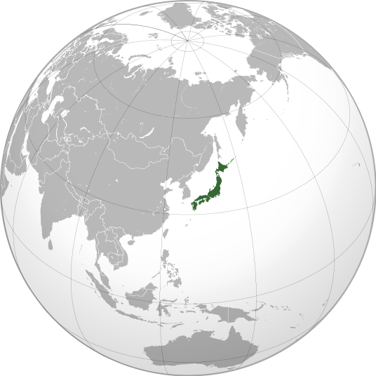
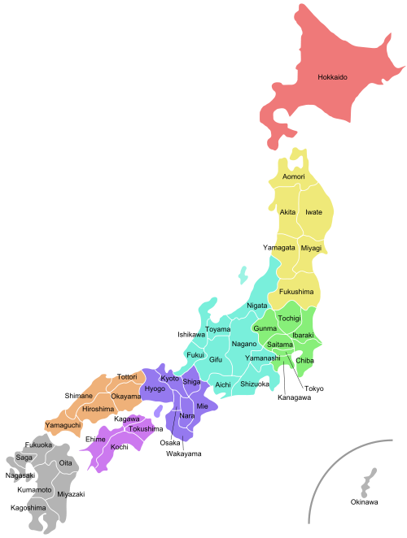

### About this site:
This site is my sounding board for not only my professional life but creative ideas as well. It's a place for my family and friends to keep up with me. My interests and travels are documented for all to enjoy. If you should have a question, please click on the "[contact me](../contact.php)" link at the top and send a message.

### History:
I'm 32 years old. 
I grew up in Dallas, Texas and graduated from Texas State Technical College in Waco, TX as a double major. 
I hold Electronics Engineering and Computer Science (related) diplomas. 

I've never been afraid to confront any challenge. I usually make it a point to learn something new everyday. I believe that the moment you stop learning is the moment you start dying. Life starts to become boring if it becomes too comfortable. I don't mind stepping outside my comfort zone and learn something new from time to time. This is a great way to expand one's mind and experience in life.

* Astrology: [Scorpion](http://en.wikipedia.org/wiki/Scorpio_(astrology)) (Type 2). The eight house of the Zodiac. A SUN sign (ruled by Mars) and WATER element. The ruling planet of the Scorpio is Pluto.
* Chinese Sign: Horse. 
* Numerology: # 1 
* Favorite Colors:  Green, black and maroon. (in that order)

### Current Travels:
 I've traveled most of the States except for the northwestern parts. I have been to Bussan, Korea and Vancouver, Canada. I have been living in Japan since 2008. I love most of Japan. But like any place you stay long enough, you eventually find the things that annoy you. For as long as the balance of things I like exceeds that for which I disagree with, I will continue to live in Japan. 

### Geographical Location: *Japan*




### Interests and Hobbies:
 I have an eclectic array of interests. They include: Nature, winter sports and skating, travel, Sony PlayStation and PC games, movies, and theme parks. My hobbies are web site programming and design, reading books, sewing, and personal health. I prefer taking my time on the things that are interesting to me.

### Current Career details:
 I currently work in the IT market of Japan. Particularly in Tokyo where the market is the largest for IT. My focus is in IT infrastructure in both application support and project management. For the past 5 years, I have worked in large financial companies. My diverse background makes me ideal for positions where stress is high and eclectic skill sets are valuable.

### fini
 Feel free to browse around. Check out my [Blog](../blog/) for the latest stuff.  Also check out the places that I have [traveled](../blog/travel.php) to.