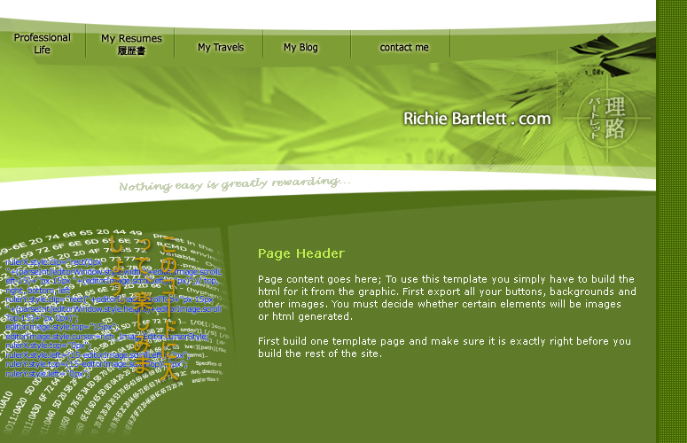

So far, I have spent a couple of days designing and coding this site. My primary purpose of this site is to have a place for my family and friends to keep up with me and my adventures. I will also, from time to time, allow people to view my professional works and history. I have designed this site using Adobe Master Collection CS3. The coding languages used are PHP and JavaScript (with the EXTjs library).

It's not complete just yet. But by the end of this week, I should have ths site done.

