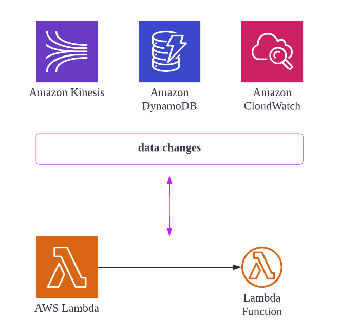

## *aaS overview

 

 From the image above, you can see how moving from legacy architectures where you are responsible for all the hardware, software, updates, and maintenance... to more FaaS and SaaS based architectures that enable a business to focus more on the business logic rather than the tedious tasks of hardware and non-business applications.

 The following image shows the responsibility matrix of what the customer needs to manage versus what could be managed by the Cloud provider.

 

### Legacy / On-Premise
 
 While legacy architectures enable maximum flexibility, it also enforces maximum upfront costs for the initial build-out. The lead-times to build out such systems can be months! Compared with FaaS and SaaS architectures which could be deployed in a matter of hours. Many businesses prize having speed-to-market as a competitive advantage when they need to expand or rollout new features.

### XaaS (Anything as a Service)
 

### IaaS
 

### PaaS
 

### CaaS
 Surprisingly, there's no Wikipedia page for **Containers-as-a-Service**. CaaS is essentially automated hosting and deployment of *containerized* software packages. Without CaaS, software development teams need to deploy, manage, and monitor the underlying infrastructure that containers run on. This infrastructure is a collection of cloud machines and network routing systems that requires dedicated DevOps resources to oversee and manage.

 PaaS is concerned with and limited to code stack level infrastructure. When using PaaS, a project has no control over the underlying operating system. Container runtimes offer configuration and virtualization of the operating system, allowing for advanced customization and control. Containers can be critical to the development of highly customized and specialized software. Yet for more generic and standard software, PaaS is often the best choice.

### FaaS
 

### SaaS (Software as a Service)
 

## Serverless Architecture Design Patterns
 Serverless architecture is a way to build and run applications and services without having to manage infrastructure. The approach helps the teams to focus on the actual business value-add and forget about the infrastructure management. There are many other advantages with serverless-based architecture and there are many blogs covering the same.

 AWS-based serverless applications hinge on AWS Lambda functions, which are stateless and ephemeral by design. Serverless is a natural choice for microservice-based architectures because Lambda functions are designed to run small chunks of code in response to events emitted by other services. Lambda also integrates with a range of managed services that can be used to implement common patterns in distributed systems, such as message queues ([Amazon Simple Queue Service](https://aws.amazon.com/sqs/)), APIs ([Amazon API Gateway](https://aws.amazon.com/api-gateway/)), and event streams ([Amazon Kinesis](https://aws.amazon.com/kinesis/)). This helps minimize the typical pain points of building microservices.

### Strangler pattern
 Strangler pattern allows developers to gradually replace components of their monolith with microservices (which can be implemented with one or more Lambda functions or containerized apps), rather than completely shutting down and replacing their monolith in one go.
 

 This pattern uses a strangler facade, such as API Gateway, to accept all incoming requests to the legacy system. The facade then routes them to either the legacy application or the new serverless application. Because clients only interact with the facade, they have no knowledge of affected or unaffected services in the backend. Once the entire legacy system has been refactored, and all traffic is routed to the new application, the former can be safely deprecated.

### Aggregator pattern
 In microservice-based architectures, clients often need to make calls to multiple backend services to perform an operation. Because these calls occur over the network, chatty communication between clients and microservices can increase application latency, particularly in situations where bandwidth is limited.
 
 
 The Aggregator pattern (aka as "Fan-out/Fan-in") reduces the number of calls clients need to make by using a single Lambda function to accept all client requests. The Lambda function then forwards the requests to the appropriate microservices and third-party APIs, aggregates their results, and returns a single response to the client.

### State Machine pattern
 As you build out your application, your business workflows can become highly complex. [AWS Step Functions](https://aws.amazon.com/step-functions/) is used to orchestrate complex workflows that involve multiple microservices. Step Functions includes built-in state management, branching, error handling, and retry capabilities, which eliminates the need to write boilerplate code.
 
 
 While it is possible to write custom code in Lambda functions to implement this logic, such implementations are incredibly brittle and tend to consume a substantial number of engineering hours. Depending on your use case, you can either leverage Standard Workflows, which can run for up to a year, or Express Workflows, which run for up to 5 minutes.

### Saga pattern
 Monolithic applications are built with a central database, which allows them to make use of ACID (atomic, consistent, isolated, durable) transactions to guarantee data consistency. In a microservice-based application, each microservice typically has its own database, which contains data that is closely related to the data in other microservices’ databases. The Saga pattern ensures data consistency by coordinating a sequence of local transactions in interconnected microservices. Once a microservice performs its local transaction, it triggers the next service in the chain to perform its transaction. If a transaction fails along the way, a series of compensating transactions is kicked off to roll back the changes made in prior transactions. (See Dead-letter-queues.)
 

 The Saga pattern can be implemented through choreography or orchestration. In the choreography model, each service publishes an event that triggers the next service to run. With orchestration, a central coordinator manages the entire chain of transactions.

### Circuit Breaker pattern
 In distributed systems, where multiple services are involved in fulfilling a request, it is crucial to think about how service failures are handled. Some issues, such as network latency, are intermittent and resolve on their own, so a retry-call from an upstream service is likely to succeed. More severe issues or outages, however, may require active intervention and can take an indeterminate amount of time to resolve. Continuous retries in these situations can consume critical resources and starve other services that depend on the same resource pool, which may result in a catastrophic cascading failure.
 

 The Circuit Breaker pattern allows you to build fault tolerance into your system by using an key-value store to keep track of request failures and circuit breaker status, along with a Lambda function to decide whether or not to allow subsequent calls to the impacted service based on the failure count.

### Backend API Service
 This is the simplest architecture pattern that you would come across the moment you search for Serverless based architecture.
 

 A backend service with AWS API Gateway acting as the Proxy layer for the Lambda based business functions. Lambda functions are invoked by API Gateway in a synchronous fashion. Data is saved or retrieved from AWS DynamoDB, a managed NoSQL serverless service from AWS.

 API Gateway comes with lot of additional features like Caching, Rate Limit, etc. which can be leveraged as per the business need.

 
 Single Lambda function for all the business functionalities or one Lambda per business functionality is a typical question that I am generally asked? Well, to keep it simple and secure — Use Single Responsibility Principle and have one Lambda function per business functionality. Consolidate all related Lambda functions to have high cohesiveness and form a Microservice for the specific domain. And follow the Least Privilege principle &mdash; Each Lambda function has an execution role with only those permissions required for it to achieve the business functionality.
 

### Hosting Microservices
 If you are dealing with multiple Microservices in your product, with each service owned by a different team, how do you deploy these services is a very important question that needs to be addressed.
 

 1. Each Team manages and owns end to end service deployment — API Gateway, Lambda functions and DynamoDB.
 2. Each service gets deployed in a different AWS account (managed by the service team). It inherently increases the TPS of the overall product because API Gateway and Lambda functions concurrency limit are at the Account level. These limits are off-course soft limits and can be increased by raising a case via AWS Console, if you plan to host the services in the same AWS account.
 3. Each service can have a custom domain attached to it. Something like — `catalog.example.com` OR `order.example.com`.

 
 If you are planning to deploy Microservices in a single account, then you can also access the service with single domain name but mounted at different URL paths. For example — `example.com/api/order` for Order service OR `example.com/api/catalog` for Catalog service. This convention is possible but designed differently &mdash; see the next pattern.
 

### Single Page Application (SPA)
 A standard architectural pattern for a product having both backend and frontend with frontend being a Single Page Application (SPA) like React or Angular based application.
 

 1. The SPA static frontend application is hosted on a private S3 bucket and proxied via AWS CloudFront service. This allows you to give a custom domain to the web application. Apart from that CDN capabilities of the CloudFront can also be leveraged to have low latency while serving the content.
 2. Backend Service is hosted using the API Gateway + Lambda + DynamoDB stack, coming from Pattern #1.

### Regional API Gateway
 An extension of SPA. If you have clients which are geographically dispersed and you want to have more control over the distribution, you can configure a CloudFront as a proxy to a Regional API Gateway.
 

 
 An edge optimized API Gateway is proxied via a CloudFront which is managed by AWS and you don’t have any control over it.
 
 

### Proxied Front & back ends
 One of the issues with SPA and Regional API-GW patterns is you have to handle CORS which results in some additional latency for every API call made from the browser (Client) to the backend API. And this additional latency is because of the OPTIONS call made by browser to the backend to check the CORS. So, there is an extra browser to Server roundtrip before the actual API call is invoked. To bypass it, below pattern can be leveraged.
 

 In this pattern, both frontend and backend APIs are *proxied* by single CloudFront and is exposed by the same Domain name. Both S3 and API Gateway (Single/Multiple) are configured as Origins and Cache Behaviors are configured for each Origin. Something like...

 - `https://example.com/ui/index.html` goes to S3 Origin
 - `https://example.com/api/orders` goes to API Gateway

And because the domain for accessing the frontend application and backend APIs is same, CORS does not play any role.

### Storage First
 Data is saved first before it gets processed. API Gateway acts as a HTTP based proxy and saves data in SQS, Kinesis or similar storage service. Then the data is processed by the Lambda functions.
 

 This pattern is most useful for high incoming traffic flow even if the backend services is not able to scale. It provides a "buffer" for the incoming calls that can be pulled from SQS when the Lambda has available resources.

### Secured Backend with SPA
 This pattern is the more advance version which can secure both the APIs hosted by the backend service and the frontend content hosted in S3.
 

 API Gateway can leverage AWS Lambda Authorizer and/or AWS Cognito service to secure API endpoints exposed. AWS AWS Lambda@Edge functions helps to secure content exposed via CloudFront.

 AWS Lambda@Edge is one of the powerful construct which can be used to perform quite a few interesting tasks when combined with CLoudFront distribution. For example:

 1. Secure static site
 2. Enhanced Origin Failover
 3. Add Security Headers for the static site
 4. A/B Testing
 5. Progressive rollout for static site

### Publisher-Subscriber (with fan-out pattern)
 Microservices communicate with each other either synchronously (through REST APIs) or asynchronously (through message and event passing). In the synchronous model, the client sends a request to a service and then waits for a response. This works well when the workflow only consists of a single service, but if the request must traverse multiple services, a delay in one service can significantly increase the overall response time. As such, asynchronous communication—in which events are passed between services and the client doesn’t wait for a response—can optimize performance and costs when an immediate response is not necessary.

 The Publisher-Subscriber pattern is a common way to implement asynchronous communication between microservices. In the example below, [Amazon S3](https://aws.amazon.com/s3/) pushes a message to an [Amazon Simple Notification Service](https://aws.amazon.com/sns/) (SNS) topic whenever a user uploads a video to an S3 bucket. SNS then forwards the message to the topic’s subscribers, which in this case are three SQS queues. Each of the SQS queues then triggers its respective Lambda function, which downloads the video from the original S3 bucket, either resizes it or creates a thumbnail, and uploads the final product to a separate S3 bucket. In this pattern, the publisher has no knowledge of which subscribers are listening and vice versa, which allows them to stay decoupled. This pattern is also commonly used to send mobile push notifications, as well as email and text messages to users at scale.
 

 For more complex use cases, such as real-time processing of large volumes of data (e.g., clickstreams, IoT sensor data, financial transactions), Lambda integrates out-of-the-box with [Amazon Kinesis Data Streams](https://aws.amazon.com/kinesis/data-streams/). A Kinesis data stream is made up of a set of shards, each containing a sequence of data records. As a consumer, Lambda automatically polls your stream and invokes your function when a new record is detected. By default, each shard uses a single instance of a function to process records, although you can increase Lambda’s parallelization factor to scale up the number of concurrent executions during peak hours.
 

### Event Driven
 An event-driven architecture uses events to trigger and communicate between decoupled services and is common in modern applications built with microservices. An event is a change in state, or an update, like an item being placed in a shopping cart on an e-commerce website.
 

 For example, the image above shows an *Internet of things* camera that uploads images or video to an S3 bucket. The lambda function is set to trigger on any input saved to the S3. Data is processed and automatically stored in the output bucket. (Which can be further processed or consumed.)

### Map Reduce
 Implementing big data applications in a serverless environment may seem counter-intuitive due to the computing limitations of FaaS. Certain types of problems fit very well into a serverless ecosystem, especially considering we practically have unlimited file storage with distributed file systems such as AWS S3. Additionally, MapReduce's magic is not so much in the application of an algorithm, but in the distribution of computing power such that computation is performed in parallel.
 


In the image above, this illustrates the "1.0" design for map-reduce. Newer versions have added intelligence to the "coordinator" component to make the process more streamlined and efficient.


### Real-Time Analytics
 One of the essential elements of modern event-driven solutions is the ability to process continuous event streams to derive real-time insights and intelligence. Anomaly detection and other insights can be gained by building real-time analytics into your architecture. This can be applied to your infra and application logs as well as your user behavior analytics (via SDK event captures).
 



## Lambda Execution Models

### Synchronous
 Lambda functions have a timeout limit of 120 seconds when connected to the API gateway.
 

### Asynchronous
 Lambda functions have a timeout limit of 900 seconds (15 minutes) when called from another function asynchronously.
 
 
### Stream-Based
 
 

## Data Lake services overview
 

## Conclusion
 This is by no means a comprehensive list of design patterns possible with AWS. Employing one or more patterns above can produce quite complex applications. Don't be afraid to test them out for your use-cases.

 