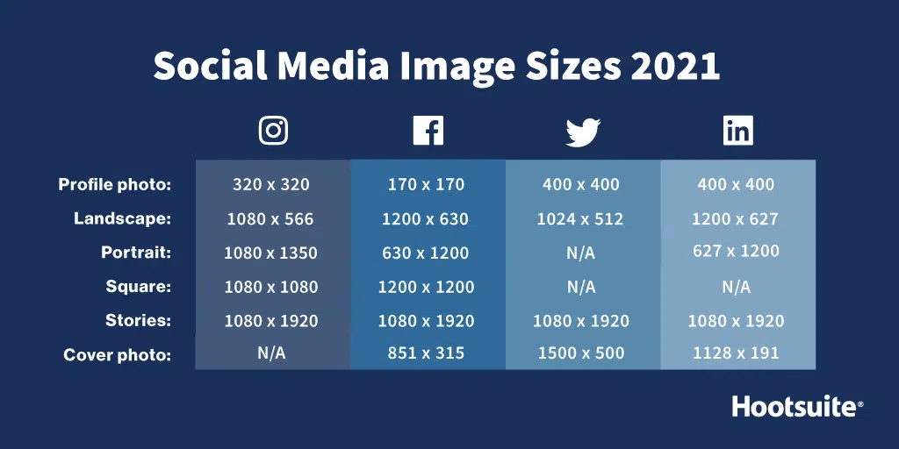
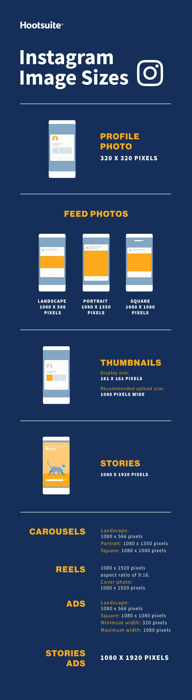
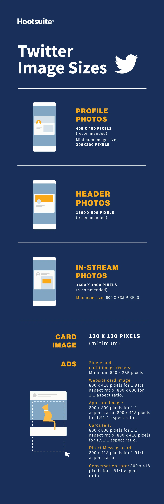
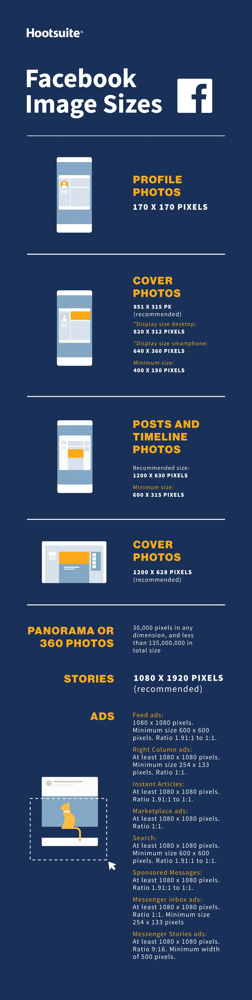
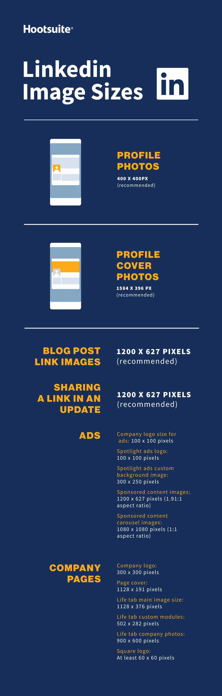
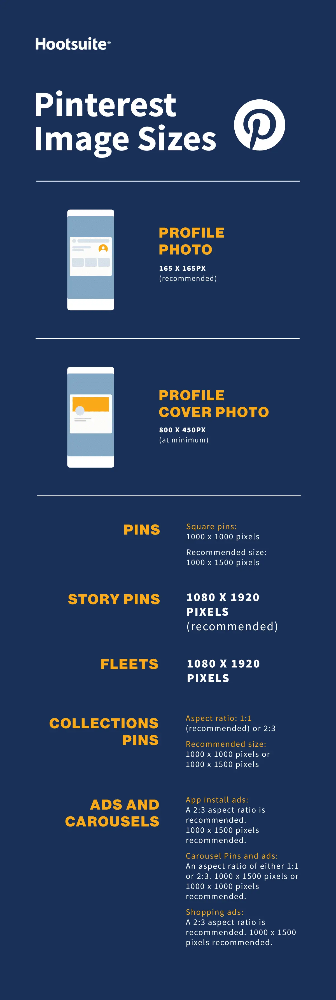
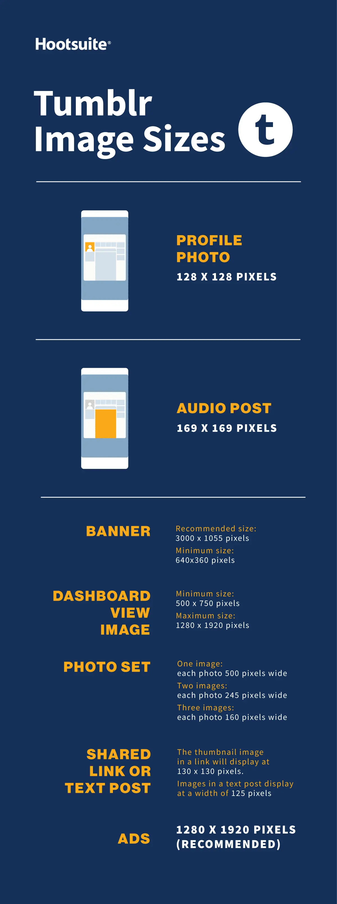
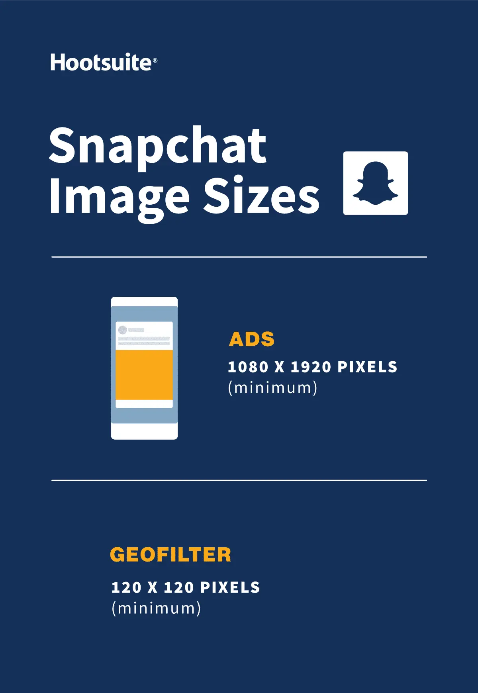
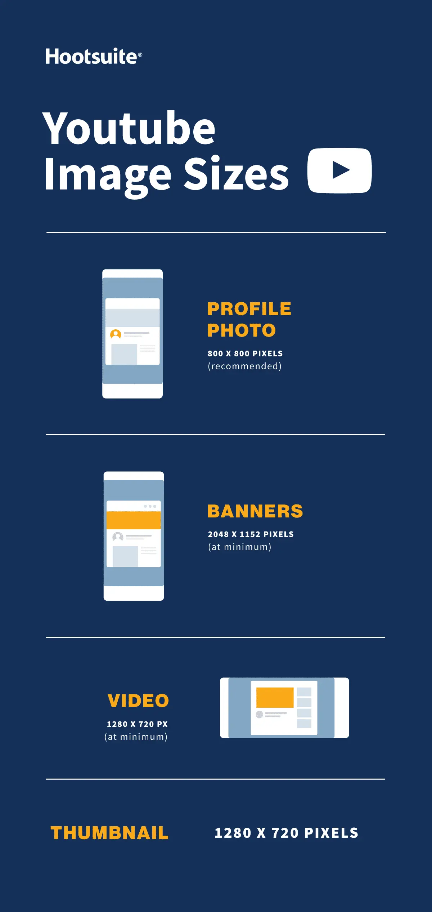
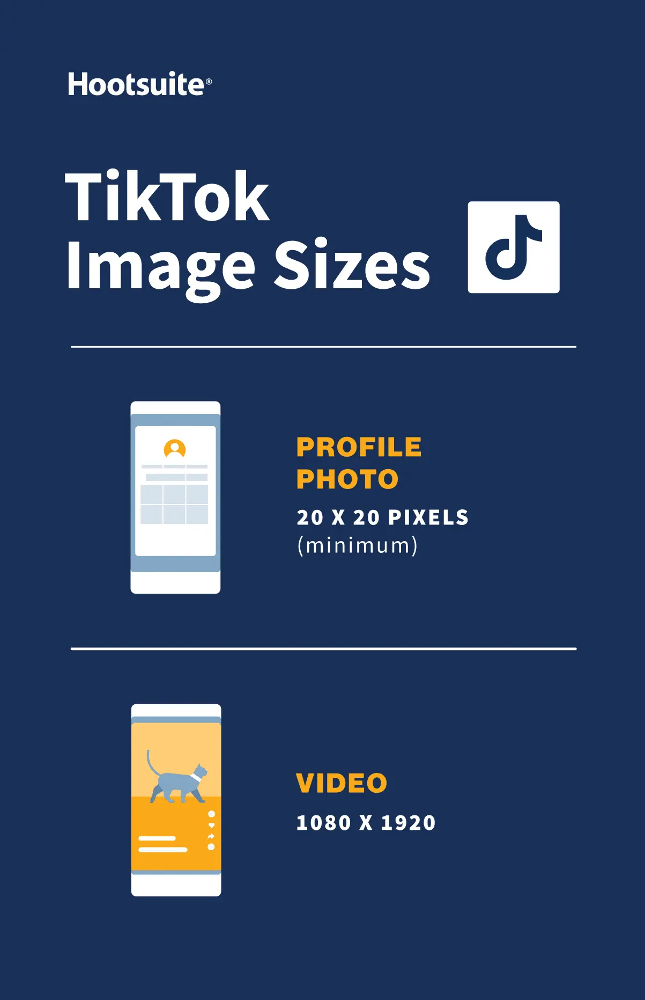

 Social media image sizes seem to change constantly.

 One moment you have the perfect cover page for your account. The next, it’s been resized, and looks all pixelated and wrong.

 It doesn’t help that information about official dimensions and image sizes is harder to find than a civil discussion on politics on Facebook.

 But, it’s not difficult if you consult this guide to social media image sizes on all important social media platforms!

 Below are the most recent social media image dimensions, as of 2022.

## Quick social media image sizes
 We go into more detail for every single network below, but this image includes the social media image sizes you probably look up most often.

 

## Instagram image sizes
 

 Instagram supports horizontally and vertically oriented images. It also still supports square images, which was what the platform was known for when it first launched.

 This increases your brand’s options. But it also makes image dimensions a little trickier to get right. Follow these guidelines to make sure your images end up looking their best.

### Instagram profile photo size

 Instagram profile photos are displayed at 110 x 100 pixels, but the image files are stored at `320 x 320` pixels, so make sure to upload an image that’s least that big.

 Even though the dimensions are in a square format, Instagram profile photos are displayed as a circle. Make sure any elements you want to focus on in the photo are centered so they don’t get cropped out.

### Instagram image sizes for feed photos
 * **Landscape**: 1080 x 566 pixels
 * **Portrait**: 1080 x 1350 pixels
 * **Square**: 1080 x 1080 pixels
 * **Supported aspect ratios**: Anywhere between 1.91:1 and 4:5
 * **Recommended image size**: Width of 1080 pixels, height between 566 and 1350 pixels (depending on whether the image is landscape or portrait)

 **Tips**:
 * If you want your images to look their best on Instagram, aim to upload an image that is 1080 pixels wide.
 * When you share an Instagram image that’s sized over 1080 pixels, [Instagram will size it down](https://help.instagram.com/1631821640426723?helpref=search&sr=1&query=image%20sizes&search_session_id=c31733a739e5847e68b4ab7b72126f73) to 1080 pixels.
 * If you share a photo that has a resolution lower than 320 pixels, Instagram will size it up to 320 pixels.
 * If your image is between 320 and 1080 pixels wide, Instagram will keep that photo at its original resolution, “[as long as the photo’s aspect ratio is between 1.91:1 and 4:5](https://help.instagram.com/1631821640426723?helpref=search&sr=1&query=image%20sizes&search_session_id=c31733a739e5847e68b4ab7b72126f73) (a height between 566 and 1350 pixels with a width of 1080 pixels).”
 * If your uploaded Instagram image is a different ratio, the platform will automatically crop your photo to fit a supported ratio.

 **Resource**: Learn how to [edit Instagram photos like a pro](https://blog.hootsuite.com/how-to-edit-instagram-photos/).

### Instagram photo thumbnail sizes
 * **Display size**: 161 x 161 pixels
 * **Recommended upload size**: 1080 pixels wide

 **Tips**:
 * Remember that Instagram stores versions of these thumbnails that are as large as 1080 x 1080.
 * To future-proof your Instagram feed and avoid pixelation, upload images that are as large as possible.

### Instagram Stories image size
 1080 x 1920 pixels
 **Tips**:
 * This is an aspect ratio of 9:16.
 * Uploading an image with a smaller pixel size (but the same aspect ratio) means the Story will buffer quickly.
 * If you don’t use this ratio, the Story might show with strange cropping, zooming, or leave large sections of the screen blank.
 * Instagram Reels use this same sizing.

 **Resource**: Take your Instagram Stories to the next level with [these free templates](https://blog.hootsuite.com/free-instagram-story-templates/).

### Instagram carousel image sizes
 * **Landscape**: 1080 x 566 pixels
 * **Portrait**: 1080 x 1350 pixels
 * **Square**: 1080 x 1080 pixels
 * **Aspect ratio**: landscape (1.91:1), square (1:1), vertical (4:5)
 * **Recommended image size**: Width of 1080 pixels, height between 566 and 1350 pixels (depending on whether the image is landscape or portrait)

### Instagram Reels sizes
 * 1080 x 1920 pixels
 * This is an aspect ratio of 9:16.
 * Cover photo: 1080 x 1920 pixels
 * Keep in mind that Reels are cropped to a 1:1 image in your profile feed and a 4:5 image in the home feed.

### Instagram ads image sizes:
 * **Landscape**: 1080 x 566 pixels
 * **Square**: 1080 x 1080 pixels
 * **Minimum width**: 320 pixels
 * **Maximum width**: 1080 pixels
 * **Supported aspect ratios**: Anywhere between 1.91:1 and 4:5

 **Tips**:
 * Remember: Instagram ads appearing in users’ feeds cannot have more than 30 hashtags.
 * There are also recommendations for the [number of characters included in an ad’s primary text and headline](https://www.facebook.com/business/ads-guide/image/instagram-feed).

### Image sizes for Instagram Stories ads
 1080 x 1920 pixels

 **Tips**:
 * Instagram recommends leaving roughly “[14% (250 pixels) of the top and bottom of the image free from text and logos](https://www.facebook.com/business/ads-guide/image/instagram-story/reach)” to prevent them from being covered.
 * As of September 2020, Facebook and Instagram ads are no longer penalized if more than 20% of the ad space is text.

## Twitter image sizes
 

 Tweets that include images consistently get more click-throughs, more likes, and more Retweets than non-image Tweets. In fact, Tweets with visual content are [three times more likely to get engagement](https://business.twitter.com/en/blog/7-tips-creating-engaging-content-every-day.html).

 So, choosing [the right images and creating great visual content](https://blog.hootsuite.com/epic-guide-creating-social-media-visuals/) for Twitter matters. And, of course, that includes getting Twitter image sizes right.

### Twitter image sizes for profile photos
 400 x 400 (recommended)
 * **Minimum image size**: 200 by 200 pixels
 * **Maximum file size**: 2MB

### Twitter image size for header photos
 1500 x 500 pixels (recommended)

 **Tips**:
 * To future-proof the image, it’s best to use the maximum size.
 * Header images are cropped to an aspect ratio of 3:1.
 * Keep in mind that the way header images display changes depending on the monitor and browser being used.

### Twitter images sizes for in-stream photos
 1600 x 900 pixels (recommended)
 * **Minimum size**: 600 by 335 pixels
 * **Recommended aspect ratio**: any aspect between 2:1 and 1:1 on desktop; 2:1, 3:4 and 16:9 on mobile
 * **Supported formats**: GIF, JPG and PNG
 * **Maximum file size**: Up to 5MB for photos and GIFs on mobile. Up to 15MB on the web.

### Twitter card image size:
 Twitter recognizes when a Tweet includes a URL. Twitter then crawls that website, pulling in content, including a Twitter image for the summary card. ([This is how it all works, by the way.](https://developer.twitter.com/en/docs/twitter-for-websites/cards/guides/getting-started))

 * **Minimum size**: 120 x 120 pixels
 * **Supported formats**: GIF, JPG, PNG
 * **Maximum file size**: 1MB

 **Tips**:
 * You can test what your Twitter summary card will look like and see a preview using the [card validator](https://cards-dev.twitter.com/validator).
 * There are a [range of different Twitter cards](https://developer.twitter.com/en/docs/twitter-for-websites/cards/overview/abouts-cards), so also a range of sizes. As well as the regular summary cards, there are summary cards with large images, app cards and player cards.

### Twitter image sizes for ads
 * **Single and multi-image tweets**: Minimum 600 x 335 pixels, but use larger images for the best results.
 * **Website card image**: 800 x 418 pixels for 1.91:1 aspect ratio. 800 x 800 for 1:1 aspect ratio. Max file size of 20MB.
 * **App card image**: 800 x 800 pixels for 1:1 aspect ratio. 800 x 418 pixels for 1.91:1 aspect ratio. Max file size of 3MB.
 * **Carousels**: 800 x 800 pixels for 1:1 aspect ratio. 800 x 418 pixels for 1.91:1 aspect ratio. Max file size of 20MB for 2-6 image cards.
 * **Direct Message card**: 800 x 418 pixels for 1.91:1 aspect ratio. Max file size of 3MB.
 * **Conversation card**: 800 x 418 pixels for 1.91:1 aspect ratio. Max file size of 3MB.

 **Resource**: Find more information here on [how to advertise on Twitter](https://blog.hootsuite.com/twitter-ads/).

## Facebook image sizes
 Facebook updates its design and image dimensions constantly. The best strategy to future-proof your brand’s content is to always upload the highest-quality image you can. Stick to Facebook’s recommended file formats for the best results.

 

### Facebook image sizes for profile photos
 170 x 170 pixels (on most computers)

 [Your Facebook profile picture](https://www.facebook.com/help/125379114252045) will display at 170 x 170 pixels on desktop. But it will display as 128 x 128 pixels on smartphones.

### Facebook image sizes for cover photos: 851 x 315 pixels (recommended)
 * **Display size desktop**: 820 x 312 pixels
 * **Display size smartphone**: 640 x 360 pixels
 * **Minimum size**: 400 x 150 pixels
 * **Ideal file size**: Less than 100KB

 **Tips**:
 * To avoid any compression or distortion, upload a JPG or PNG file.
 * Use the recommended pixel sizes for the fastest load times.
 * Profile pictures and cover photos with logos or text work best when uploaded as a PNG file.
 * Don’t drag to reposition once you’ve uploaded your cover photo.

 **Resource**: Get more tips on [creating great Facebook cover photos](https://blog.hootsuite.com/facebook-cover-photos/).

### Facebook image sizes for posts and timeline photos
 Facebook automatically resizes and formats your photos when they are uploaded for the timeline to be 500 pixels wide and to fit the 1.91:1 aspect ratio.

 But avoid pixelation or slow load times by remembering these sizes:

 * **Recommended size**: 1200 x 630 pixels
 * **Minimum size**: 600 x 315 pixels

 **Tips**:
 * If you are sharing 2-10 images in your brand’s Facebook post using the carousel display, images should be 1200 x 1200.
 * This is a 1:1 ratio.

### Facebook event cover photo image sizes
 1200 x 628 pixels (recommended)

 **Tips**:
 * This is about a 2:1 ratio.
 * The size of your event cover photo [can’t be edited after it’s been added to an event](https://www.facebook.com/help/1910675759253872?rdrhc).

### Facebook image sizes for panorama or 360 photos
 * **Minimum image size**: Facebook says that it should be “[30,000 pixels in any dimension, and less than 135,000,000 pixels in total size](https://facebook360.fb.com/editing-360-photos-injecting-metadata/).”
 * **Aspect ratio**: 2:1

 **Tips**:
 * Facebook automatically recognizes and processes these images based on “camera-specific metadata found in photos taken using 360-ready devices.”
 * Files for these Facebook images can be up to 45 MB for JPEGs or 60 MB for PNGs.
 * Facebook recommends using JPEGs for 360 photos and ensuring files aren’t bigger than 30 MB.

### Facebook image sizes for Facebook Stories
 1080 x 1920 pixels (recommended)
 
 **Tips**:
 * Facebook Stories take up the full screen of a phone. That’s an aspect ratio of 9:16.
 * Don’t choose an image with a width smaller than 500 pixels.
 * For Stories with text, consider leaving 14% of the top and bottom text-free. (That’s 250 pixels.) That way any call-to-action won’t be covered by your brand’s profile photo or buttons.

### Facebook image sizes for ads
 * **Sizes for Facebook Feed ads**: At least 1080 x 1080 pixels. Minimum size 600 x 600 pixels. Ratio 1.91:1 to 1:1. Maximum file size of 30 MB.
 * **Sizes for Facebook Right Column ads**: At least 1080 x 1080 pixels. Minimum size 254 x 133 pixels. Ratio 1:1. (Remember: These are a desktop-only ad format.)
 * **Facebook image sizes for Instant Articles**: At least 1080 x 1080 pixels. Ratio 1.91:1 to 1:1. Maximum file size of 30 MB.
 * **Image sizes for Facebook Marketplace ads**: At least 1080 x 1080 pixels. Ratio 1:1. Maximum file size of 30 MB.
 * **Image sizes for Facebook Search**: At least 1080 x 1080 pixels. Minimum size 600 x 600 pixels. Ratio 1.91:1 to 1:1. Maximum file size of 30 MB.
 * **Facebook image sizes for Sponsored Messages**: At least 1080 x 1080 pixels. Ratio 1.91:1 to 1:1. Maximum file size of 30 MB.
 * **Sizes for Messenger inbox ads**: At least 1080 x 1080 pixels. Ratio 1:1. Minimum size 254 x 133 pixels. Maximum file size of 30 MB.
 * **Sizes for Messenger Stories ads**: At least 1080 x 1080 pixels. Ratio 9:16. Minimum width of 500 pixels.

 **Resource**: Here’s more info on [how to advertise on Facebook](https://blog.hootsuite.com/how-to-advertise-on-facebook/).

## LinkedIn image sizes
 When you [use LinkedIn for business](https://blog.hootsuite.com/linkedin-for-business/) — whether it’s via your personal profile or a company page — pairing your LinkedIn updates with images has consistently been shown to increase comments and sharing.

 Stick to the recommended sizes below for best results. And always make sure to look at your profile and content on multiple devices before finalizing.

 

 
### LinkedIn image sizes for profile photos
 400 x 400 pixels or larger (recommended)

 **Tips**:
 * LinkedIn can accommodate photos up to 7680 x 4320 pixels.
 * And it can handle files up to 8MB, so upload as large as you can to future-proof.

### LinkedIn image sizes for profile cover photos
 * **Dimensions**: 1584 x 396 pixels (recommended)
 * **Aspect ratio**: 4:1

 **Tips**:
 * Make sure your file is smaller than 8MB.
 * Cover photos are cropped differently on mobile and desktop. Make sure to view your profile on both kinds of display before finalizing.

### LinkedIn image sizes for company pages
 * **Company logo size**: 300 x 300 pixels
 * **Page cover image size**: 1128 x 191 pixels
 * **Life tab main image size**: 1128 x 376 pixels
 * **Life tab custom modules image size**: 502 x 282 pixels
 * **Life tab company photos image sizes**: 900 x 600 pixels
 * **Square logo**: At least 60 x 60 pixels

 **Tips**:
 * When posting image updates to your company page, make sure to use PNG or JPG images.
 * Use an aspect ratio of 1.91:1.
 * 1200 x 628 pixel images are ideal.
 * This LinkedIn image sizing also applies to [LinkedIn Showcase pages](https://business.linkedin.com/marketing-solutions/linkedin-pages/showcase-pages#:~:text=Showcase%20Pages%20are%20extensions%20of,on%20your%20main%20LinkedIn%20Page.).

### LinkedIn image sizes for blog post link images
 1200 x 627 pixels (recommended)

### LinkedIn custom image size for sharing a link in an update
 1200 x 627 pixels (recommended)
 
 When pasting a URL into an update, an auto-generated thumbnail image may appear in the preview if one is available, along with the article or website title.

 But, you can customize it by clicking the Image icon below the text box and selecting a photo from your computer.

 **Tips**:
 * The image should use a 1.91:1 ratio.
 * More than the minimum of 200 pixels wide.
 * If the image width is less than 200 pixels wide, it will appear as a thumbnail on the left side of the post.

### LinkedIn image sizes for ads
 * **Company logo size for ads**: 100 x 100 pixels
 * **Spotlight ads logo size**: 100 x 100 pixels
 * **Spotlight ads custom background image**: 300 x 250 pixels
 * **Sponsored content images**: 1200 x 627 pixels (1.91:1 aspect ratio)
 * **Sponsored content carousel images**: 1080 x 1080 pixels (1:1 aspect ratio)

## Pinterest image sizes
 
 
 
### Pinterest image size for profile image
 165 x 165 pixels (recommended)

 **Tips**:
 * Remember that your profile photo will be displayed as a circle.

### Pinterest image size for profile cover photo
 800 x 450 pixels (at minimum)

 **Tips**:
 * Try to avoid placing a portrait photo into the cover photo spot.
 * Instead, use a landscape photo with a 16:9 aspect ratio.

### Pinterest image sizes for Pins
 * **Aspect ratio**: 2:3 (recommended)
 * **Square pins**: 1000 x 1000 pixels
 * **Recommended size**: 1000 x 1500 pixels
 * **Max file size**: 20MB

 **Tips**:
 * Keeping the 2:3 aspect ratio ensures your brand’s audience sees all the image’s details on their feed.
 * On the feed, Pins are displayed with a fixed width of 236 pixels.
 * If you want to create Pins with a different aspect ratio, know that Pinterest crops images from the bottom.
 * Both PNG and JPEG files are accepted.

### Pinterest image sizes for collections Pins
 * **Aspect ratio**: 1:1 (recommended) or 2:3
 * **Recommended size**: 1000 x 1000 pixels or 1000 x 1500 pixels
 * **Max file size**: 10MB

 **Tips**:
 * This format appears as one main image, above three smaller images.
 * All images must have the same aspect ratio.
 * Collections appear in feeds on mobile devices.
 * Both PNG and JPEG files are accepted.
 * Collections can also be an ad format on Pinterest.

### Pinterest image size for Story Pins
 * **Recommended size**: 1080 x 1920 pixels
 * **Aspect ratio**: 9:16
 * **Max file size**: 20MB

### Pinterest image sizes for ads and carousels
 * **App install ads**: Same specs as standard Pins. A 2:3 aspect ratio is recommended. 1000 x 1500 pixels recommended.
 * **Carousel Pins and ads**: An aspect ratio of either 1:1 or 2:3. 1000 x 1500 pixels or 1000 x 1000 pixels recommended. Up to 5 images can be included in a carousel.
 * **Shopping ads**: Same specs as standard Pins. A 2:3 aspect ratio is recommended. 1000 x 1500 pixels recommended.

 **Resource**: Get some advice on [how to use Pinterest for business](https://blog.hootsuite.com/how-to-use-pinterest-for-business/).

## Tumblr image sizes
 

### Tumblr profile photo size
 * **Recommended size**: 128 x 128 pixels
 * **Minimum size and avatar**: 64 x 64 pixels

### Tumblr banner size
 * **Recommended size**: 3000 x 1055 pixels
 * **Minimum size**: 640 x 360 pixels

### Dashboard view image
 * **Minimum size**: 500 x 750 pixels
 * **Maximum size**: 1280 x 1920 pixels

### Tumblr photo set
 * **One image**: each photo 500 pixels wide
 * **Two images**: each photo 245 pixels wide
 * **Three images**: each photo 160 pixels wide

### Tumblr images in a shared link or text post
 * The **thumbnail image in a link** will display at 130 x 130 pixels.
 * **Images in a text post** display at a width of 125 pixels, but expand when clicked on.

### Tumblr audio post image size
 169 x 169 pixels

### Tumblr ads image size
 1280 x 1920 pixels (recommended)

## Snapchat image sizes
 

### Snapchat ads image size
 1080 x 1920 pixels (at minimum)
 * **Aspect ratio**: 9:16
 * **File type**: JPEG or PNG
 * **Maximum file size**: 5MB

### Snapchat Geofilter image size
 1080 x 1920 (at minimum)
 * **Aspect ratio**: 9:16
 * **File type**: JPEG or PNG
 * **Maximum file size**: 5MB

 **Resource**: [How to Create a Custom Snapchat Geofilter](https://blog.hootsuite.com/how-to-make-a-snapchat-on-demand-geofilter/)

## YouTube image sizes
 

### YouTube profile photo size
 800 x 800 pixels (recommended)

 **Tips**:
 * Make sure the focus of your photo is centered for best results.
 * Files should be JPEG, GIF, BMP or PNG. Animated GIFs won’t work.
 * Photos will render at 98 x 98 pixels.

### YouTube banner image size
 2048 x 1152 pixels (at minimum)
 * **Aspect ratio**: 16:9
 * **Minimum area for text and logos without being cut off**: 1235 x 338 pixels
 * **Maximum file size**: 6MB

 **Resource**: [How to make the best YouTube channel art](https://blog.hootsuite.com/youtube-channel-art-templates/) (plus 5 free templates).

### YouTube video size
 1280 x 720 pixels (at minimum)

 **Tips**:
 * YouTube recommends that videos intended for sale or rental have a higher pixel count: 1920 x 1080 pixels.
 * YouTube requires videos to be 1280 x 720 pixels in order to meet HD standards.
 * This is a 16:9 aspect ratio.

### YouTube thumbnail size
 1280 x 720 pixels

## TikTok image sizes
 

### TikTok profile photo size
 20 x 20 pixels (minimum size to upload)

 **Tips**:
 * While 20 x 20 is the minimum upload size, upload a higher quality photo for future-proofing.

### TikTok video size
 1080 x 1920

 **Tips**:
 * The ideal aspect ratio for Tik Tok videos is 1:1 or 9:16.

## Why is it important to get social media image sizes right?
 Social media marketers need to get many things right when creating visual content for social media.

 You’ve got to make sure any images you use [don’t defy copyright laws](https://blog.hootsuite.com/understanding-image-copyright/). If you don’t have original imagery, you’ve got to find [high-quality stock photos](https://blog.hootsuite.com/20-free-stock-photo-sites-social-media-images/). And you’ve got to figure out which [tools out there can help elevate your social media images](https://blog.hootsuite.com/resources-to-create-quick-and-beautiful-images-for-social-media/).

 On top of that, you’ve got to get your social media image sizes right. And getting that right is really important because:

 * **It avoids pixelation and awkward image stretching.** And avoiding that keeps your images looking professional.
 * **Your photos will be optimized for each social channel’s feed.** This can help increase engagement.
 * **It ensures your audience sees the full photo.** Incorrect sizing could cut off some of your brand’s messaging.
 * **It can future-proof your content.** Being in-the-know with social media image sizes now could mean less work for your brand in the future, when network change up how images display again.
