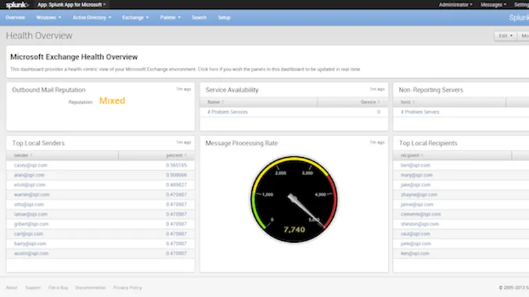



Kick-ass!
M$ Exchange & $plunk...

Awesome!


# Splunk upgrades app for Microsoft Exchange

 New out-of-the-box dashboards and reports in the app correlate operating system data to enable monitoring of the email service and provide deep visibility into usage and behavior.

 Splunk, the machine data focused big data player, announced Monday the release of version 3.0 of the Splunk App for Microsoft Exchange. Despite having a complex install process, the company said Splunk for Microsoft Exchange is one of the most popular apps it has produced, a reality that likely prompted the upgrade.

The latest app iteration touts pre-built, out-of-the box dashboards and reports that correlate Exchange data with supporting infrastructure data from Active Directory and Windows OS.

Part of the goal of the rejuvenated relationship between the data is to increase the monitoring capabilities of the email service, boost visibility into usage and behavior, and maximize uptime.

According to Leena Joshi, senior director of infrastructure operations marketing at Splunk, another objective for packaging the three views is to satisfy users' desires to both visualize the health of their service and also the context around it. Joshi said:



The messaging infrastructure is critical to organizations of all sizes. A disruption in email can damage the reputation of an IT department or the entire organization through lost orders, broken customer communications, and chaotic internal communications.



 Other features of version 3.0 include message tracking, which provides a breakdown of message flow from the desktop to the gateway, and capacity planning, which displays information about messaging volume and the number of users the system is handling over time. 

