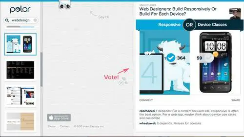

 

 What if designers worried about digit size instead?

 Luke Wroblewski, a respected designer who sold a company to Twitter and more recently founded Polar, an app maker, thinks it’s time to reconsider mobile design principles. Instead of worrying about questions like whether to upsize smartphone apps for tablets, designers should start by asking how their users will physically interact with their devices when using an app.

 The technical term for this is input type—keyboard versus touchscreen, one-handed or two-handed interactions, and the like. This requires designers to think about how a device is held, which fingers are used, and how the app in question can optimize the experience for users’ dexterity. 

## The Beginning: Start With Responsive Design
 

 For a smartphone, the primary input type has become a single hand with a single finger, typically the thumb. For tablets, it’s two hands with two inputs, typically both thumbs. And for desktops, it’s still restricted largely to the mouse, trackpad, and keyboard, but can branch out in rare circumstances, in the case of devices like the Chromebook Pixel or Microsoft Surface to touchscreen inputs as well. 

 Wroblewski’s [Polar](http://polarb.com) makes an iOS app that lets users poll friends on any topic and then build communities around these topics. Just last week, Polar launched a desktop Web client that is designed to match not just the look but the functionality of the mobile app versions and the input types taken into account with each one. As you change the size of your window, the app morphs from the desktop version to the tablet/touchscreen computer version, and then down to its smartphone version.

 If you resize ReadWrite in a browser window, you’ll see a similar transformation. This is known as responsive design, and it’s an increasingly popular approach to Web design. Last week, at its I/O conference, Google unveiled tools that promise to make it [much easier to build responsive websites](https://readwrite.com/2013/05/15/now-google-wants-to-kill-the-mobile-web).

 That way, Polar not only looks the same in-app for the iPhone and iPad as it does on the mobile Web, but it adapts for pretty much every platform for optimal use. It’s not about scaling the layout of interface objects up and down; it’s about scaling the whole experience up or down. 

## Next: Think About How We Hold Our Devices
 

 But responsive design has largely been limited to these screen-size adjustments. Input type may be an even more important concept because it factors in both the physical limitations of the device from a display and functionality standpoint as well as how those limitations translate to our physical interactions with the devices. 

 Wroblewski detailed the input-type approach to design in a [blog post on May 13](http://www.lukew.com/ff/entry.asp?1721) that covered the app’s new Web client, which lets users quickly scroll through and vote on topic pages related to everything from Star Wars and Game of Thrones to Web design and photography.

 “Topic pages on Polar were designed to adapt to not only different screen sizes but to different input types as well,” Wroblewski writes. “The end result is a Web interface that aims to fit into the reality of Web use today. In particular, the human ergonomics of how people interact with different devices …”

 It turns out that thinking about ergonomics on mobile devices and adapting design accordingly is not a widely used approach. Steven Hoober, who Wroblewski cites as his primary source for input-type research, published a report earlier this year on UXmatters, [“How Do Users Really Hold Mobile Devices?”](http://www.uxmatters.com/mt/archives/2013/02/how-do-users-really-hold-mobile-devices.php?) that collected two months of observations on how more than 1,300 people used their mobile devices. 

 Hoober’s report aimed to dispel the myth that designers should follow a “best practices” approach to app design that relies on assumptions that cast the widest net. Instead, Hoober advises that the approach should be far more customized, taking into account the constantly changing nature of mobile use that is contingent on factors like device type and screen size as well as physical location, be it standing or sitting on a bus or in a cafe. 

 “The way in which users hold their phone is not a static state,” Hoober writes. “Users change the way they’re holding their phone very often—sometimes every few seconds.”

 

 While Hoober did verify the assumption that majority of smartphone use is done one-handed with the thumb—49% of the time—he also discovered that designing from that standpoint alone could lead users to alter their behavior and thus deemphasize the very reasons underlying the approach.

 “What if a user sees buttons at the top, so switches to cradling his phone to more easily reach all functionality on the screen—or just prefers holding it that way all the time?” he explains.  

## Comfort-First Approach
 Wroblewski stresses that Polar was designed primarily to be “comfortable to use,” incorporating the ideas behind Hoober’s findings into the app’s design to cover the best input types for every device.  

 For instance, Polar’s smartphone app contains no left-hand column because users wouldn’t typically be able to access it comfortably using one hand and one finger. It does support keyboard use in the event someone is using a large-screen phone-tablet hybrid, also known as a phablet, that’s more typically held with two hands.

 By contrast, when using Polar on a full tablet, a browsing column is present to take advantage of two-handed use. That’s placed strategically on the left edge, with voting options on the right to take advantage of quick thumb access to the left and right sides of the screen. 

 The desktop version of Polar mostly matches the mobile app experience. The main difference: When Polar detects a large enough screen, it adds keyboard support.

 This type of comfort-first approach has its downsides.

 “Looking at the Polar interface on a laptop can be a bit disconcerting because we’ve essentially left the middle of the page ‘blank,'” Wroblewski says. This runs contrary to the fill-‘et-up instincts of most Web designers, but it’s the only way Polar could create something that easily scales down both aesthetically and functionally from a 27-inch monitor to a 4-inch smartphone screen. 

 While these methods are very much experimental, they showcase the implementation of a much more sophisticated approach for thinking about mobile app design. We know that the diversity of devices is only increasing. With responsive design, we’ve scrapped a one-size-fits-all approach to screen size. The next step is to discard one-swipe-fits-all thinking about how we interact with those screens.

 Photo by [Intel Free Press](https://www.flickr.com/photos/intelfreepress/6837433138/)