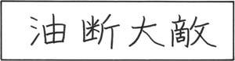



  January 11, 2014
  Yoji-jukugo of The Day: Yudan-taiteki
  ______________________________________
  Yudan-taiteki literally means, "carelessness is the greatest enemy." A wider translation is, "danger comes when you least expect it."
  Yoji-jukugo are idiomatic expressions made up of four kanji characters. These idiomatic words are written in kanji only and with no kana between them. Yoji-jukugo, of which there are hundreds, contain classical wisdom or morals in short phrases.

